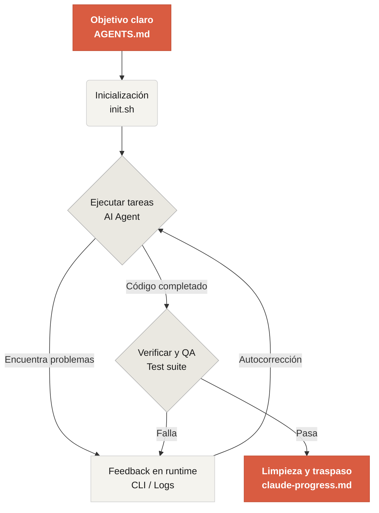

# Bienvenido a Learn Harness Engineering

Learn Harness Engineering es un curso dedicado a la ingeniería de agents de programación con IA. Sintetiza teorías y prácticas avanzadas de Harness Engineering para enseñar cómo diseñar entornos, estado, verificación y sistemas de control que hacen más fiable el trabajo de herramientas como Codex y Claude Code.

Referencias principales:

- [OpenAI: Harness engineering: leveraging Codex in an agent-first world](https://openai.com/index/harness-engineering/)
- [Anthropic: Effective harnesses for long-running agents](https://www.anthropic.com/engineering/effective-harnesses-for-long-running-agents)
- [Anthropic: Harness design for long-running application development](https://www.anthropic.com/engineering/harness-design-long-running-apps)
- [Awesome Harness Engineering](https://github.com/walkinglabs/awesome-harness-engineering)

## Empezar

Elige una ruta de aprendizaje. El curso combina lecciones teóricas, proyectos prácticos y una biblioteca de recursos lista para copiar.

  <a href="./lectures/lecture-01-why-capable-agents-still-fail/" class="card">
    <h3>Lecciones</h3>
    
Entiende por qué los modelos potentes siguen fallando y aprende la teoría detrás de los harnesses efectivos.

  </a>
  <a href="./projects/" class="card">
    <h3>Proyectos</h3>
    
Construye desde cero un entorno de trabajo agentic fiable mediante práctica guiada.

  </a>
  <a href="./resources/" class="card">
    <h3>Biblioteca de recursos</h3>
    
Plantillas listas para copiar, como AGENTS.md y feature_list.json, para tus propios repositorios.

  </a>

## El mecanismo central de un harness

Un harness no hace que el modelo sea más inteligente. Construye un **sistema de trabajo cerrado** alrededor del modelo para guiarlo, observarlo y verificarlo.

## Qué aprenderás

<ul class="index-list">
  <li><strong>Restringir el comportamiento del agent</strong> con reglas y límites explícitos.</li>
  <li><strong>Mantener contexto</strong> en tareas largas y de varias sesiones.</li>
  <li><strong>Evitar declaraciones prematuras de victoria</strong> antes de verificar el trabajo.</li>
  <li><strong>Validar el resultado</strong> con pruebas de pipeline completo y revisión explícita.</li>
  <li><strong>Hacer observable el runtime</strong> para depurar y corregir fallos.</li>
</ul>

## Siguientes pasos

<ul class="index-list">
  <li><a href="./lectures/lecture-01-why-capable-agents-still-fail/">Lección 01: Por qué los agents capaces siguen fallando</a>: empieza con la teoría de Harness Engineering.</li>
  <li><a href="./projects/project-01-baseline-vs-minimal-harness/">Proyecto 01: Baseline vs Minimal Harness</a>: ejecuta tu primera comparación real.</li>
  <li><a href="./resources/templates/">Plantillas</a>: copia el pack mínimo de harness para tus propios proyectos.</li>
</ul>
