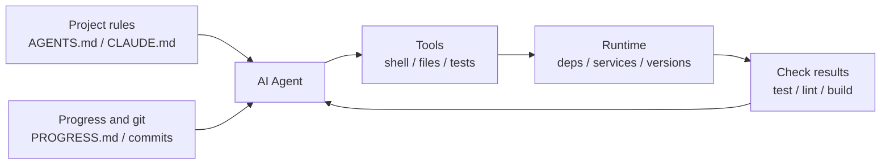

[中文版本 →](../../../zh/lectures/lecture-02-what-a-harness-actually-is/)

> Ejemplos de código: [code/](https://github.com/walkinglabs/learn-harness-engineering/blob/main/docs/es/lectures/lecture-02-what-a-harness-actually-is/code/)
> Proyecto práctico: [Proyecto 01. Prompt-only vs. reglas primero](./../../projects/project-01-baseline-vs-minimal-harness/index.md)

# Lección 02. Qué significa realmente un harness

La palabra "harness" se usa mucho en círculos de agents de programación con IA, pero muchas veces la gente quiere decir simplemente "un archivo de prompt". Eso no es un harness. Es como abrir un restaurante con solo ingredientes: sin fogón, sin cuchillos, sin recetas y sin flujo de emplatado. Eso no es un restaurante; es una nevera.

Esta lección te da una definición precisa y accionable de harness. No una abstracción académica, sino un marco que puedes usar hoy: un harness consta de cinco subsistemas, cada uno con responsabilidades y criterios de evaluación claros.

## Empieza con una analogía

Imagina que eres un ingeniero recién contratado y te sueltan en un proyecto sin documentación. No hay README, no hay comentarios en el código, nadie te dice cómo ejecutar pruebas y la configuración de CI está enterrada en algún sitio. ¿Puedes escribir buen código? Tal vez, si eres suficientemente paciente. Pero gastarás una enorme cantidad de tiempo entendiendo "de qué va este proyecto" en lugar de resolver el problema.

Un AI agent afronta exactamente la misma situación, y peor: tú al menos puedes preguntar a un compañero. El agent solo ve los archivos que le pones delante y los comandos que puede ejecutar. No puede tocarle el hombro a alguien y preguntar "¿qué versión del ORM usa este proyecto?".

OpenAI formula el principio central como "the repo IS the spec": todo el contexto necesario debe estar en el repositorio, entregado mediante archivos de instrucciones estructurados, comandos explícitos de verificación y una organización clara de directorios. La documentación de Anthropic sobre agents de larga duración enfatiza persistencia de estado, rutas explícitas de recuperación y seguimiento estructurado de progreso. Se centran en aspectos distintos, pero dicen lo mismo: **todo lo que hay en la infraestructura de ingeniería fuera del modelo determina cuánta capacidad del modelo se realiza realmente.**

Mira herramientas que ya conoces:

**Claude Code** encarna esta forma de pensar. Lee `CLAUDE.md` del repo (estantería de recetas), puede ejecutar comandos de shell (juego de cuchillos), trabaja en tu entorno local (fogón), mantiene historial de sesión (mesa de preparación) y puede ejecutar pruebas y ver resultados (ventana de control de calidad). Pero si no le dices cómo ejecutar las pruebas, la ventana de control está rota: nadie sabe si el plato está bien cocinado.

**Cursor** sigue una lógica parecida. Su archivo `.cursorrules` es la estantería de recetas, el terminal es el juego de cuchillos y la estructura del proyecto más la configuración de lint forman parte del fogón. Pero su gestión de estado es relativamente débil: cierras el IDE, lo abres de nuevo y el contexto anterior desaparece.

**Codex**, el agent de programación de OpenAI, usa git worktrees para aislar el entorno de runtime de cada tarea y lo combina con observabilidad local (logs, métricas, trazas), de modo que cada cambio se verifica en un entorno independiente. En repos con `AGENTS.md` y comandos claros de verificación, rinde mucho mejor que en repos desnudos.

**AutoGPT** es la advertencia: la falta de gestión estructurada de estado acumula contexto en tareas largas, y la falta de feedback preciso hace que el agent entre en bucles. Mucha gente dice que AutoGPT "no funciona", pero en realidad lo que no funciona es su harness. Dale a un chef un fogón roto y ni los mejores ingredientes producirán una comida.

## Conceptos centrales

- **Qué es un harness**: todo lo que hay en la infraestructura de ingeniería fuera de los pesos del modelo. OpenAI resume el trabajo central del ingeniero en tres cosas: diseñar entornos, expresar intención y construir bucles de feedback. Anthropic llama a su Claude Agent SDK un "general-purpose agent harness".
- **El repo es la fuente de verdad**: todo lo que el agent no puede ver, en la práctica, no existe. OpenAI trata el repo como sistema de registro: el contexto necesario debe vivir ahí, mediante archivos estructurados y organización clara.
- **Da un mapa, no un manual**: según la experiencia de OpenAI, `AGENTS.md` debe ser una página de directorio, no una enciclopedia. Unas 100 líneas suelen bastar. Si no cabe, divídelo en `docs/` y deja que el agent lea bajo demanda.
- **Restringe, no microgestiones**: un buen harness usa reglas ejecutables para restringir al agent, no una lista interminable de instrucciones. OpenAI lo formula como "enforce invariants, don't micromanage implementation"; Anthropic observó que los agents elogian con confianza su propio trabajo, y la solución es separar a quien hace el trabajo de quien lo revisa.
- **Elimina componentes de uno en uno**: para cuantificar el valor de cada componente del harness, quítalos de uno en uno y mide qué retirada causa la mayor caída de rendimiento. Anthropic usó este método y vio que, a medida que los modelos mejoran, algunos componentes dejan de ser críticos, pero siempre aparecen otros nuevos.

## El modelo de harness de cinco subsistemas

Volvamos a la cocina. Una cocina completa tiene cinco áreas funcionales, y un harness tiene cinco subsistemas:



**Subsistema de instrucciones (estantería de recetas)**: crea `AGENTS.md` o `CLAUDE.md` con una visión general del proyecto, propósito en una frase, stack y versiones, comandos de primera ejecución (`make setup`, `make test`), restricciones no negociables ("All APIs must use OAuth 2.0") y enlaces a documentación más detallada.

**Subsistema de herramientas (juego de cuchillos)**: asegúrate de que el agent tiene acceso suficiente a herramientas. No desactives shell por "seguridad" si luego esperas que pueda ejecutar `pip install`. Pero tampoco abras todo: aplica mínimo privilegio.

**Subsistema de entorno (fogón)**: haz que el estado del entorno se describa a sí mismo. Usa `pyproject.toml` o `package.json` para fijar dependencias, `.nvmrc` o `.python-version` para versiones de runtime, y Docker o devcontainers para reproducibilidad.

**Subsistema de estado (mesa de preparación)**: las tareas largas necesitan seguimiento de progreso. Usa un `PROGRESS.md` simple que registre qué está hecho, qué está en curso y qué está bloqueado. Actualízalo antes de terminar cada sesión y léelo al empezar la siguiente.

**Subsistema de feedback (ventana de control de calidad)**: suele ser el subsistema con mayor retorno. Lista explícitamente comandos de verificación en `AGENTS.md`:

```text
Verification commands:
- Tests: pytest tests/ -x
- Type check: mypy src/ --strict
- Lint: ruff check src/
- Full verification: make check (includes all above)
```

Si falta un subsistema, es como si faltara una zona funcional en la cocina: puedes cocinar, pero siempre será torpe.

**Diagnosticar la calidad del harness**: usa control de modelo isométrico. Mantén fijo el modelo, elimina subsistemas de uno en uno y mide qué eliminación causa la mayor caída de rendimiento. Ese es tu cuello de botella. Es como buscar el cuello de botella en una cocina: quita la estantería de recetas, mide cuánto se ralentiza todo; apaga el fogón y mira el impacto.

## Historia real de un equipo

Un equipo usó GPT-4o en una app frontend TypeScript + React de unas 20.000 líneas. Pasaron por cuatro etapas, añadiendo equipamiento de cocina pieza a pieza:

**Etapa 1: cocina vacía**. Solo había una descripción básica del proyecto en el README. Tuvo éxito 1 de 5 ejecuciones (20%). Fallos principales: eligió mal el package manager (npm frente a yarn), no siguió convenciones de nombres de componentes y no pudo ejecutar pruebas.

**Etapa 2: estantería de recetas instalada**. Añadieron `AGENTS.md` con versiones del stack, convenciones de nombres y decisiones arquitectónicas clave. La tasa de éxito subió al 60%. Los fallos restantes eran sobre todo de entorno y verificación faltante.

**Etapa 3: ventana de control de calidad abierta**. Añadieron comandos de verificación en `AGENTS.md`: `yarn test && yarn lint && yarn build`. La tasa de éxito subió al 80%.

**Etapa 4: mesa de preparación lista**. Introdujeron plantillas de progreso donde los agents registraban trabajo completado e incompleto en cada ejecución. La tasa de éxito se estabilizó entre 80% y 100%.

Cuatro iteraciones, sin cambiar el modelo, y la tasa de éxito pasó del 20% a casi el 100%. Esa es la fuerza de Harness Engineering: no compraron ingredientes más caros; organizaron bien la cocina.

## Ideas clave

- Harness = instrucciones + herramientas + entorno + estado + feedback. Cinco subsistemas, como cinco áreas funcionales de una cocina.
- Si no son pesos del modelo, es harness. El harness determina cuánta capacidad del modelo se materializa.
- De los cinco subsistemas, feedback suele tener la menor inversión y el mayor retorno. Ajusta primero los comandos de verificación.
- Usa control de modelo isométrico para medir la contribución marginal de cada subsistema.
- El harness se degrada como el código. Audítalo con regularidad y paga deuda de harness igual que pagas deuda técnica.

## Lecturas adicionales

- [OpenAI: Harness Engineering](https://openai.com/index/harness-engineering/)
- [Anthropic: Effective Harnesses for Long-Running Agents](https://www.anthropic.com/engineering/effective-harnesses-for-long-running-agents)
- [HumanLayer: Harness Engineering for Coding Agents](https://humanlayer.dev/articles/harness-engineering-for-coding-agents/)
- [SWE-agent: Agent-Computer Interfaces](https://github.com/princeton-nlp/SWE-agent)
- [Thoughtworks: Harness Engineering on Technology Radar](https://www.thoughtworks.com/radar)

## Ejercicios

1. **Auditoría de harness en cinco partes**: toma un proyecto donde uses un AI agent y audítalo con el marco de cinco subsistemas. Puntúa cada subsistema de 1 a 5. Mejora durante 30 minutos el subsistema con peor puntuación y observa el cambio en rendimiento.

2. **Experimento de control de modelo isométrico**: elige un modelo y una tarea difícil. Quita instrucciones, feedback o estado de uno en uno y mide la caída de rendimiento. Ordena la importancia de los subsistemas para tu proyecto.

3. **Análisis de affordance**: busca un caso donde el agent "quiere hacer algo pero no puede" (por ejemplo, sabe que debería usar consultas parametrizadas pero desconoce los patrones ORM del proyecto). Decide si es un Gulf of Execution o un Gulf of Evaluation y diseña una mejora de harness para cerrarlo.
