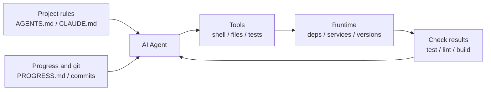

[Versión en chino →](../../../zh/lectures/lecture-02-what-a-harness-actually-is/)

> Ejemplos de código: [código/](https://github.com/walkinglabs/learn-harness-engineering/blob/main/docs/es/lectures/lecture-02-what-a-harness-actually-is/code/)
> Proyecto práctico: [Proyecto 01. Prompt-only vs. reglas primero](./../../projects/project-01-baseline-vs-minimal-harness/index.md)

# Lección 02. What Harness Actually Means

The word "harness" gets thrown around a lot in agent de programación con IA circles, but honestly, most people mean "a prompt archivo" when they say harness. That's not a harness. It's like opening a restaurant with nothing but ingredients — no stove, no knives, no recipes, no plating flujo de trabajo. That's not a restaurant. That's a refrigerator.

This lección gives you a precise, actionable harness definition. Not an academic abstraction, but a framework you can usar today: a harness consists of five subsystems, each with claro responsibilities and evaluation criterios.

## Empezar with an Analogy

Imagine you're a newly hired engineer dropped into a proyecto with zero documentation. No README, no comments in the código, nobody tells you how to ejecutar pruebas, CI config is buried somewhere. Can you escribir good código? Maybe — if you're smart enough and patient enough. But you'll spend enormous time on "figuring out what this proyecto is about" rather than "solving the problema."

An AI agent faces the exact mismo situation. And it's worse — you can at least ask a colleague. The agent can only see archivos you put in front of it and comandos it can execute. It can't tap someone on the shoulder and ask "hey, which version of the ORM does this proyecto usar?"

OpenAI frames the core principle as "the repo IS the spec" — all necessary contexto should be in the repositorio, delivered through estructurado instrucción archivos, explícito verificación comandos, and claro directory organization. Anthropic's agents de larga duración documentation emphasizes estado persistence, explícito recovery paths, and estructurado progress tracking. The two companies focus on diferente aspects, but they're saying the mismo thing: **everything in the ingeniería infrastructure outside the modelo determines how much of the modelo's capability actually gets realized.**

Look at some herramientas you already know:

**Claude Código** embodies harness thinking. It reads `CLAUDE.md` from your repo (recipe shelf), can ejecutar shell comandos (knife rack), executes in your local entorno (stove), maintains sesión history (prep station), and can ejecutar pruebas and see resultados (calidad check window). But if you don't tell it how to ejecutar pruebas, the calidad check window is broken — nobody knows whether the dish is fully cooked.

**Cursor** follows similar logic. Its `.cursorrules` archivo is the recipe shelf, the terminal is the knife rack, it reads your proyecto estructura and lint config for the stove. But Cursor's gestión de estado is relatively weak — close the IDE and reopen it, and the anterior contexto is gone.

**Codex** (OpenAI's agent de programación) uses git worktrees to isolate each tarea's runtime entorno, paired with a local observabilidad stack (logs, metrics, traces), so every cambio is verified in an independent entorno. In repos with `AGENTS.md` and claro verificación comandos, it performs far better than in "bare" repos.

**AutoGPT** is the cautionary tale — lack of estructurado gestión de estado leads to contexto accumulation in long tareas, and lack of precise feedback mechanisms causes the agent to loop. Many people say AutoGPT "doesn't work," but really it's AutoGPT's harness that doesn't work — give a chef a broken stove and even the best ingredients won't produce a meal.

## Core Concepts

- **What is a harness**: Everything in the ingeniería infrastructure outside the modelo weights. OpenAI distills the engineer's core job into three things: designing entornos, expressing intent, and construyendo feedback loops. Anthropic calls their Claude Agent SDK a "general-purpose agent harness."
- **The repo is the single fuente de verdad**: Anything the agent can't see, for all practical purposes, doesn't exist. OpenAI treats the repo as the "sistema de registro" — all necessary contexto must live there, through estructurado archivos and claro directory organization.
- **Give a map, not a manual**: OpenAI's experience — `AGENTS.md` should be a directory página, not an encyclopedia. Around 100 lines is enough. If it doesn't fit, split it into the `docs/` directory and let the agent leer on demand.
- **Constrain, don't micromanage**: A good harness uses executable reglas to constrain the agent, rather than enumerating instrucciones one by one. OpenAI says "enforce invariants, don't micromanage implementation"; Anthropic found that agents confidently praise their own work, and the solución is to separate "the person who does the work" from "the person who checks the work."
- **Remove components one at a time**: To quantify the value of each harness component, remove them one at a time and see which removal causes the biggest performance drop. Anthropic usado this método and found that as modelos get stronger, some components stop being critical — but new ones always emerge.

## The Five-Subsystem Harness Modelo

Back to the kitchen analogy. A completo kitchen has five functional areas, and a harness has five subsystems:



**Instrucción subsystem (recipe shelf)**: Crear `AGENTS.md` (or `CLAUDE.md`) containing a proyecto resumen and purpose (one sentence), tech stack and versions (Python 3.11, FastAPI 0.100+, PostgreSQL 15), first-run comandos (`hacer setup`, `hacer prueba`), non-negotiable hard constraints ("All APIs must usar OAuth 2.0"), and links to more detailed documentation.

**Herramienta subsystem (knife rack)**: Ensure the agent has sufficient herramienta access. Don't disable shell for "security" — if the agent can't even ejecutar `pip install`, how is it supposed to work? But don't open everything either — follow least-privilege principles.

**Entorno subsystem (stove)**: Hacer the entorno estado self-describing. Usar `pyproject.toml` or `package.json` to lock dependencies, `.nvmrc` or `.python-version` for runtime versions, Docker or devcontainers for reproducibility.

**Estado subsystem (prep station)**: Long tareas need progress tracking. Usar a simple `PROGRESS.md` archivo recording: what's terminado, what's in progress, what's blocked. Update before each sesión ends, leer when the siguiente sesión starts.

**Feedback subsystem (calidad check window)**: This is the highest-ROI subsystem. Explicitly lista verificación comandos in `AGENTS.md`:
```
Verification commands:
- Tests: pytest tests/ -x
- Type check: mypy src/ --strict
- Lint: ruff check src/
- Full verification: make check (includes all above)
```

Faltante any subsystem is like faltante a functional area in the kitchen — you can still cook, but it's always awkward.

**Diagnosing harness calidad**: Usar "isometric modelo control." Keep the modelo fixed, remove subsystems one at a time, measure which removal causes the biggest performance drop. That's your bottleneck — focus your effort there. Like finding the bottleneck in a kitchen: take away the recipe shelf and see how much slower things get, shut off the stove and see the impact.

## A Equipo's Real Story

A equipo usado GPT-4o on a TypeScript + React frontend app (~20,000 lines of código). They went through four stages — essentially adding kitchen equipment one piece at a time:

**Stage 1 — Empty kitchen**: Only a basic proyecto description in README. 1 out of 5 ejecuta succeeded (20%). Main fallos: chose incorrecto package manager (npm vs yarn), didn't follow component naming conventions, couldn't ejecutar pruebas.

**Stage 2 — Recipe shelf installed**: Added `AGENTS.md` with tech stack versions, naming conventions, key arquitectura decisions. Éxito rate rose to 60%. Remaining fallos were mainly entorno issues and faltante verificación.

**Stage 3 — Calidad check window opened**: Listed verificación comandos in `AGENTS.md`: `yarn prueba && yarn lint && yarn construir`. Éxito rate rose to 80%.

**Stage 4 — Prep station ready**: Introduced progress archivo plantillas where agents recorded completed and incomplete work each ejecutar. Éxito rate stabilized at 80-100%.

Four iterations, the modelo didn't cambio at all, éxito rate went from 20% to near 100%. That's the power of harness ingeniería. You didn't buy more expensive ingredients — you just organized the kitchen properly.

## Ideas clave

- Harness = Instrucciones + Herramientas + Entorno + Estado + Feedback. Five subsystems, like a kitchen's five functional areas — all essential.
- If it's not modelo weights, it's harness. Your harness determines how much modelo capability gets realized.
- Among the five subsystems, the feedback subsystem usually has the lowest investment and highest return. Get your verificación comandos right first — the calidad check window is the most worthwhile upgrade.
- Usar "isometric modelo control" to quantify each subsystem's marginal contribution — don't go by gut feeling.
- Harness rots like código does. Audit regularly, pay down harness debt like you pay down technical debt.

## Lecturas adicionales

- [OpenAI: Harness Ingeniería](https://openai.com/index/harness-engineering/)
- [Anthropic: Effective Harnesses for Long-Running Agents](https://www.anthropic.com/engineering/effective-harnesses-for-long-running-agents)
- [HumanLayer: Harness Ingeniería for Coding Agents](https://humanlayer.dev/articles/harness-engineering-for-coding-agents/)
- [SWE-agent: Agent-Computer Interfaces](https://github.com/princeton-nlp/SWE-agent)
- [Thoughtworks: Harness Ingeniería on Technology Radar](https://www.thoughtworks.com/radar)

## Ejercicios

1. **Five-tuple harness audit**: Take a proyecto where you usar an AI agent and do a completo audit usando the five-tuple framework. Score each subsystem 1-5. Find the lowest-scoring subsystem, spend 30 minutes improving it, then observe the cambio in agent performance.

2. **Isometric modelo control experiment**: Pick one modelo and one challenging tarea. Sequentially remove instrucciones (delete AGENTS.md), remove feedback (don't proporcionar verificación comandos), remove estado (no progress archivos) — remove only one at a time and measure the performance drop. Based on resultados, rank subsystem importance for your proyecto.

3. **Affordance analysis**: Find a scenario where the agent in your proyecto "wants to do something but can't" (e.g., knows it should usar parameterized queries but doesn't know your proyecto's ORM patterns). Analyze whether this is a Gulf of Execution (doesn't know how) or Gulf of Evaluation (doesn't know if it's right), then diseño a harness improvement to bridge it.
