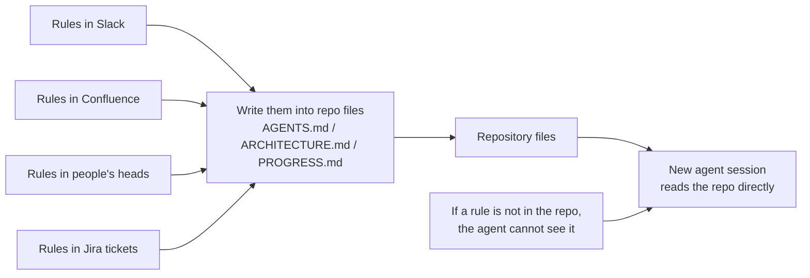
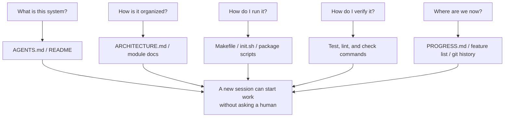

[Versión en chino →](../../../zh/lectures/lecture-03-why-the-repository-must-become-the-system-of-record/)

> Ejemplos de código: [código/](https://github.com/walkinglabs/learn-harness-engineering/blob/main/docs/es/lectures/lecture-03-why-the-repository-must-become-the-system-of-record/code/)
> Proyecto práctico: [Proyecto 02. Agent-readable workspace](./../../projects/project-02-agent-readable-workspace/index.md)

# Lección 03. Hacer the Repository Your Single Fuente of Truth

Your equipo's arquitectura decisions are scattered across Confluence, Slack, Jira, and a few senior engineers' heads. For humans this barely works — you can ask a colleague, search chat history, dig through docs. If all else falla, you can corner someone in the break room. But for an AI agent, information that's not in the repositorio simply does not exist.

This isn't an exaggeration. Think about what an agent's inputs actually are: system prompts and tarea descriptions, archivo contents from the repositorio, and herramienta execution salida. That's it. Your Slack history, Jira tickets, Confluence páginas, and that arquitectura decision you discussed with a colleague over coffee on Friday afternoon — the agent can't see any of it. It can't "go ask someone" or "search the chat history." It's an engineer locked inside the repositorio — everything outside, it knows nothing about.

So the question becomes: are you going to give this engineer a good map?

## What Belongs on the Map

OpenAI states this bluntly: **information that doesn't exist in the repo, doesn't exist for the agent.** They call this the "repo as spec" principle — the repositorio itself is the highest-authority specification document.

Anthropic's agents de larga duración documentation echoes this: persistent estado is a necessary condición for long-task continuity. Cross-sesión knowledge recoverability directly determines tarea éxito rates. And this estado must exist in the repositorio — because that's the only stable, accessible storage the agent has.

You might think: "Our equipo is small, knowledge is in everyone's heads, and it works fine." Sure, for humans. But if you're usando an agent, accept this fact: the agent can't ask people. Everything it needs to know must be written down and placed where it can find it.

This isn't about "escritura more documentation." It's about "putting decision information in the right place." A 50-line `ARCHITECTURE.md` in the `src/api/` directory is ten thousand times more useful than a 500-página diseño document in Confluence that nobody maintains. It's like a hand-drawn office map taped to your desk versus a beautiful architectural blueprint locked in a filing cabinet — the former is right there when you need it; the latter is technically superior but useless in the moment.

## Knowledge Visibility



How do you prueba whether your map is good enough? Ejecutar a "cold-start prueba": open a brand new agent sesión usando only repo contents, and see if it can answer five basic questions:



If it can't answer, the map has blank spots. Where the map is blank, the agent guesses — incorrecto guesses become errores, excessive guessing wastes contexto. And every new sesión guesses all over again. The cost of guessing is always higher than the cost of drawing the map properly in the first place.

## Core Concepts

- **Knowledge Visibility Gap**: The proportion of total proyecto knowledge that's NOT in the repositorio. The bigger the gap, the higher the agent's fallo rate. How much implícito knowledge about this proyecto lives in your head? Count it all, then see how much made it into the repo — the difference is your visibility gap.
- **System of Record**: The código repositorio as the authoritative source for proyecto decisions, arquitectura constraints, execution estado, and verificación standards. The repo has the final word, nowhere else counts. Like a map that marks "road closed" — you won't go down that road. But if that information only exists in Old Zhang's head, you have to ask Old Zhang every time.
- **Cold-Start Prueba**: The five questions above. How many it can answer is how completo your map is.
- **Discovery Cost**: How much contexto budget the agent burns to find a key piece of information in the repo. The more hidden the information, the higher the discovery cost, and the less budget left for the real tarea. Hiding critical information in a README ten directory levels deep is like locking the fire extinguisher in a basement safe — it exists, but you can't find it when you need it.
- **Knowledge Decay Rate**: The proportion of knowledge entries that become stale per unit of time. Documentation going out of sync with código is the biggest enemy — worse than no documentation at all.
- **ACID Analogy**: Applying database transaction principles (Atomicity, Consistency, Isolation, Durability) to agent gestión de estado. We'll expand on this below.

## How to Draw a Good Map

**Principle 1: Knowledge lives siguiente to código.** A rule about API endpoint authentication belongs siguiente to the API código, not buried in a giant global document. Put a short doc in each module directory explaining that module's responsibilities, interfaces, and special constraints. Like biblioteca shelf labels — you want history books, go straight to the shelf marked "History." No need to search the entire biblioteca.

**Principle 2: Usar a standardized entry archivo.** `AGENTS.md` (or `CLAUDE.md`) is the agent's "landing página." It doesn't need to contain all information, but it must let the agent quickly answer three questions: "What is this proyecto," "How do I ejecutar it," and "How do I verificar it." 50-100 lines is enough.

**Principle 3: Minimal but completo.** Every piece of knowledge should have a claro usar case. If removing a rule doesn't affect the agent's decision calidad, that rule shouldn't exist. But every question from the cold-start prueba must have an answer. This is a delicate balance — not too much, not too little, just enough.

**Principle 4: Update with código.** Bind knowledge updates to código cambios. The simplest approach: put arquitectura docs in the corresponding module directory. When you modify código, you naturally see the doc. After código cambios, CI can remind you to check if docs need updating.

**Concrete repo estructura**:

```
project/
├── AGENTS.md              # Entry: project overview, run commands, hard constraints
├── src/
│   ├── api/
│   │   ├── ARCHITECTURE.md  # API layer architecture decisions
│   │   └── ...
│   ├── db/
│   │   ├── CONSTRAINTS.md   # Database operation hard constraints
│   │   └── ...
│   └── ...
├── PROGRESS.md             # Current progress: done, in-progress, blocked
└── Makefile                # Standardized commands: setup, test, lint, check
```

## Managing Agent Estado with ACID Principles

This analogy comes from database transaction gestión — you might think it's overcomplicating things, but it actually gives you a very practical framework:

- **Atomicity**: Each "logical operation" (e.g., "añadir new endpoint and update pruebas") gets one git commit. If it falla midway, `git stash` to roll back. All or nothing — no "half terminado."
- **Consistency**: Define "consistent estado" verificación predicates — all pruebas pass, lint reports zero errors. The agent ejecuta verificación after each operation; inconsistent intermediate states don't get committed. Like a bank transfer — you can't debit without crediting.
- **Isolation**: When multiple agents work concurrently, diseño estado archivos to avoid race condiciones. Simple approach: each agent uses its own progress archivo, or usar git branches for isolation. Two chefs can't season the mismo pot simultaneously — who takes responsibility when it's over-salted?
- **Durability**: Critical proyecto knowledge lives in git-tracked archivos. Temporary estado can stay in sesión memory, but cross-sesión knowledge must be persisted to archivos. What's in your head doesn't count — only what's on paper counts.

## A Real Transformation Story

A equipo maintained an e-commerce platform with ~30 microservices. Arquitectura decisions (inter-service communication protocols, datos consistency strategies, API versioning reglas) were scattered across: Confluence (partially outdated), Slack (hard to search), a few senior engineers' heads (not scalable), and sporadic código comments (not systematic).

After introducing AI agents, 70% of tareas required human intervention. Nearly every fallo involved the agent violating some "everyone knows but nobody wrote down" implícito constraint. It's like a new employee whom nobody told "you need to post your lunch order in the group chat" — they guess incorrecto, get scolded, but after the scolding still nobody tells them the rule.

The equipo executed a transformation:
1. Created `AGENTS.md` in the repo root with proyecto resumen, tech stack versions, and global hard constraints
2. Added `ARCHITECTURE.md` in each microservice directory describing responsibilities, interfaces, and dependencies
3. Created a centralized `CONSTRAINTS.md` with hard constraints in explícito "MUST/MUST NOT" language
4. Added `PROGRESS.md` in each service directory tracking current work status

After transformation: the mismo agent could answer all key proyecto questions on cold empezar, and tarea finalización calidad improved significantly.

## Ideas clave

- Knowledge not in the repo doesn't exist for the agent. Putting critical decisions in the repo is the most basic harness investment — draw a good map so you don't get lost.
- Usar the "cold-start prueba" to evaluate repo calidad: can a fresh sesión answer five basic questions usando only repo contents?
- Knowledge should be near código, minimal but completo, and updated with código. It's not about escritura more docs — it's about putting information in the right place.
- Usar ACID principles for agent estado: atomic commits, consistency verificación, concurrency isolation, durable critical knowledge.
- Knowledge decay is the biggest enemy. Documentation out of sync with código is more dangerous than no documentation — it sends the agent in the incorrecto direction while they think they're right.

## Lecturas adicionales

- [OpenAI: Harness Ingeniería](https://openai.com/index/harness-engineering/)
- [Anthropic: Effective Harnesses for Long-Running Agents](https://www.anthropic.com/engineering/effective-harnesses-for-long-running-agents)
- [Infrastructure as Código — Martin Fowler](https://martinfowler.com/bliki/InfrastructureAsCode.html)
- [ADR: Arquitectura Decision Records](https://adr.github.io/)
- [The Twelve-Factor App](https://12factor.net/)

## Ejercicios

1. **Cold-start prueba**: Open a completely fresh agent sesión in your proyecto (no verbal contexto, repo contents only). Ask it five questions: What is this system? How is it organized? How do I ejecutar it? How do I verificar it? What's the current progress? Record what it can't answer, then improve the repo until it can.

2. **Knowledge externalization quantification**: Lista all decisions and constraints important for development work in your proyecto. Mark each as inside or outside the repo. Calculate your knowledge visibility gap (proportion outside repo). Hacer a plan to get it below 10%.

3. **ACID assessment**: Evaluate your proyecto's gestión de estado usando this lección's ACID analogy. Atomicity — can agent operations be cleanly rolled back? Consistency — is there "consistent estado" verificación? Isolation — do concurrent agents paso on each other? Durability — is all cross-sesión knowledge persisted?
