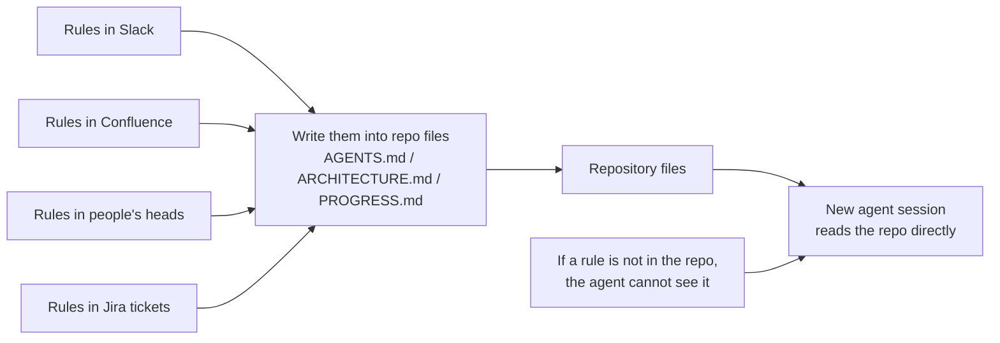
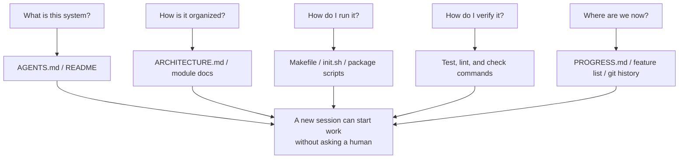

[中文版本 →](../../../zh/lectures/lecture-03-why-the-repository-must-become-the-system-of-record/)

> Ejemplos de código: [code/](https://github.com/walkinglabs/learn-harness-engineering/blob/main/docs/es/lectures/lecture-03-why-the-repository-must-become-the-system-of-record/code/)
> Proyecto práctico: [Proyecto 02. Workspace legible por agents](./../../projects/project-02-agent-readable-workspace/index.md)

# Lección 03. Haz del repositorio tu fuente de verdad

Las decisiones arquitectónicas de tu equipo están repartidas entre Confluence, Slack, Jira y la cabeza de algunos ingenieros senior. Para humanos esto apenas funciona: puedes preguntar a un compañero, buscar en el historial del chat o revisar documentación. Pero para un AI agent, la información que no está en el repositorio simplemente no existe.

No es una exageración. Las entradas reales del agent son prompts del sistema, descripción de la tarea, archivos del repo y salidas de herramientas. Tu historial de Slack, tickets de Jira, páginas de Confluence y aquella decisión de arquitectura tomada tomando café un viernes no están disponibles. El agent es como un ingeniero encerrado dentro del repositorio: de lo que está fuera no sabe nada.

La pregunta es: ¿vas a darle un buen mapa?

## Qué debe estar en el mapa

OpenAI lo expresa sin rodeos: **la información que no existe en el repo no existe para el agent.** Es el principio de "repo as spec": el repositorio es el documento de especificación con mayor autoridad.

Anthropic llega a la misma conclusión desde otro ángulo: la persistencia de estado es condición necesaria para continuidad en tareas largas, y la recuperabilidad del conocimiento entre sesiones determina directamente la tasa de éxito. Ese estado debe vivir en el repo porque es el almacenamiento estable y accesible que el agent tiene.

Quizá pienses que tu equipo es pequeño y el conocimiento está en la cabeza de todos. Para humanos puede servir. Si usas agents, acepta este hecho: el agent no puede preguntar a la gente. Todo lo que necesite debe estar escrito y colocado donde pueda encontrarlo.

No se trata de "escribir más documentación". Se trata de poner información de decisión en el lugar correcto. Un `ARCHITECTURE.md` de 50 líneas dentro de `src/api/` es mucho más útil que un documento de diseño de 500 páginas en Confluence que nadie mantiene. Es como tener un mapa dibujado pegado a la mesa frente a un plano arquitectónico perfecto guardado bajo llave: el primero está disponible cuando hace falta.

## Visibilidad del conocimiento



¿Cómo sabes si el mapa es suficiente? Ejecuta una "prueba de arranque en frío": abre una sesión nueva de agent usando solo el contenido del repo y comprueba si puede responder cinco preguntas:



Si no puede responder, el mapa tiene huecos. Donde el mapa está en blanco, el agent adivina. Las conjeturas erróneas se convierten en bugs y las conjeturas excesivas gastan contexto. El coste de adivinar siempre es mayor que el coste de dibujar bien el mapa desde el principio.

## Conceptos centrales

- **Brecha de visibilidad del conocimiento**: proporción del conocimiento total del proyecto que no está en el repositorio. Cuanto mayor es la brecha, mayor es la tasa de fallo del agent.
- **Sistema de registro**: el repositorio de código como fuente autoritativa para decisiones de proyecto, restricciones arquitectónicas, estado de ejecución y estándares de verificación. El repo tiene la última palabra.
- **Prueba de arranque en frío**: las cinco preguntas anteriores. Cuantas más pueda responder una sesión nueva, más completo es el mapa.
- **Coste de descubrimiento**: presupuesto de contexto que el agent gasta para encontrar una pieza clave de información. Cuanto más escondida está, menos presupuesto queda para la tarea real.
- **Tasa de degradación del conocimiento**: proporción de entradas de conocimiento que quedan obsoletas con el tiempo. La documentación desincronizada con el código puede ser peor que no tener documentación.
- **Analogía ACID**: aplicar principios de transacciones de base de datos (Atomicity, Consistency, Isolation, Durability) a la gestión de estado de agents.

## Cómo dibujar un buen mapa

**Principio 1: el conocimiento vive junto al código.** Una regla sobre autenticación de endpoints debe estar cerca del código de API, no enterrada en un documento global. Pon una nota corta en cada módulo con responsabilidades, interfaces y restricciones especiales.

**Principio 2: usa un archivo de entrada estándar.** `AGENTS.md` o `CLAUDE.md` es la página de aterrizaje del agent. No necesita contenerlo todo, pero debe responder rápido: qué es el proyecto, cómo se ejecuta y cómo se verifica. Entre 50 y 100 líneas suele bastar.

**Principio 3: mínimo pero completo.** Cada pieza de conocimiento debe tener un caso de uso claro. Si quitar una regla no afecta a la calidad de decisión del agent, esa regla sobra. Pero las cinco preguntas de arranque en frío deben tener respuesta.

**Principio 4: actualiza con el código.** Vincula las actualizaciones de conocimiento a cambios de código. La forma más simple es poner docs de arquitectura en el directorio del módulo correspondiente: al modificar código, ves la doc y recuerdas actualizarla.

**Estructura concreta de repo:**

```text
project/
├── AGENTS.md              # Entrada: overview, comandos, restricciones duras
├── src/
│   ├── api/
│   │   ├── ARCHITECTURE.md  # Decisiones de arquitectura de la capa API
│   │   └── ...
│   ├── db/
│   │   ├── CONSTRAINTS.md   # Restricciones duras de operaciones de datos
│   │   └── ...
│   └── ...
├── PROGRESS.md             # Progreso actual: done, in-progress, blocked
└── Makefile                # Comandos estándar: setup, test, lint, check
```

## Gestionar estado del agent con principios ACID

La analogía viene de la gestión de transacciones. Puede parecer excesiva, pero da un marco práctico:

- **Atomicidad**: cada operación lógica, como "añadir endpoint y actualizar pruebas", recibe un commit. Si falla a mitad, se revierte. Todo o nada.
- **Consistencia**: define predicados de estado consistente: pruebas en verde, lint sin errores. El agent verifica después de cada operación; estados intermedios inconsistentes no se commitean.
- **Aislamiento**: si varios agents trabajan en paralelo, diseña archivos de estado para evitar carreras. Cada agent puede usar su propio progress file o su propia rama.
- **Durabilidad**: el conocimiento crítico vive en archivos versionados por git. El estado temporal puede vivir en la sesión, pero el conocimiento entre sesiones debe persistirse.

## Historia real de transformación

Un equipo mantenía una plataforma e-commerce con unos 30 microservicios. Las decisiones arquitectónicas estaban dispersas: Confluence parcialmente obsoleto, Slack difícil de buscar, conocimiento en la cabeza de seniors y comentarios esporádicos.

Tras introducir AI agents, el 70% de las tareas requerían intervención humana. Casi todos los fallos venían de violar una restricción implícita que "todo el mundo sabía" pero nadie había escrito.

El equipo transformó el repo:

1. Creó `AGENTS.md` en la raíz con overview, versiones del stack y restricciones globales.
2. Añadió `ARCHITECTURE.md` en cada microservicio con responsabilidades, interfaces y dependencias.
3. Creó `CONSTRAINTS.md` con restricciones explícitas en lenguaje `MUST`/`MUST NOT`.
4. Añadió `PROGRESS.md` en cada servicio para seguir el trabajo actual.

Después, el mismo agent podía responder las preguntas clave desde una sesión fría y la calidad de finalización mejoró de forma clara.

## Ideas clave

- El conocimiento que no está en el repo no existe para el agent.
- Usa la prueba de arranque en frío para evaluar la calidad del repositorio.
- El conocimiento debe estar cerca del código, ser mínimo pero completo y actualizarse con el código.
- Usa principios ACID para estado de agents: commits atómicos, verificación de consistencia, aislamiento de concurrencia y conocimiento duradero.
- La degradación del conocimiento es el enemigo principal. Documentación desactualizada puede enviar al agent en la dirección equivocada con mucha confianza.

## Lecturas adicionales

- [OpenAI: Harness Engineering](https://openai.com/index/harness-engineering/)
- [Anthropic: Effective Harnesses for Long-Running Agents](https://www.anthropic.com/engineering/effective-harnesses-for-long-running-agents)
- [Infrastructure as Code — Martin Fowler](https://martinfowler.com/bliki/InfrastructureAsCode.html)
- [ADR: Architecture Decision Records](https://adr.github.io/)
- [The Twelve-Factor App](https://12factor.net/)

## Ejercicios

1. **Prueba de arranque en frío**: abre una sesión completamente nueva de agent en tu proyecto, sin contexto verbal. Pregúntale: qué es el sistema, cómo está organizado, cómo se ejecuta, cómo se verifica y cuál es el progreso actual. Registra qué no puede responder y mejora el repo.

2. **Cuantificación de externalización**: lista decisiones y restricciones importantes para desarrollar en tu proyecto. Marca cuáles están dentro y fuera del repo. Calcula la brecha de visibilidad y diseña un plan para bajarla del 10%.

3. **Evaluación ACID**: evalúa la gestión de estado de tu proyecto. ¿Las operaciones son reversibles?, ¿hay verificación de estado consistente?, ¿los agents concurrentes se pisan?, ¿el conocimiento entre sesiones persiste?
