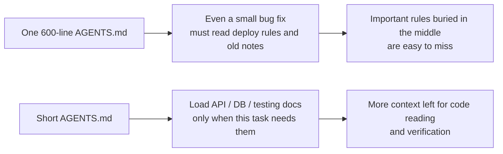
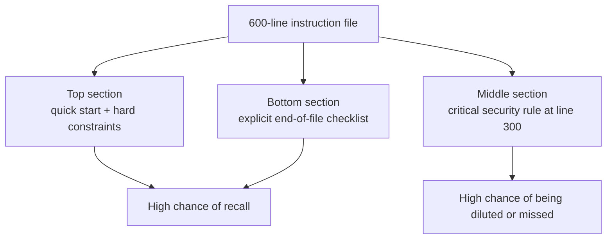

[Versión en chino →](../../../zh/lectures/lecture-04-why-one-giant-instruction-file-fails/)

> Ejemplos de código: [código/](https://github.com/walkinglabs/learn-harness-engineering/blob/main/docs/es/lectures/lecture-04-why-one-giant-instruction-file-fails/code/)
> Proyecto práctico: [Proyecto 02. Agent-readable workspace](./../../projects/project-02-agent-readable-workspace/index.md)

# Lección 04. Split Instrucciones Across Archivos

You got serious about harness ingeniería — good for you. You created an `AGENTS.md` and packed every rule, constraint, and lesson learned you could think of into it. One month later the archivo bloated to 300 lines, two months 450 lines, three months 600 lines. Then you notice the agent's performance is actually getting worse — on a simple bug arreglar, the agent burns tons of contexto processing irrelevant deployment instrucciones; a critical security constraint buried at line 300 gets ignored outright; three contradictory código style reglas mean the agent picks one at random each time.

This is the "giant instrucción archivo" trap. It's like overpacking a suitcase — everything seems useful, so you cram it all in until the zipper is about to burst. Finding your cambio of underwear means emptying the entire bag. You carried a full suitcase, but you actually usado maybe a third of what's inside.

## The Vicious Cycle at the Root

The most common vicious cycle goes like this: agent hace a mistake, you say "añadir a rule to prevent this," añadir it to AGENTS.md, it works temporarily, agent hace a diferente mistake, añadir another rule, repeat, archivo bloats out of control.

This isn't your fault. It's a very natural reaction — "añadir a rule" each time something goes incorrecto feels reasonable, like tossing one more thing into your bag every time you leave the house "just in case." But the cumulative effect is disastrous. Let's look at what goes incorrecto specifically.

**Contexto budget gets eaten alive.** The agent's contexto window is finite. Say your agent has a 200K token window (Claude's standard). A bloated instrucción archivo might eat 10-20K tokens. Seems like there's still plenty of room? But a complex tarea might need to leer dozens of source archivos, herramienta execution salida also takes contexto, and conversation history accumulates. By the time the agent needs to entender the código, the budget is already tight — like a suitcase so full of "just in case" items that there's no room for your laptop.

**Lost in the middle.** The "Lost in the Middle" paper (Liu et al., 2023) clearly demonstrated that LLMs utilize information in the middle of long texts significantly less effectively than at the beginning or end. Your AGENTS.md is 600 lines, and line 300 says "all database queries must usar parameterized queries" — that's a security hard constraint. But it's buried in the middle, and the agent will almost certainly ignore it. Like that bottle of sunscreen at the bottom of your overstuffed suitcase — you know it's there, you dig three times, can't find it, end up buying another one.

**Priority conflicts.** The archivo mixes non-negotiable hard constraints ("never usar eval()"), important diseño guidelines ("prefer functional style"), and a específico historical lesson ("fixed a WebSocket memory leak last week, watch for similar patterns"). These three reglas have completely diferente importance levels, but they look identical in the archivo. The agent has no fiable signal to distinguish — like your passport and charging cable jumbled together in the suitcase, no way to tell which is more urgent.

**Maintenance decay.** Large archivos are inherently hard to maintain. Outdated instrucciones rarely get deleted — because the consequences of deletion are uncertain ("maybe something else depends on this rule?"), while adding new instrucciones feels free. The resultado: the archivo only grows, never shrinks, and signal-to-noise ratio continuously declines. This is exactly like technical debt accumulation in software.

**Contradiction accumulation.** Instrucciones added at diferente times empezar contradicting each other — one says "usar TypeScript strict mode," another says "some legacy archivos allow any types." The agent randomly picks one to follow each time. Like your mom saying "dress warm" and your dad saying "don't wear too much," and you standing at the door not knowing who to listen to.

## Core Concepts

- **Instrucción Bloat**: When an instrucción archivo occupies more than 10-15% of the contexto window, it starts crowding out budget for código lectura and tarea reasoning. A 600-line `AGENTS.md` might consume 10,000-20,000 tokens — that's 8-15% of a 128K window eaten before the agent even starts.
- **Lost in the Middle Effect**: Liu et al.'s 2023 research proved that LLMs usar information in the middle of long texts significantly less effectively than information at the beginning or end. A critical constraint buried at line 300 of a 600-line archivo has a very high probability of being effectively ignored.
- **Instrucción Signal-to-Noise Ratio (SNR)**: The proportion of instrucciones in a archivo that are relevant to the current tarea. Being forced to leer 50 lines of deployment instrucciones during a bug arreglar — that's low SNR.
- **Routing Archivo**: A short entry archivo whose core function is pointing the agent to more detailed docs, not containing everything itself. 50-200 lines is plenty.
- **Progressive Disclosure**: Give resumen information first, detailed information when needed. Good harness diseño is like good UI diseño — don't dump all options on the usuario at once.
- **Priority Ambiguity**: When all instrucciones appear in the mismo format and location, the agent can't distinguish non-negotiable hard constraints from suggestive soft guidelines.

## Instrucción Arquitectura





## How to Split

Core principle: keep frequently-needed information at hand, tuck away occasionally-needed information, and leave behind what you'll never usar.

The entry archivo `AGENTS.md` stays at 50-200 lines, containing only the most frequently usado items — proyecto resumen (one or two sentences), first-run comandos (`hacer setup && hacer prueba`), global hard constraints (no more than 15 non-negotiable reglas), and links to topic documents (one-line description + applicability condición).

```markdown
# AGENTS.md

## Project Overview
Python 3.11 FastAPI backend, PostgreSQL 15 database.

## Quick Start
- Install: `make setup`
- Test: `make test`
- Full verification: `make check`

## Hard Constraints
- All APIs must use OAuth 2.0 authentication
- All database queries must use SQLAlchemy 2.0 syntax
- All PRs must pass pytest + mypy --strict + ruff check

## Topic Docs
- `docs/api-patterns.md` — lectura requerida al añadir endpoints
- `docs/database-rules.md` — requerido al modificar operaciones de base de datos
- `docs/testing-standards.md` — referencia al escribir pruebas
```

Each topic document is 50-150 lines, organized by subject in the `docs/` directory or siguiente to the corresponding module. The agent only reads them when needed. Like packing cubes in a suitcase — underwear in one cube, toiletries in another, chargers in a third. Finding things doesn't require emptying the whole bag.

Some information is better placed directly in the código — type definitions, interface comments, explanations in config archivos. The agent naturally sees these when lectura código, no need to duplicate in instrucciones.

Every instrucción should have a source ("why was this rule added?"), an applicability condición ("when is this rule needed?"), and an expiry condición ("under what circumstances can this rule be removed?"). Audit regularly, remove outdated, redundant, and contradictory entries. Manage your instrucciones like you manage código dependencies — unused dependencies should be deleted, otherwise they just slow the system down.

If an instrucción must be in the entry archivo, put it at the top or bottom — never the middle. The "lost in the middle" effect tells us that LLMs usar information at the extremes significantly better than in the center. But the better approach is to move instrucciones to topic documents for on-demand loading.

Both OpenAI and Anthropic implicitly soporte the splitting approach. OpenAI says entry archivos should be "short and routing-oriented," Anthropic says long-running agent control information should be "concise and high-priority." Both are saying the mismo thing: don't stuff everything into one archivo. A suitcase needs organizing, not just brute-force cramming.

## Real-World Ejemplo

A SaaS equipo's `AGENTS.md` ballooned from 50 lines to 600. Contents mixed tech stack versions, coding standards, historical bug arreglar notes, API usage guías, deployment procedures, and equipo members' personal preferences — the entire suitcase bursting at the seams.

Agent performance iniciado declining noticeably: during simple bug arregla the agent spent lots of contexto processing irrelevant deployment instrucciones; the security constraint "all database queries must usar parameterized queries" was buried at line 300 and frequently ignored; three contradictory código style reglas caused random agent behavior.

The equipo executed a "suitcase reorganization":
1. `AGENTS.md` trimmed to 80 lines: only proyecto resumen, ejecutar comandos, and 15 global hard constraints
2. Created topic documents: `docs/api-patterns.md` (120 lines), `docs/database-rules.md` (60 lines), `docs/testing-standards.md` (80 lines)
3. Added topic document links in the routing archivo
4. Historical notes either converted to prueba cases or deleted

After refactoring: mismo tarea set éxito rate went from 45% to 72%. Security constraint compliance went from 60% to 95% — because it moved from the archivo middle to the routing archivo top, no longer "lost in the middle."

## Ideas clave

- "Añadir a rule" is short-term pain relief, long-term poison. Before adding a rule, ask: would this be better in a topic document? Don't just keep cramming things into the suitcase.
- The entry archivo is a router, not an encyclopedia. 50-200 lines with resumen, hard constraints, and links only.
- Leverage the "lost in the middle" effect: important info goes at the top or bottom; unimportant info moves to topic documents.
- Manage instrucción bloat like technical debt. Regular audits, every instrucción needs a source, applicability condición, and expiry condición.
- After splitting, SNR improves and the agent spends more contexto budget on real tareas instead of processing irrelevant instrucciones.

## Lecturas adicionales

- [OpenAI: Harness Ingeniería](https://openai.com/index/harness-engineering/)
- [Anthropic: Effective Harnesses for Long-Running Agents](https://www.anthropic.com/engineering/effective-harnesses-for-long-running-agents)
- [Lost in the Middle: How Language Modelos Usar Long Contexts](https://arxiv.org/abs/2307.03172)
- [HumanLayer: Harness Ingeniería for Coding Agents](https://humanlayer.dev/articles/harness-engineering-for-coding-agents/)
- [Nielsen Norman Group: Progressive Disclosure](https://www.nngroup.com/articles/progressive-disclosure/)

## Ejercicios

1. **SNR audit**: Take your current entry instrucción archivo and lista all instrucción entries. Pick 5 diferente common tarea types and mark whether each instrucción is relevant to that tarea. Calculate SNR for each tarea type. Instrucciones that are noise for most tareas should move to topic documents.

2. **Progressive disclosure refactor**: If you have an instrucción archivo over 300 lines, split it into: (a) a routing archivo under 100 lines, (b) 3-5 topic documents. Ejecutar the mismo set of tareas (at least 5) before and after, comparar éxito rates.

3. **Lost in the middle verificación**: In a long instrucción archivo, place a critical constraint at the top, middle, and bottom respectively, ejecutando the mismo tarea set each time (at least 5 ejecuta per position). See if there's a difference in compliance rate. You might be surprised by how potente the position effect is.
