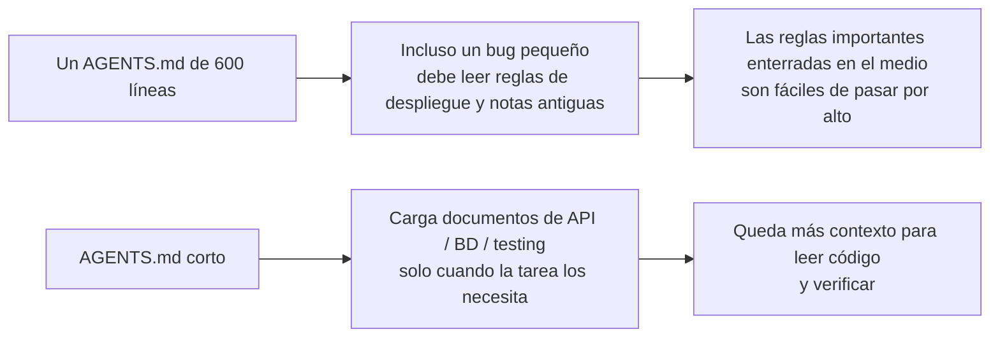
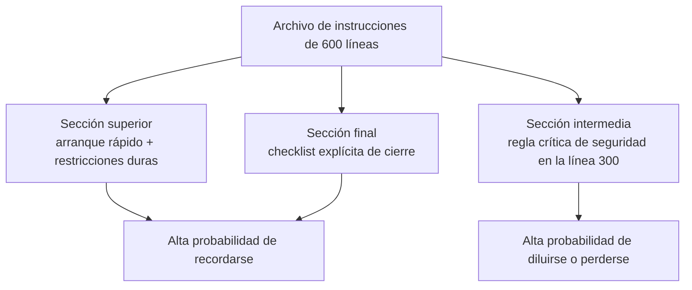

[Versión en chino →](../../../zh/lectures/lecture-04-why-one-giant-instruction-file-fails/)

> Ejemplos de código: [code/](https://github.com/walkinglabs/learn-harness-engineering/blob/main/docs/es/lectures/lecture-04-why-one-giant-instruction-file-fails/code/)
> Proyecto práctico: [Proyecto 02. Agent-readable workspace](./../../projects/project-02-agent-readable-workspace/index.md)

# Lección 04. Dividir las instrucciones entre varios archivos

Te tomaste en serio la ingeniería de harnesses. Creaste un `AGENTS.md` y metiste en él todas las reglas, restricciones y lecciones aprendidas que se te ocurrieron. Un mes después el archivo tenía 300 líneas; dos meses después, 450; tres meses después, 600. Entonces notas que el rendimiento del agent está empeorando: en una corrección sencilla, consume muchísimo contexto procesando instrucciones de despliegue irrelevantes; una restricción crítica de seguridad enterrada en la línea 300 se ignora por completo; tres reglas contradictorias de estilo hacen que el agent elija una al azar cada vez.

Esta es la trampa del "archivo de instrucciones gigante". Es como preparar una maleta metiendo cosas "por si acaso": todo parece útil, así que lo comprimes todo hasta que la cremallera casi revienta. Para encontrar una muda tienes que vaciar la maleta entera. Llevabas una maleta completa, pero en realidad usaste quizá un tercio de lo que había dentro.

## El ciclo vicioso de fondo

El ciclo vicioso más común es este: el agent comete un error, tú dices "añade una regla para evitarlo", la añades a `AGENTS.md`, funciona temporalmente, el agent comete otro error distinto, añades otra regla, repites, y el archivo crece sin control.

No es culpa tuya. Es una reacción natural: "añadir una regla" cada vez que algo sale mal parece razonable, como meter una cosa más en la maleta cada vez que sales de casa "por si acaso". Pero el efecto acumulado es desastroso. Veamos qué falla exactamente.

**El presupuesto de contexto se consume rápidamente.** La ventana de contexto del agent es finita. Supongamos que tu agent tiene una ventana de 200K tokens, el estándar de Claude. Un archivo de instrucciones inflado puede consumir 10-20K tokens. ¿Parece que todavía queda mucho espacio? En una tarea compleja, el agent puede necesitar leer decenas de archivos fuente, la salida de las herramientas también ocupa contexto y el historial de conversación se acumula. Cuando por fin necesita entender el código, el presupuesto ya está apretado: como una maleta tan llena de cosas "por si acaso" que no queda sitio para el portátil.

**Lost in the middle.** El artículo "Lost in the Middle" (Liu et al., 2023) demostró con claridad que los LLM aprovechan la información situada en mitad de textos largos de forma bastante menos eficaz que la información del principio o del final. Tu `AGENTS.md` tiene 600 líneas y en la línea 300 dice "all database queries must use parameterized queries": una restricción dura de seguridad. Pero está enterrada en el medio, y es muy probable que el agent la ignore. Como ese protector solar en el fondo de la maleta sobrecargada: sabes que está ahí, rebuscas tres veces, no lo encuentras y acabas comprando otro.

**Conflictos de prioridad.** El archivo mezcla restricciones duras no negociables ("never use eval()"), directrices importantes de diseño ("prefer functional style") y una lección histórica concreta ("la semana pasada corregimos una fuga de memoria en WebSocket; vigila patrones similares"). Estas tres reglas tienen niveles de importancia completamente distintos, pero en el archivo se ven iguales. El agent no tiene una señal fiable para distinguirlas: como llevar el pasaporte y el cable de carga revueltos en la maleta sin ninguna pista de cuál es más urgente.

**Deterioro de mantenimiento.** Los archivos grandes son difíciles de mantener por naturaleza. Las instrucciones obsoletas rara vez se borran, porque las consecuencias de borrarlas son inciertas ("¿y si otra cosa depende de esta regla?"), mientras que añadir instrucciones nuevas parece gratis. Resultado: el archivo solo crece, nunca se reduce, y la relación señal-ruido cae continuamente. Es exactamente la acumulación de deuda técnica aplicada a las instrucciones.

**Acumulación de contradicciones.** Las instrucciones añadidas en momentos distintos empiezan a contradecirse: una dice "usa TypeScript en modo estricto", otra dice "algunos archivos heredados permiten tipos `any`". El agent elige al azar cuál seguir cada vez. Como si una persona te dijera "abrígate" y otra "no te pongas demasiada ropa", y tú te quedaras en la puerta sin saber a quién hacer caso.

## Conceptos clave

- **Inflación de instrucciones**: cuando un archivo de instrucciones ocupa más del 10-15% de la ventana de contexto, empieza a desplazar el presupuesto necesario para leer código y razonar sobre la tarea. Un `AGENTS.md` de 600 líneas puede consumir 10.000-20.000 tokens: entre el 8% y el 15% de una ventana de 128K antes de que el agent siquiera empiece.
- **Efecto Lost in the Middle**: la investigación de Liu et al. de 2023 probó que los LLM usan la información situada en mitad de textos largos bastante peor que la del principio o el final. Una restricción crítica en la línea 300 de un archivo de 600 líneas tiene una probabilidad muy alta de quedar efectivamente ignorada.
- **Relación señal-ruido de instrucciones (SNR)**: proporción de instrucciones de un archivo que son relevantes para la tarea actual. Tener que leer 50 líneas de instrucciones de despliegue durante una corrección de bug es una SNR baja.
- **Archivo enrutador**: archivo de entrada corto cuya función principal es dirigir al agent hacia documentación más detallada, no contenerlo todo. Entre 50 y 200 líneas suele bastar.
- **Divulgación progresiva**: dar primero la visión general y mostrar los detalles cuando hacen falta. Un buen diseño de harness se parece a un buen diseño de UI: no vuelca todas las opciones sobre el usuario de una vez.
- **Ambigüedad de prioridad**: cuando todas las instrucciones aparecen con el mismo formato y en la misma ubicación, el agent no puede distinguir las restricciones duras no negociables de las recomendaciones flexibles.

## Arquitectura de instrucciones





## Cómo dividir

Principio central: conserva a mano la información que se necesita con frecuencia, aparta la que solo se necesita ocasionalmente y elimina lo que no se va a usar.

El archivo de entrada `AGENTS.md` debe quedarse en 50-200 líneas y contener solo lo más usado: resumen del proyecto en una o dos frases, comandos iniciales (`make setup && make test`), restricciones globales duras (no más de 15 reglas no negociables) y enlaces a documentos temáticos con una descripción de una línea y una condición de aplicabilidad.

```markdown
# AGENTS.md

## Project Overview
Python 3.11 FastAPI backend, PostgreSQL 15 database.

## Quick Start
- Install: `make setup`
- Test: `make test`
- Full verification: `make check`

## Hard Constraints
- All APIs must use OAuth 2.0 authentication
- All database queries must use SQLAlchemy 2.0 syntax
- All PRs must pass pytest + mypy --strict + ruff check

## Topic Docs
- [API Design Patterns](docs/api-patterns.md) — lectura obligatoria al añadir endpoints
- [Database Rules](docs/database-rules.md) — obligatorio al modificar operaciones de base de datos
- [Testing Standards](docs/testing-standards.md) — referencia al escribir pruebas
```

Cada documento temático ocupa 50-150 líneas y se organiza por tema dentro de `docs/` o junto al módulo correspondiente. El agent solo los lee cuando los necesita. Como los organizadores dentro de una maleta: ropa interior en uno, artículos de aseo en otro, cargadores en un tercero. Encontrar algo no requiere vaciar la maleta entera.

Parte de la información encaja mejor directamente en el código: definiciones de tipos, comentarios de interfaces, explicaciones en archivos de configuración. El agent la ve de forma natural al leer el código, sin necesidad de duplicarla en instrucciones.

Cada instrucción debería tener una fuente ("¿por qué se añadió esta regla?"), una condición de aplicabilidad ("¿cuándo se necesita?") y una condición de caducidad ("¿en qué circunstancias puede retirarse?"). Audita con regularidad y elimina entradas obsoletas, redundantes o contradictorias. Gestiona las instrucciones como gestionas las dependencias de código: las dependencias sin uso deben borrarse; si no, solo ralentizan el sistema.

Si una instrucción debe estar en el archivo de entrada, colócala arriba o abajo, nunca en medio. El efecto "lost in the middle" nos dice que los LLM aprovechan mucho mejor la información de los extremos que la del centro. Pero el enfoque mejor es mover las instrucciones a documentos temáticos para cargarlas bajo demanda.

Tanto OpenAI como Anthropic respaldan implícitamente este enfoque de división. OpenAI dice que los archivos de entrada deben ser "short and routing-oriented"; Anthropic dice que la información de control para agents de larga duración debe ser "concise and high-priority". Están diciendo lo mismo: no metas todo en un único archivo. La maleta necesita organización, no más fuerza bruta.

## Ejemplo real

El `AGENTS.md` de un equipo SaaS pasó de 50 líneas a 600. Mezclaba versiones del stack técnico, estándares de código, notas históricas de bugs corregidos, guías de uso de API, procedimientos de despliegue y preferencias personales de miembros del equipo: una maleta entera a punto de reventar.

El rendimiento del agent empezó a caer de forma visible: durante correcciones sencillas, gastaba mucho contexto procesando instrucciones de despliegue irrelevantes; la restricción de seguridad "all database queries must use parameterized queries" estaba enterrada en la línea 300 y se ignoraba con frecuencia; tres reglas contradictorias de estilo producían comportamiento aleatorio.

El equipo ejecutó una "reorganización de la maleta":
1. `AGENTS.md` reducido a 80 líneas: solo resumen del proyecto, comandos de ejecución y 15 restricciones globales duras.
2. Documentos temáticos creados: `docs/api-patterns.md` (120 líneas), `docs/database-rules.md` (60 líneas), `docs/testing-standards.md` (80 líneas).
3. Enlaces a documentos temáticos añadidos al archivo enrutador.
4. Notas históricas convertidas en casos de prueba o eliminadas.

Después de la refactorización, la tasa de éxito del mismo conjunto de tareas pasó del 45% al 72%. El cumplimiento de la restricción de seguridad pasó del 60% al 95%, porque se movió desde el medio del archivo hasta la parte superior del archivo enrutador y dejó de estar "lost in the middle".

## Ideas clave

- "Añadir una regla" alivia el dolor a corto plazo y envenena el sistema a largo plazo. Antes de añadir una regla, pregunta: ¿encajaría mejor en un documento temático? No sigas metiendo cosas en la maleta.
- El archivo de entrada es un enrutador, no una enciclopedia. Entre 50 y 200 líneas con resumen, restricciones duras y enlaces.
- Aprovecha el efecto "lost in the middle": la información importante va arriba o abajo; la menos importante se mueve a documentos temáticos.
- Gestiona la inflación de instrucciones como deuda técnica. Auditorías periódicas; cada instrucción necesita fuente, condición de aplicabilidad y condición de caducidad.
- Después de dividir, mejora la SNR y el agent dedica más presupuesto de contexto a la tarea real en vez de procesar instrucciones irrelevantes.

## Lecturas adicionales

- [OpenAI: Harness Engineering](https://openai.com/index/harness-engineering/)
- [Anthropic: Effective Harnesses for Long-Running Agents](https://www.anthropic.com/engineering/effective-harnesses-for-long-running-agents)
- [Lost in the Middle: How Language Models Use Long Contexts](https://arxiv.org/abs/2307.03172)
- [HumanLayer: Harness Engineering for Coding Agents](https://humanlayer.dev/articles/harness-engineering-for-coding-agents/)
- [Nielsen Norman Group: Progressive Disclosure](https://www.nngroup.com/articles/progressive-disclosure/)

## Ejercicios

1. **Auditoría de SNR**: toma tu archivo de instrucciones de entrada actual y lista todas sus instrucciones. Elige 5 tipos comunes de tarea y marca si cada instrucción es relevante para cada tarea. Calcula la SNR para cada tipo de tarea. Las instrucciones que son ruido para la mayoría de tareas deben moverse a documentos temáticos.

2. **Refactorización con divulgación progresiva**: si tienes un archivo de instrucciones de más de 300 líneas, divídelo en: (a) un archivo enrutador de menos de 100 líneas, (b) 3-5 documentos temáticos. Ejecuta el mismo conjunto de tareas, al menos 5, antes y después; compara las tasas de éxito.

3. **Verificación de lost in the middle**: en un archivo de instrucciones largo, coloca una restricción crítica arriba, en medio y abajo respectivamente, ejecutando el mismo conjunto de tareas cada vez, con al menos 5 ejecuciones por posición. Comprueba si cambia la tasa de cumplimiento. Puede sorprenderte la fuerza del efecto de posición.
