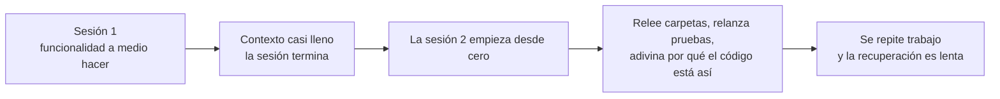
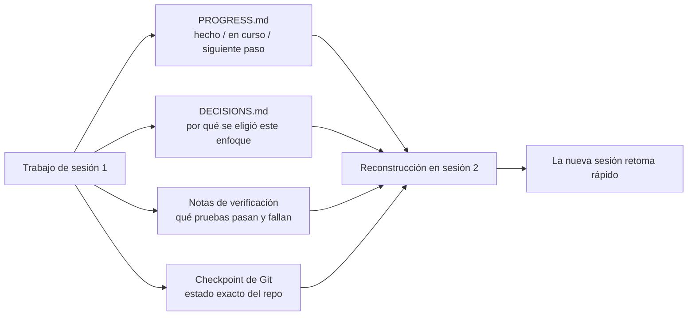

[Versión en chino →](../../../zh/lectures/lecture-05-why-long-running-tasks-lose-continuity/)

> Ejemplos de código: [code/](https://github.com/walkinglabs/learn-harness-engineering/blob/main/docs/es/lectures/lecture-05-why-long-running-tasks-lose-continuity/code/)
> Proyecto práctico: [Proyecto 03. Multi-session continuity](./../../projects/project-03-multi-session-continuity/index.md)

# Lección 05. Mantener vivo el contexto entre sesiones

Le pides a Claude Code que implemente una funcionalidad completa. Trabaja durante 30 minutos, hace casi todo, pero el contexto se está agotando. Abres una sesión nueva para continuar y descubres que no recuerda qué decisiones se tomaron, por qué se eligió la opción A en vez de la B, qué archivos ya se modificaron ni en qué estado están las pruebas. Dedica 15 minutos a explorar de nuevo el proyecto y puede acabar siendo inconsistente con el enfoque anterior.

Imagina que fueras un constructor que olvidara todo cada mañana al despertar. Tendrías que volver a familiarizarte con toda la obra: qué pared está a medio hacer, por qué se eligieron ladrillos rojos en vez de azules, por dónde pasan las tuberías. Peor aún: podrías arrancar una ventana instalada ayer simplemente porque no recuerdas que ya estaba hecha.

Esta es exactamente la situación a la que se enfrentan los agents de programación en tareas que atraviesan varias sesiones. Esta lección explica por qué los agents "se quedan en blanco" durante tareas largas y cómo la persistencia estructurada de estado puede convertirlos en constructores con un diario diario fiable: siguen teniendo amnesia, pero el diario lo recuerda todo.

## Las ventanas de contexto no son infinitas

Las ventanas de contexto son finitas. Esto no se resuelve solo con modelos más grandes: aunque las ventanas crezcan a 1M tokens, las tareas complejas seguirán agotándolas. Los agents no solo generan código; entienden bases de código, siguen su propio historial de decisiones, procesan salida de herramientas y mantienen contexto conversacional. Toda esa información crece más rápido que el tamaño de la ventana.

Hay un problema más profundo: la información que produce el agent no tiene toda la misma importancia. Los pasos intermedios de razonamiento contienen el "por qué" de las decisiones: por qué se eligió la opción B sobre la A, por qué se usó una biblioteca en vez de otra, por qué se descartó una optimización. El resultado final contiene solo el "qué": el código. Las estrategias de compactación suelen preservar lo segundo y perder lo primero. La siguiente sesión ve el código, pero no sabe por qué está escrito así, y quizá "optimice" eliminando una decisión deliberada.

Anthropic descubrió algo llamativo en su investigación sobre agents de larga duración: cuando los agents perciben que el contexto se agota, muestran un comportamiento de "convergencia prematura": se apresuran a terminar el trabajo actual, saltan pasos de verificación o eligen una solución simple en lugar de la óptima. Es como darte cuenta de que se acaba el tiempo en un examen y marcar deprisa las respuestas restantes. Anthropic lo llama "ansiedad de contexto".

## Flujo de continuidad de sesión

Sin artefactos de continuidad, cada nueva sesión empieza mal:



Con artefactos de continuidad, las sesiones nuevas retoman rápido:



## Conceptos clave

- **Las ventanas de contexto son finitas**: no importa qué tamaño se prometa, 128K, 200K o 1M; las tareas largas acabarán agotándolas. Tras el agotamiento hace falta compactación, que pierde información, o reinicio, que abre una sesión nueva. Ambas opciones pierden algo.
- **Artefactos de continuidad**: archivos de estado persistido que permiten a una sesión nueva retomar sin ambigüedad donde terminó la anterior. La forma básica: registro de progreso + registro de verificación + próximas acciones. El diario del constructor.
- **Coste de reconstrucción**: tiempo que necesita una sesión nueva para llegar a un estado ejecutable. Un buen harness puede reducirlo de 15 minutos a 3.
- **Deriva**: brecha entre la comprensión del agent y el estado real del repositorio. Cada límite de sesión introduce deriva; sin control, se acumula.
- **Ansiedad de contexto**: fenómeno observado por Anthropic en el que los agents muestran convergencia prematura al acercarse a límites percibidos de contexto y terminan tareas antes de tiempo para evitar perder información. Es una ansiedad irracional por recursos.
- **Compactación frente a reinicio**: la compactación resume contexto dentro de la misma sesión, mantiene el "qué" pero puede perder el "por qué"; el reinicio abre una sesión nueva que reconstruye desde estado persistido, limpia pero dependiente de la completitud de los artefactos.

## Qué ocurre cuando se rompe la continuidad

La sesión anterior gastó mucho contexto analizando tres enfoques y eligiendo la opción B. El agent de esta sesión no conoce ese análisis y puede decidir otra vez con información incompleta, quizá eligiendo la opción A. Como el constructor amnésico que no recuerda por qué se eligieron ladrillos rojos, mira hoy los azules, piensa que quedan mejor y derriba la pared de ayer para reconstruirla.

Peor aún es el trabajo duplicado. El agent no está seguro de si algo ya se completó y lo hace de nuevo. O peor: hace la mitad, descubre un conflicto con la implementación existente y tiene que rehacerlo. En una obra, dos equipos no pueden construir la misma pared a la vez; sin registros de progreso, el nuevo equipo no sabe que alguien ya está trabajando ahí.

A lo largo de varias sesiones, la dirección de implementación puede haberse alejado silenciosamente de los requisitos originales. Cada sesión nueva entiende los objetivos del proyecto de forma ligeramente distinta. Como el juego del teléfono: después de diez personas, "tráeme un café" puede convertirse en "cómprame una cafetera".

También está la brecha de verificación. Los resultados de la sesión anterior, qué pruebas pasan, cuáles fallan y por qué, no quedaron registrados. La nueva sesión tiene que relanzar toda la verificación para entender el estado actual. Cada sesión diagnostica desde cero y desperdicia contexto valioso.

Tanto OpenAI como Anthropic enfatizan la persistencia estructurada de estado en su documentación. El artículo de OpenAI sobre harness engineering trata el repositorio como "registro operativo": los resultados de cada operación deben dejar evidencia trazable en el repo. La documentación de Anthropic sobre agents de larga duración recomienda específicamente archivos de handoff: documentos estructurados con estado actual, problemas conocidos y próximas acciones.

## Un diario para el constructor amnésico

Enfoque central: **trata al agent como un ingeniero brillante con amnesia**. Antes de "fichar la salida", debe anotar la información crítica para que el agent del siguiente "turno" pueda retomar rápido.

**Herramienta 1: archivo de progreso (`PROGRESS.md`).** El artefacto de continuidad más básico, el núcleo del diario:

```markdown
# Project Progress

## Current State
- Latest commit: abc1234 (feat: add user preferences endpoint)
- Test status: 42/43 passing (test_pagination_edge_case failing)
- Lint: passing

## Completed
- [x] User model and database migration
- [x] Basic CRUD endpoints
- [x] Auth middleware integration

## In Progress
- [ ] Pagination feature (90% - edge case test failing)

## Known Issues
- test_pagination_edge_case returns 500 on empty result sets
- Need to confirm whether deleted users should appear in listings

## Next Steps
1. Fix pagination edge case bug
2. Add "include deleted users" query parameter
3. Update API documentation
```

**Herramienta 2: registro de decisiones (`DECISIONS.md`).** Registra decisiones de diseño importantes y sus razones. No hace falta un documento de diseño detallado; basta con "qué decisión, por qué, cuándo": las notas del diario:

```markdown
# Design Decisions

## 2024-01-15: Use Redis for user preferences caching
- Reason: High read frequency (every API call), small data size
- Rejected alternative: PostgreSQL materialized view (high change frequency makes maintenance cost not worthwhile)
- Constraint: Cache TTL of 5 minutes, active invalidation on write
```

**Herramienta 3: commits de Git como checkpoints.** Haz commit después de completar cada unidad atómica de trabajo. Los mensajes de commit deberían explicar qué se hizo y por qué. Son snapshots de estado gratuitos y versionados automáticamente.

**Herramienta 4: `init.sh` o flujo de inicialización del harness.** Especifica en `AGENTS.md` las rutinas de "entrada" y "salida":

```markdown
## At session start (clock in)
1. Read PROGRESS.md for current state
2. Read DECISIONS.md for important decisions
3. Run make check to confirm repo is in consistent state
4. Continue from PROGRESS.md "Next Steps" section

## Before session end (clock out)
1. Update PROGRESS.md
2. Run make check to confirm consistent state
3. Commit all completed work
```

**Estrategia mixta**: no todas las tareas necesitan reiniciar contexto. Las tareas cortas, de menos de 30 minutos, pueden completarse en una sola sesión. Las tareas largas, que atraviesan sesiones, deben usar archivos de progreso y registros de decisiones para mantener continuidad. Criterio práctico: si una tarea necesita más del 60% de la ventana, empieza a preparar el handoff.

### Análisis más profundo de la ansiedad de contexto

La investigación de Anthropic de marzo de 2026 reveló además las manifestaciones concretas de la ansiedad de contexto: en Sonnet 4.5, cuando el contexto se acerca al límite de la ventana, el agent muestra una fuerte "convergencia prematura". Es como darte cuenta de que casi se acaba el tiempo en un examen y rellenar respuestas al azar en las preguntas de opción múltiple.

Dos estrategias la abordan:

**Compactación**: resumir la conversación temprana dentro de la misma sesión. Ventaja: mantiene continuidad y el agent puede ver el "qué". Desventaja: en los resúmenes suele perderse el "por qué": por qué se eligió la opción B sobre la A, por qué se descartó una optimización. Más importante todavía: la compactación no elimina la ansiedad de contexto; el agent sabe que el contexto fue grande y psicológicamente tiende a cerrar deprisa.

**Reinicio de contexto**: limpiar por completo el contexto, abrir una sesión nueva y reconstruir desde artefactos persistidos. Ventaja: estado mental limpio; la nueva sesión no tiene la ansiedad de "me estoy quedando sin tiempo". Desventaja: depende de la completitud de los artefactos de handoff. Si al diario le falta información crítica, la nueva sesión puede desperdiciar tiempo en una dirección equivocada.

Datos reales de Anthropic: para Sonnet 4.5, la ansiedad de contexto es lo bastante severa como para que la compactación por sí sola no baste; el reinicio de contexto se convierte en un componente crítico del diseño de harness. En cambio, para Opus 4.5 este comportamiento disminuye mucho y la compactación puede gestionar el contexto sin depender de reinicios. Esto significa que **el diseño de harness necesita entender el modelo objetivo, no aplicar una plantilla universal**.

> Fuente: [Anthropic: Harness design for long-running application development](https://www.anthropic.com/engineering/harness-design-long-running-apps)

## Ejemplo real

Se encargó a un agent implementar un sistema de blog con autenticación de usuarios: 12 puntos de funcionalidad y una estimación de 5 sesiones.

**Baseline sin diario**: la sesión 1 implementó el modelo de usuario y rutas básicas. La sesión 2 empezó sin recordar el contrato de interfaz del middleware de autenticación, gastando unos 15 minutos en inferir la intención de diseño previa. Para la sesión 3, la deriva acumulada hizo que el agent empezara a reimplementar funcionalidades ya completadas. En la sesión 5, el repositorio contenía mucho código redundante, pero la funcionalidad central de autenticación aún no pasaba pruebas end-to-end. Solo se completaron 7 de 12 puntos, 3 con problemas ocultos de corrección. Como el constructor que nunca escribe en su diario: al quinto día la obra es un caos, algunas paredes están construidas dos veces y otras ni siquiera se empezaron.

**Con diario**: usando archivos de progreso, registros de decisiones, registros de verificación y checkpoints de Git. El informe de estado se actualizaba automáticamente al final de cada sesión. El coste de reconstrucción de la sesión 2 bajó a unos 3 minutos. En la sesión 5, los 12 puntos estaban completos y verificados.

Comparación cuantitativa: el tiempo de reconstrucción se redujo aproximadamente un 78%, la tasa de finalización de funcionalidades pasó del 58% al 100% y la tasa de defectos ocultos bajó del 43% al 8%. El constructor sigue siendo amnésico, pero con el diario cada día empieza donde terminó el anterior, no desde cero.

## Ideas clave

- Las ventanas de contexto son un recurso finito. Las tareas largas cruzarán sesiones, y las sesiones perderán información: como el constructor que olvida cada día, es una realidad objetiva.
- La solución no son ventanas más grandes, sino mejor persistencia de estado. Archivos de progreso + registros de decisiones + checkpoints de Git: dale al constructor amnésico un diario fiable.
- Trata al agent como un ingeniero con amnesia: antes de "fichar la salida", escribe qué se hizo, por qué y qué viene después.
- El coste de reconstrucción es la métrica clave. Un buen harness debería llevar una nueva sesión a un estado ejecutable en menos de 3 minutos.
- Estrategia mixta: tareas cortas dentro de una sesión; tareas largas con artefactos estructurados de continuidad.

## Lecturas adicionales

- [Anthropic: Effective Harnesses for Long-Running Agents](https://www.anthropic.com/engineering/effective-harnesses-for-long-running-agents)
- [OpenAI: Harness Engineering](https://openai.com/index/harness-engineering/)
- [Lost in the Middle: How Language Models Use Long Contexts](https://arxiv.org/abs/2307.03172)
- [Claude Code Documentation](https://docs.anthropic.com/en/docs/claude-code)
- [HumanLayer: Harness Engineering for Coding Agents](https://humanlayer.dev/articles/harness-engineering-for-coding-agents/)

## Ejercicios

1. **Medición de pérdida de continuidad**: elige una tarea de desarrollo que necesite al menos 3 sesiones. Sin dar artefactos de continuidad, registra al inicio de cada sesión cuánto contexto gasta el agent en "averiguar qué pasó la vez anterior". Después de cada sesión, crea un archivo de progreso y deja que la siguiente empiece desde él. Compara los costes de reconstrucción con y sin archivos de progreso.

2. **Diseño de plantilla de handoff**: diseña una plantilla mínima de handoff con cuatro campos: estado del repo, con hash de commit; estado de runtime, con tasa de pruebas que pasan; bloqueos; próximas acciones. Haz que una sesión completamente nueva restaure el estado del proyecto usando solo esta plantilla. Registra las ambigüedades encontradas durante la restauración e itera para mejorarla.

3. **Experimento de estrategia mixta**: en una tarea de desarrollo de 5 sesiones, compara tres estrategias: (a) empezar siempre sesiones frescas + archivos de progreso, (b) hacer todo lo posible en una sola sesión con compactación de contexto, (c) estrategia mixta, con tareas cortas dentro de sesión y tareas largas entre sesiones + archivos de progreso. Compara tiempo de reconstrucción, tasa de finalización de funcionalidades y consistencia de decisiones.
