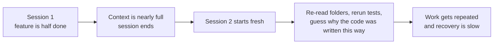
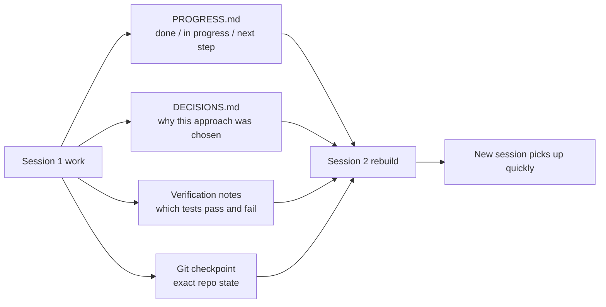

[Versión en chino →](../../../zh/lectures/lecture-05-why-long-running-tasks-lose-continuity/)

> Ejemplos de código: [código/](https://github.com/walkinglabs/learn-harness-engineering/blob/main/docs/es/lectures/lecture-05-why-long-running-tasks-lose-continuity/code/)
> Proyecto práctico: [Proyecto 03. Multi-sesión continuity](./../../projects/project-03-multi-session-continuity/index.md)

# Lección 05. Keep Contexto Alive Across Sessions

You ask Claude Código to implement a completo feature. It ejecuta for 30 minutes, does most of the work, but contexto is ejecutando low. You empezar a new sesión to continue — and discover it doesn't remember what decisions were made last time, why option A was chosen over option B, which archivos were already modified, or what estado the pruebas are in. It spends 15 minutes re-exploring the proyecto, and might be inconsistent with the anterior approach.

Imagine if you were a craftsman who forgot everything each morning upon waking. You'd have to reacquaint yourself with the entire construction site — which wall is half-built, why red bricks were chosen over blue ones, where the plumbing ejecuta got to. Worse, you might tear out a window that was already installed yesterday, simply because you didn't remember it was terminado.

This is exactly the predicament agents de programación con IA face in cross-sesión tareas. This lección explains why agents "black out" during long tareas, and how estructurado estado persistence can hacer them like a craftsman who keeps a fiable diario journal — still amnesiac, but the journal remembers everything.

## Contexto Windows: Not Infinite

Contexto windows are finite. This isn't solvable by modelo upgrades — even if window sizes grow to 1M tokens, complex tareas will still exhaust them. Because agents aren't just generating código; they're comprensión codebases, tracking their own decision history, processing herramienta salida, and maintaining conversation contexto. All this information grows faster than window expansion.

A deeper problema: information the agent produces isn't uniformly important. Intermediate reasoning pasos contain the "why" of decisions — why option B was chosen over A, why this biblioteca instead of that one, why a particular optimization was skipped. The final salida only contains the "what" — the código itself. Compaction strategies usually preserve the latter but lose the former. The siguiente sesión sees the código but doesn't know why it's written that way, and might "optimize" away a deliberate diseño decision.

Anthropic discovered something fascinating in their long-running agent research: when agents sense contexto is ejecutando low, they exhibit "premature convergence" behavior — rushing to finish current work, skipping verificación pasos, or choosing a simple solución over the optimal one. It's like realizing time is ejecutando out on an exam and quickly guessing on the remaining multiple-choice questions. Anthropic calls this "contexto anxiety."

## Session Continuity Flow

Without continuity artifacts, every new sesión is a disaster:



With continuity artifacts, new sesións can pick up quickly:



## Core Concepts

- **Contexto windows are finite**: No matter what window size is claimed (128K, 200K, 1M), long tareas will eventually exhaust them. After exhaustion, either compaction (losing information) or reset (new sesión) is required. Both lose something.
- **Continuity artifacts**: Persisted estado archivos that let a new sesión unambiguously resume where the last one left off. The basic form: progress log + verificación record + siguiente actions. That craftsman's journal.
- **Rebuild cost**: The time a new sesión needs to reach an executable estado. Good harnesses can compress rebuild cost from 15 minutes to 3 minutes.
- **Drift**: The gap between the agent's comprensión and the real estado of the código repositorio. Every sesión boundary introduces drift; without control, it compounds.
- **Contexto anxiety**: A phenomenon observed by Anthropic — agents exhibit premature convergence behavior when approaching perceived contexto limits, ending tareas early to avoid information loss. It's an irrational recurso anxiety.
- **Compaction vs reset**: Compaction summarizes contexto within the mismo sesión (keeps "what," may lose "why"); reset opens a new sesión rebuilding from persisted estado (limpio but depends on artifact completeness).

## What Happens When Continuity Breaks

The anterior sesión spent significant contexto budget analyzing three approaches and choosing option B. This sesión's agent doesn't know about that analysis and might re-decide based on incomplete information — potentially choosing option A. Like the amnesiac craftsman who doesn't remember why red bricks were chosen, looks at the blue ones today and thinks they're prettier, and tears down yesterday's wall to rebuild.

Even worse is duplicate work. The agent isn't sure whether certain work was already completed and does it again. Or worse — does half of it, discovers a conflict with the existing implementation, and has to rework. On a construction site, two equipos can't construir the mismo wall simultaneously — but without progress records, the new crew has no idea someone is already working on it.

Over several sesións, the implementation direction may have silently drifted from the original requirements. Each new sesión has a slightly diferente comprensión of the proyecto objetivos. Like a game of telephone — after ten people pass the message, "pick me up a coffee" might become "buy me a coffee machine."

There's also the verificación gap. The anterior sesión's verificación resultados (which pruebas pass, which fail, why they fail) weren't recorded. The new sesión has to re-run all verificación to entender the current estado. Every sesión re-diagnoses from scratch, every time wasting precious contexto.

Both OpenAI and Anthropic emphasize estructurado estado persistence in their documentation. OpenAI's harness ingeniería article treats the repositorio as an "operational record" — every operation's resultados should leave traceable evidence in the repo. Anthropic's agents de larga duración documentation specifically recommends "traspaso archivos" — estructurado documents containing current estado, known issues, and siguiente actions.

## A Journal for the Amnesiac Craftsman

Core approach: **Treat the agent like a brilliant engineer with amnesia.** Before it "clocks out," it must escribir down critical information so the siguiente "shift" agent can pick up quickly.

**Herramienta 1: Progress archivo (PROGRESS.md).** The most basic continuity artifact — the core of the journal:

```markdown
# Project Progress

## Current State
- Latest commit: abc1234 (feat: add user preferences endpoint)
- Test status: 42/43 passing (test_pagination_edge_case failing)
- Lint: passing

## Completed
- [x] User model and database migration
- [x] Basic CRUD endpoints
- [x] Auth middleware integration

## In Progress
- [ ] Pagination feature (90% - edge case test failing)

## Known Issues
- test_pagination_edge_case returns 500 on empty result sets
- Need to confirm whether deleted users should appear in listings

## Next Steps
1. Fix pagination edge case bug
2. Add "include deleted users" query parameter
3. Update API documentation
```

**Herramienta 2: Decision log (DECISIONS.md).** Record important diseño decisions and reasons. No need for detailed diseño documents — just "what decision, why, when" — the memos in the journal:

```markdown
# Design Decisions

## 2024-01-15: Use Redis for user preferences caching
- Reason: High read frequency (every API call), small data size
- Rejected alternative: PostgreSQL materialized view (high change frequency makes maintenance cost not worthwhile)
- Constraint: Cache TTL of 5 minutes, active invalidation on write
```

**Herramienta 3: Git commits as checkpoints.** Commit after completing each atomic unit of work. Commit messages should explain what was terminado and why. These are free, automatically versioned estado snapshots.

**Herramienta 4: init.sh or harness inicialización flow.** Specify in `AGENTS.md` the "clock-in" and "clock-out" routines:

```markdown
## At session start (clock in)
1. Read PROGRESS.md for current state
2. Read DECISIONS.md for important decisions
3. Run make check to confirm repo is in consistent state
4. Continue from PROGRESS.md "Next Steps" section

## Before session end (clock out)
1. Update PROGRESS.md
2. Run make check to confirm consistent state
3. Commit all completed work
```

**Mixed strategy**: Not every tarea needs a contexto reset. Short tareas (under 30 minutes) can completo within one sesión. Long tareas (spanning sesións) must usar progress archivos and decision logs for continuity. Decision criterion: if a tarea needs more than 60% of the window, empezar preparing traspaso.

### Deep Dive on Contexto Anxiety

Anthropic's March 2026 research further revealed the específico manifestations of contexto anxiety: on Sonnet 4.5, when contexto approaches the window limit, the agent shows potente "premature convergence" behavior. It's like realizing time is almost up on an exam and quickly filling in random answers on the multiple choice.

Two strategies address this:

**Compaction**: Summarizing early conversation within the mismo sesión. Advantage: maintains continuity, the agent can see "what." Disadvantage: "why" is often lost in summaries — why option B was chosen over A, why a particular optimization was skipped. More critically, compaction doesn't eliminate contexto anxiety — the agent knows contexto was once large, and psychologically still tends to rush to closure.

**Contexto reset**: Completely clearing contexto, opening a new sesión, rebuilding from persisted artifacts. Advantage: limpio mental estado — the new sesión has no "I'm ejecutando out of time" anxiety. Disadvantage: depends on the completeness of traspaso artifacts. If the journal is faltante critical information, the new sesión may waste time going in the incorrecto direction.

Anthropic's real datos: for Sonnet 4.5, contexto anxiety is severe enough that compaction alone isn't sufficient — contexto reset becomes a critical component of harness diseño. But for Opus 4.5, this behavior is greatly diminished, and compaction can manage contexto without relying on resets. This means: **harness diseño needs específico comprensión of the target modelo, not a one-size-fits-all plantilla.**

> Fuente: [Anthropic: Harness diseño for long-running application development](https://www.anthropic.com/engineering/harness-design-long-running-apps)

## Real-World Ejemplo

An agent was tasked with implementing a blog system with usuario authentication — 12 feature points, estimated 5 sesións needed.

**Baseline without the journal**: Session 1 implemented the usuario modelo and basic routes. Session 2 iniciado without the agent remembering the auth middleware's interface contract, spending ~15 minutes inferring the anterior diseño intent. By sesión 3, accumulated drift caused the agent to empezar reimplementing already-completed funcionalidades. By sesión 5, the repo contained lots of redundant código but the core auth feature still hadn't passed end-to-end pruebas. Only 7 of 12 feature points completed, 3 with hidden correctness issues. Like the craftsman who never escribe in his journal — by day five, the construction site is chaos, some walls built twice, some that should have been built never iniciado.

**With the journal**: Usando progress archivos, decision logs, verificación records, and git checkpoints. Estado report updated automatically at each sesión end. Session 2's rebuild cost dropped to ~3 minutes. By sesión 5, all 12 feature points completed and verified.

Quantitative comparación: rebuild time reduced ~78%, feature finalización rate from 58% to 100%, hidden defect rate from 43% down to 8%. The craftsman is still amnesiac, but with the journal, each day starts from where yesterday stopped, not from zero.

## Ideas clave

- Contexto windows are a finite recurso. Long tareas will span sesións, and sesións will lose information — like the craftsman who forgets each day, this is objective reality.
- The solución isn't bigger windows — it's better estado persistence. Progress archivos + decision logs + git checkpoints — give the amnesiac craftsman a fiable journal.
- Treat the agent like an engineer with amnesia: before "clocking out," escribir down what was terminado, why, and what's siguiente.
- Rebuild cost is the key metric. Good harnesses should get new sesións to an executable estado within 3 minutes.
- Mixed strategy: short tareas within sesións, long tareas with estructurado artifacts for continuity.

## Lecturas adicionales

- [Anthropic: Effective Harnesses for Long-Running Agents](https://www.anthropic.com/engineering/effective-harnesses-for-long-running-agents)
- [OpenAI: Harness Ingeniería](https://openai.com/index/harness-engineering/)
- [Lost in the Middle: How Language Modelos Usar Long Contexts](https://arxiv.org/abs/2307.03172)
- [Claude Código Documentation](https://docs.anthropic.com/es/docs/claude-code)
- [HumanLayer: Harness Ingeniería for Coding Agents](https://humanlayer.dev/articles/harness-engineering-for-coding-agents/)

## Ejercicios

1. **Continuity loss measurement**: Pick a development tarea needing at least 3 sesións. Without providing any continuity artifacts, record at each sesión empezar how much contexto the agent spends "figuring out what happened last time." After each sesión, crear a progress archivo and let the siguiente sesión empezar from it. Comparar rebuild costs with and without progress archivos.

2. **Handoff plantilla diseño**: Diseño a minimal traspaso plantilla with four fields: repo estado (commit hash), runtime estado (prueba pass rate), blockers, siguiente actions. Let a completely fresh agent sesión restore proyecto estado usando only this plantilla. Record ambiguities encountered during restoration, iterate to improve the plantilla.

3. **Mixed strategy experiment**: In a 5-sesión development tarea, comparar three strategies: (a) always empezar fresh sesións + progress archivos, (b) do as much as possible in one sesión (contexto compaction), (c) mixed strategy (short tareas in-sesión, long tareas across sesións + progress archivos). Comparar rebuild time, feature finalización rate, and decision consistency.
