[Versión en chino →](../../../zh/lectures/lecture-06-why-initialization-needs-its-own-phase/)

> Ejemplos de código: [código/](https://github.com/walkinglabs/learn-harness-engineering/blob/main/docs/es/lectures/lecture-06-why-initialization-needs-its-own-phase/code/)
> Proyecto práctico: [Proyecto 03. Multi-sesión continuity](./../../projects/project-03-multi-session-continuity/index.md)

# Lección 06. Initialize Before Every Agent Session

You empezar a new agent sesión and say "añadir a search feature." It jumps straight into coding — admirable enthusiasm. After 20 minutes it discovers the prueba framework isn't configured properly, spends another 10 fixing that, then the database migration script format is incorrecto, more fiddling. The search feature eventually gets added, but the whole sesión was inefficient — most time went to "figuring out how this proyecto works" rather than escritura the search feature.

The better approach: before letting the agent empezar working, usar a separate phase to get the base entorno ready, verificación comandos passing, and proyecto estructura understood. It's like construyendo a house — you don't pour the foundation and put up walls simultaneously. If you do, the walls go up before the foundation has cured, and the whole construyendo has to be torn down and iniciado over. Pour the foundation first, let it cure, then construir the walls — limpio and efficient.

This lección explains why inicialización must be a separate phase, not mixed in with implementation.

## Foundation and Walls: Two Fundamentally Diferente Jobs

Initialization and implementation have completely diferente optimization targets. The implementation phase optimizes for: maximizing the quantity and calidad of verified funcionalidades. The inicialización phase optimizes for: maximizing the reliability and efficiency of all subsequent implementation.

When you mix inicialización and implementation, the agent faces a multi-objective optimization problema — simultaneously construyendo infrastructure and escritura feature código. Without explícito priority setting, the agent naturally gravitates toward escritura código (because that's directly visible salida) while sacrificing infrastructure (because its value only shows in subsequent sesións). It's like telling a construction crew to simultaneously pour the foundation and construir the walls — they'll probably rush to construir walls because walls are visible and demonstrable. But a house with a bad foundation has systemic problemas down the line.

## Initialization Lifecycle

```mermaid
flowchart TB
    subgraph Wrong["Mixed session (wrong)"]
        W1["Start feature work immediately"] --> W2["Discover env and test gaps mid-task"]
        W2 --> W3["Accumulate unverified code"]
        W3 --> W4["Next session must rediscover project state"]
    end

    subgraph Right["Dedicated initialization (right)"]
        R1["Session 1: environment runnable"] --> R2["Example test passing"]
        R2 --> R3["Bootstrap contract + task list written"]
        R3 --> R4["Clean checkpoint committed"]
        R4 --> R5["Later sessions start directly on verified tasks"]
    end
```



## What Happens When You Mix Them

The most direct problema: the foundation doesn't set properly. The agent spends 80% of its effort on feature código and 20% casually setting up some infrastructure. The prueba framework is configured but never verified, lint reglas are set but too loose, no progress archivo created. These defects aren't obvious in the first sesión (because the agent still remembers what it did), but they surface in the second sesión — the new agent doesn't know how to ejecutar, prueba, or where things stand. Shoddy foundation, shaky construyendo.

A more hidden cost is "unverified accumulation" — feature código written before the prueba framework is configured is código without verificación. When you finally go back to añadir pruebas for that código, you might discover the diseño was incorrecto from the empezar — had you known, you would have implemented it differently. Like tiling over wet concrete — when you discover the floor isn't level, all the tiles have to be pried up and redone.

Session budget is being wasted too. Initialization work (configuring entornos, setting up pruebas, comprensión proyecto estructura) consumes significant budget, leaving less for real feature implementation. Resultado: the first sesión only completes half the funcionalidades, and the second sesión has to empezar over comprensión the proyecto. Budget spent on the foundation, but the foundation isn't solid either — neither objetivo achieved.

The most easily overlooked problema is implícito assumption landmines. Decisions the agent hace during inicialización (which prueba framework, how to organize directories, dependency gestión) — if not explicitly recorded, subsequent sesións can't entender these choices. Worse, subsequent sesións might hacer contradictory choices. The first construction crew usado a concrete foundation, the second crew doesn't know and drove wooden pilings into it — the foundation cracks.

Anthropic's long-running application development research explicitly recommends separating inicialización from implementation. Their experimental datos: proyectos usando a dedicado inicialización phase showed 31% higher feature finalización rates in multi-sesión scenarios compared to mixed approaches. The key insight — time invested in the inicialización phase is fully recovered in the siguiente 3-4 sesións. The more solid the foundation, the faster the walls go up.

OpenAI's Codex harness ingeniería guía also emphasizes the "repositorio as operational record" principle — establish claro operational estructura from the first ejecutar, or every new sesión has to re-infer proyecto conventions.

## Core Concepts

- **Initialization Phase**: The first phase in the agent's lifecycle — no feature implementation, only establishing prerequisites for all subsequent implementation phases. The salida isn't código, it's infrastructure.
- **Bootstrap Contract**: The condiciones under which a proyecto can be unambiguously operated by a fresh agent sesión — can empezar, can prueba, can see progress, can pick up siguiente pasos. Four condiciones, all required.
- **Cold Empezar vs Warm Empezar**: Cold empezar is from an empty directory where the agent must guess proyecto estructura; warm empezar is from a plantilla or existing proyecto where infrastructure is already in place. Warm empezar far outperforms cold empezar — like starting work on a site with ejecutando water and electricity versus beginning from a barren wasteland.
- **Handoff Readiness**: The proyecto is in a estado at any given moment where a fresh agent can take over. No verbal explanation needed — just repo contents.
- **Time to First Verification**: The time from proyecto empezar until the first feature point passes verificación. This is the core metric for measuring inicialización efficiency.
- **Downstream Usability**: The best measure of inicialización calidad — the proportion of subsequent sesións that can successfully execute tareas without relying on implícito knowledge.

## How to Do Initialization Right

**Treat inicialización as a dedicado phase.** The first sesión does only inicialización — no business feature código at all. Initialization produces:

**1. Runnable entorno.** The proyecto starts, dependencies are installed, no entorno issues. Foundation poured, no cracks.

**2. Verifiable prueba framework.** At least one ejemplo prueba passes. This proves the prueba framework itself is properly configured — like standing a pillar on the foundation to prove it can bear weight.

**3. Bootstrap contract document.** A claro document telling subsequent sesións:
```markdown
# Initialization Contract

## Start Commands
- Install dependencies: `make setup`
- Start dev server: `make dev`
- Run tests: `make test`
- Full verification: `make check`

## Current State
- All dependencies installed and locked
- Test framework configured (Vitest + React Testing Library)
- Example test passing (1/1)
- Lint rules configured (ESLint + Prettier)

## Project Structure
- src/ — Source code
- src/components/ — React components
- src/api/ — API client
- tests/ — Test files
```

**4. Tarea breakdown.** Split the entire proyecto into an ordered tarea lista, each tarea with claro acceptance criterios:
```markdown
# Task Breakdown

## Task 1: User Authentication Basics
- Implement JWT auth middleware
- Add login/register endpoints
- Acceptance: pytest tests/test_auth.py all passing

## Task 2: User Profile Page
- Implement user profile CRUD
- Add profile edit form
- Acceptance: pytest tests/test_profile.py all passing

## Task 3: Search Feature
- ...
```

**5. Git commit as checkpoint.** After inicialización completes, commit a limpio checkpoint. All subsequent work starts from this checkpoint.

**Warm empezar strategy**: Don't empezar from an empty directory. Usar a proyecto plantilla (create-react-app, fastapi-template, etc.) to preset standard directory estructura, dependency configuration, and prueba framework. Bake common inicialización pasos into the plantilla, leaving only project-specific inicialización work. Like starting work on a site with ejecutando water and electricity — ten thousand times better than beginning from a barren wasteland.

**Initialization finalización criterios**: Not "how much código was written," but whether the bootstrap contract's four condiciones are met — can empezar, can prueba, can see progress, can pick up siguiente pasos. Usar this checklist to validate inicialización:

```markdown
## Initialization Acceptance Checklist
- [ ] `make setup` succeeds from scratch
- [ ] `make test` has at least one passing test
- [ ] A new agent session can answer "how to run" and "how to test" from repo contents alone
- [ ] Task breakdown file exists with at least 3 tasks
- [ ] Everything committed to git
```

## Real-World Ejemplo

Two inicialización approaches for a React frontend proyecto:

**Mixed approach (pouring foundation and construyendo walls simultaneously)**: The agent simultaneously created proyecto scaffolding and implemented the first feature in sesión 1. At sesión end, the repo had runnable código but: no explícito empezar/prueba comando documentation, no progress tracking archivo, no tarea breakdown. Session 2 spent ~20 minutes inferring proyecto estructura, prueba framework, and construir proceso — like a new construction crew arriving at a site, not knowing how far the foundation got or where the plumbing ejecuta are, having to dig holes one by one to find out.

**Dedicado inicialización (foundation first)**: Session 1 did only inicialización — created directory estructura from a plantilla, configured the prueba framework (Vitest + React Pruebas Biblioteca), wrote and verified one ejemplo prueba, created the bootstrap contract document and tarea breakdown archivo, committed the initial checkpoint. Session 2's rebuild time was under 3 minutes, and it iniciado working directly from the tarea lista — the crew arrives, glances at the blueprint, and knows exactly where to pick up.

Full proyecto cycle comparación: the mixed approach's total rebuild time (across all sesións) was ~60% more than the dedicado inicialización approach. The extra 20 minutes spent on inicialización was recovered many times over in subsequent sesións. Like a solid foundation making the walls go up faster — slow is fast.

## Ideas clave

- Initialization and implementation have diferente optimization targets — mixing them just drags both down. Pour the foundation first, then construir the walls.
- Initialization's salida isn't código, it's infrastructure: runnable entorno, verifiable pruebas, bootstrap contract, tarea breakdown.
- Validate inicialización with the bootstrap contract's four condiciones: can empezar, can prueba, can see progress, can pick up siguiente pasos.
- Warm empezar beats cold empezar. Usar proyecto plantillas to preset standardized infrastructure.
- Time invested in inicialización is fully recovered in the siguiente 3-4 sesións. This isn't extra cost — it's upfront investment. The more solid the foundation, the faster the construyendo goes up.

## Lecturas adicionales

- [Anthropic: Effective Harnesses for Long-Running Agents](https://www.anthropic.com/engineering/effective-harnesses-for-long-running-agents)
- [OpenAI: Harness Ingeniería](https://openai.com/index/harness-engineering/)
- [HumanLayer: Harness Ingeniería for Coding Agents](https://humanlayer.dev/articles/harness-engineering-for-coding-agents/)
- [Infrastructure as Código — Martin Fowler](https://martinfowler.com/bliki/InfrastructureAsCode.html)
- [SWE-agent: Agent-Computer Interfaces](https://github.com/princeton-nlp/SWE-agent)

## Ejercicios

1. **Bootstrap contract diseño**: Escribir a completo bootstrap contract for a proyecto you're developing. Then open a completely fresh agent sesión, show it only repo contents (no verbal contexto), and have it try to empezar the proyecto, ejecutar pruebas, and entender current progress. Record every problema it encounters — each one corresponds to a faltante clause in your bootstrap contract.

2. **Comparación experiment**: Pick a moderately complex new proyecto. Approach A: let the agent initialize and do first implementation simultaneously. Approach B: spend one sesión on dedicado inicialización, empezar implementation in sesión 2. After 4 sesións, comparar: time to first verificación, rebuild cost, feature finalización rate.

3. **Initialization acceptance checklist**: Diseño an inicialización acceptance checklist for your proyecto. Have a fresh agent sesión execute each checklist item and record which pass and which fail. The failing items are where your harness needs strengthening.
