[Versión en chino →](../../../zh/lectures/lecture-06-why-initialization-needs-its-own-phase/)

> Ejemplos de código: [code/](https://github.com/walkinglabs/learn-harness-engineering/blob/main/docs/es/lectures/lecture-06-why-initialization-needs-its-own-phase/code/)
> Proyecto práctico: [Proyecto 03. Multi-session continuity](./../../projects/project-03-multi-session-continuity/index.md)

# Lección 06. Inicializar antes de cada sesión del agent

Inicias una nueva sesión de agent y dices "añade una funcionalidad de búsqueda". El agent salta directamente a programar, con un entusiasmo admirable. Tras 20 minutos descubre que el framework de pruebas no está bien configurado, dedica otros 10 a arreglarlo, luego ve que el formato del script de migraciones de base de datos es incorrecto y sigue ajustando cosas. La búsqueda acaba añadida, pero toda la sesión fue ineficiente: la mayor parte del tiempo se fue en "averiguar cómo funciona este proyecto" en lugar de escribir la funcionalidad.

El enfoque mejor: antes de dejar que el agent empiece a trabajar, usa una fase separada para preparar el entorno base, hacer que los comandos de verificación pasen y entender la estructura del proyecto. Es como construir una casa: no viertes los cimientos y levantas las paredes a la vez. Si lo haces, las paredes suben antes de que el hormigón haya fraguado y todo el edificio acaba teniendo que derribarse y empezar de nuevo. Primero se vierten los cimientos, se dejan fraguar y después se levantan las paredes: limpio y eficiente.

Esta lección explica por qué la inicialización debe ser una fase separada, no mezclada con la implementación.

## Cimientos y paredes: dos trabajos fundamentalmente distintos

Inicialización e implementación tienen objetivos de optimización completamente distintos. La fase de implementación optimiza por maximizar la cantidad y calidad de funcionalidades verificadas. La fase de inicialización optimiza por maximizar la fiabilidad y eficiencia de toda la implementación posterior.

Cuando mezclas inicialización e implementación, el agent se enfrenta a un problema de optimización multiobjetivo: construir infraestructura y escribir código de funcionalidad al mismo tiempo. Sin prioridades explícitas, el agent gravita de forma natural hacia escribir código, porque es el resultado visible, y sacrifica infraestructura, porque su valor solo se nota en sesiones posteriores. Es como decirle a una cuadrilla que vierta los cimientos y levante las paredes simultáneamente: probablemente se apresurará a levantar paredes porque son visibles y demostrables. Pero una casa con malos cimientos tendrá problemas sistémicos después.

## Ciclo de vida de inicialización

```mermaid
flowchart TB
    subgraph Wrong["Sesión mezclada (incorrecta)"]
        W1["Empezar funcionalidad inmediatamente"] --> W2["Descubrir huecos de entorno y pruebas a media tarea"]
        W2 --> W3["Acumular código sin verificar"]
        W3 --> W4["La siguiente sesión debe redescubrir el estado del proyecto"]
    end

    subgraph Right["Inicialización dedicada (correcta)"]
        R1["Sesión 1: entorno ejecutable"] --> R2["Prueba de ejemplo pasando"]
        R2 --> R3["Contrato bootstrap + lista de tareas escritos"]
        R3 --> R4["Checkpoint limpio commiteado"]
        R4 --> R5["Sesiones posteriores empiezan directamente en tareas verificadas"]
    end
```



## Qué ocurre cuando las mezclas

El problema más directo: los cimientos no quedan asentados. El agent gasta el 80% de su esfuerzo en código de funcionalidad y el 20% en configurar infraestructura de manera casual. El framework de pruebas queda configurado pero nunca verificado, las reglas de lint existen pero son demasiado laxas, no se crea archivo de progreso. Estos defectos no son obvios en la primera sesión, porque el agent aún recuerda lo que hizo, pero aparecen en la segunda: el nuevo agent no sabe cómo ejecutar, cómo probar ni en qué punto está el trabajo. Cimientos deficientes, edificio inestable.

Un coste más oculto es la "acumulación no verificada": código de funcionalidad escrito antes de configurar el framework de pruebas es código sin verificación. Cuando por fin vuelves para añadir pruebas, quizá descubres que el diseño estaba mal desde el principio; de haberlo sabido, lo habrías implementado de otra forma. Como poner baldosas sobre hormigón húmedo: cuando descubres que el suelo no está nivelado, tienes que arrancarlo todo.

También se desperdicia presupuesto de sesión. El trabajo de inicialización, configurar entornos, pruebas y estructura del proyecto, consume mucho presupuesto y deja menos para la implementación real. Resultado: la primera sesión solo completa la mitad de las funcionalidades, y la segunda tiene que empezar de nuevo entendiendo el proyecto. Se gastó presupuesto en los cimientos, pero ni siquiera quedaron sólidos: no se logró ninguno de los dos objetivos.

El problema más fácil de pasar por alto son las minas de suposiciones implícitas. Las decisiones que toma el agent durante la inicialización, framework de pruebas, organización de directorios, gestión de dependencias, si no se registran explícitamente, las sesiones posteriores no pueden entenderlas. Peor aún: pueden tomar decisiones contradictorias. La primera cuadrilla usó cimientos de hormigón; la segunda no lo sabe y clava pilotes de madera en ellos. Los cimientos se agrietan.

La investigación de Anthropic sobre desarrollo de aplicaciones de larga duración recomienda explícitamente separar inicialización e implementación. Sus datos experimentales: los proyectos con una fase de inicialización dedicada mostraron tasas de finalización de funcionalidades un 31% mayores en escenarios multisessión frente a enfoques mezclados. La idea clave: el tiempo invertido en inicialización se recupera por completo en las siguientes 3-4 sesiones. Cuanto más sólidos los cimientos, más rápido suben las paredes.

La guía de OpenAI sobre harness engineering para Codex también enfatiza el principio de "repositorio como registro operativo": establece una estructura operativa clara desde la primera ejecución o cada sesión nueva tendrá que volver a inferir las convenciones del proyecto.

## Conceptos clave

- **Fase de inicialización**: primera fase del ciclo de vida del agent. No implementa funcionalidades; solo establece prerrequisitos para todas las fases posteriores. Su salida no es código de negocio, sino infraestructura.
- **Contrato bootstrap**: condiciones bajo las cuales una sesión fresca de agent puede operar el proyecto sin ambigüedad: puede arrancar, puede probar, puede ver el progreso y puede retomar los siguientes pasos. Cuatro condiciones, todas obligatorias.
- **Cold start frente a warm start**: cold start parte de un directorio vacío donde el agent debe adivinar la estructura; warm start parte de una plantilla o proyecto existente donde la infraestructura ya está colocada. Warm start supera por mucho a cold start, como empezar en una obra con agua y electricidad frente a un solar vacío.
- **Preparación para handoff**: el proyecto está en un estado en el que una sesión fresca puede tomar el relevo en cualquier momento. Sin explicación verbal: solo con el contenido del repo.
- **Tiempo hasta la primera verificación**: tiempo desde el inicio del proyecto hasta que el primer punto de funcionalidad pasa verificación. Es la métrica central para medir la eficiencia de inicialización.
- **Usabilidad aguas abajo**: mejor medida de calidad de la inicialización: proporción de sesiones posteriores que pueden ejecutar tareas correctamente sin depender de conocimiento implícito.

## Cómo inicializar bien

**Trata la inicialización como una fase dedicada.** La primera sesión solo hace inicialización, sin código de funcionalidad de negocio. La inicialización produce:

**1. Entorno ejecutable.** El proyecto arranca, las dependencias están instaladas y no hay problemas de entorno. Cimientos vertidos, sin grietas.

**2. Framework de pruebas verificable.** Al menos una prueba de ejemplo pasa. Esto demuestra que el framework de pruebas está bien configurado: como poner un pilar sobre los cimientos para probar que soportan carga.

**3. Documento de contrato bootstrap.** Un documento claro que diga a sesiones posteriores:

```markdown
# Initialization Contract

## Start Commands
- Install dependencies: `make setup`
- Start dev server: `make dev`
- Run tests: `make test`
- Full verification: `make check`

## Current State
- All dependencies installed and locked
- Test framework configured (Vitest + React Testing Library)
- Example test passing (1/1)
- Lint rules configured (ESLint + Prettier)

## Project Structure
- src/ — Source code
- src/components/ — React components
- src/api/ — API client
- tests/ — Test files
```

**4. Desglose de tareas.** Divide todo el proyecto en una lista ordenada de tareas, cada una con criterios de aceptación claros:

```markdown
# Task Breakdown

## Task 1: User Authentication Basics
- Implement JWT auth middleware
- Add login/register endpoints
- Acceptance: pytest tests/test_auth.py all passing

## Task 2: User Profile Page
- Implement user profile CRUD
- Add profile edit form
- Acceptance: pytest tests/test_profile.py all passing

## Task 3: Search Feature
- ...
```

**5. Commit de Git como checkpoint.** Cuando termine la inicialización, haz commit de un checkpoint limpio. Todo el trabajo posterior empieza desde ahí.

**Estrategia de warm start**: no empieces desde un directorio vacío. Usa una plantilla de proyecto, por ejemplo `create-react-app` o `fastapi-template`, para preconfigurar estructura de directorios, dependencias y framework de pruebas. Hornea los pasos comunes de inicialización dentro de la plantilla y deja solo la inicialización específica del proyecto. Como empezar una obra con agua y electricidad: muchísimo mejor que partir de un solar vacío.

**Criterios de finalización de inicialización**: no "cuánto código se escribió", sino si se cumplen las cuatro condiciones del contrato bootstrap: puede arrancar, puede probar, puede ver progreso, puede retomar siguientes pasos. Usa esta checklist para validar la inicialización:

```markdown
## Initialization Acceptance Checklist
- [ ] `make setup` succeeds from scratch
- [ ] `make test` has at least one passing test
- [ ] A new agent session can answer "how to run" and "how to test" from repo contents alone
- [ ] Task breakdown file exists with at least 3 tasks
- [ ] Everything committed to git
```

## Ejemplo real

Dos enfoques de inicialización para un proyecto frontend en React:

**Enfoque mezclado (verter cimientos y levantar paredes a la vez)**: el agent creó el andamiaje del proyecto e implementó la primera funcionalidad simultáneamente en la sesión 1. Al terminar, el repo tenía código ejecutable, pero no tenía documentación explícita de comandos de arranque/prueba, archivo de progreso ni desglose de tareas. La sesión 2 gastó unos 20 minutos infiriendo estructura, framework de pruebas y proceso de build: como una nueva cuadrilla que llega a una obra sin saber hasta dónde llegaron los cimientos ni por dónde pasan las tuberías, y tiene que cavar agujeros uno por uno para averiguarlo.

**Inicialización dedicada (cimientos primero)**: la sesión 1 solo hizo inicialización: creó estructura desde una plantilla, configuró el framework de pruebas, Vitest + React Testing Library, escribió y verificó una prueba de ejemplo, creó el contrato bootstrap y el desglose de tareas, y commiteó el checkpoint inicial. El coste de reconstrucción de la sesión 2 fue inferior a 3 minutos, y empezó a trabajar directamente desde la lista de tareas: la cuadrilla llega, mira el plano y sabe exactamente dónde retomar.

Comparación del ciclo completo: el tiempo total de reconstrucción del enfoque mezclado, acumulado entre sesiones, fue alrededor de un 60% mayor que con la inicialización dedicada. Los 20 minutos adicionales invertidos en inicialización se recuperaron muchas veces en sesiones posteriores. Como unos cimientos sólidos que permiten levantar paredes más rápido: ir despacio es ir rápido.

## Ideas clave

- Inicialización e implementación tienen objetivos de optimización distintos. Mezclarlas solo perjudica a ambas. Primero vierte los cimientos; después levanta las paredes.
- La salida de la inicialización no es código, sino infraestructura: entorno ejecutable, pruebas verificables, contrato bootstrap y desglose de tareas.
- Valida la inicialización con las cuatro condiciones del contrato bootstrap: puede arrancar, puede probar, puede ver progreso, puede retomar siguientes pasos.
- Warm start supera a cold start. Usa plantillas de proyecto para preconfigurar infraestructura estándar.
- El tiempo invertido en inicialización se recupera por completo en las siguientes 3-4 sesiones. No es coste extra: es inversión inicial. Cuanto más sólidos los cimientos, más rápido sube el edificio.

## Lecturas adicionales

- [Anthropic: Effective Harnesses for Long-Running Agents](https://www.anthropic.com/engineering/effective-harnesses-for-long-running-agents)
- [OpenAI: Harness Engineering](https://openai.com/index/harness-engineering/)
- [HumanLayer: Harness Engineering for Coding Agents](https://humanlayer.dev/articles/harness-engineering-for-coding-agents/)
- [Infrastructure as Code — Martin Fowler](https://martinfowler.com/bliki/InfrastructureAsCode.html)
- [SWE-agent: Agent-Computer Interfaces](https://github.com/princeton-nlp/SWE-agent)

## Ejercicios

1. **Diseño de contrato bootstrap**: escribe un contrato bootstrap completo para un proyecto que estés desarrollando. Luego abre una sesión de agent completamente fresca, muéstrale solo el contenido del repo, sin contexto verbal, y pídele que intente arrancar el proyecto, ejecutar pruebas y entender el progreso actual. Registra cada problema que encuentre: cada uno corresponde a una cláusula ausente en tu contrato bootstrap.

2. **Experimento de comparación**: elige un proyecto nuevo de complejidad moderada. Enfoque A: deja que el agent inicialice e implemente la primera funcionalidad simultáneamente. Enfoque B: dedica una sesión a inicialización y empieza a implementar en la sesión 2. Después de 4 sesiones, compara: tiempo hasta la primera verificación, coste de reconstrucción y tasa de finalización de funcionalidades.

3. **Checklist de aceptación de inicialización**: diseña una checklist de aceptación de inicialización para tu proyecto. Haz que una sesión fresca ejecute cada punto y registra cuáles pasan y cuáles fallan. Los fallos indican dónde necesita fortalecerse tu harness.
