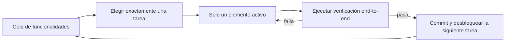
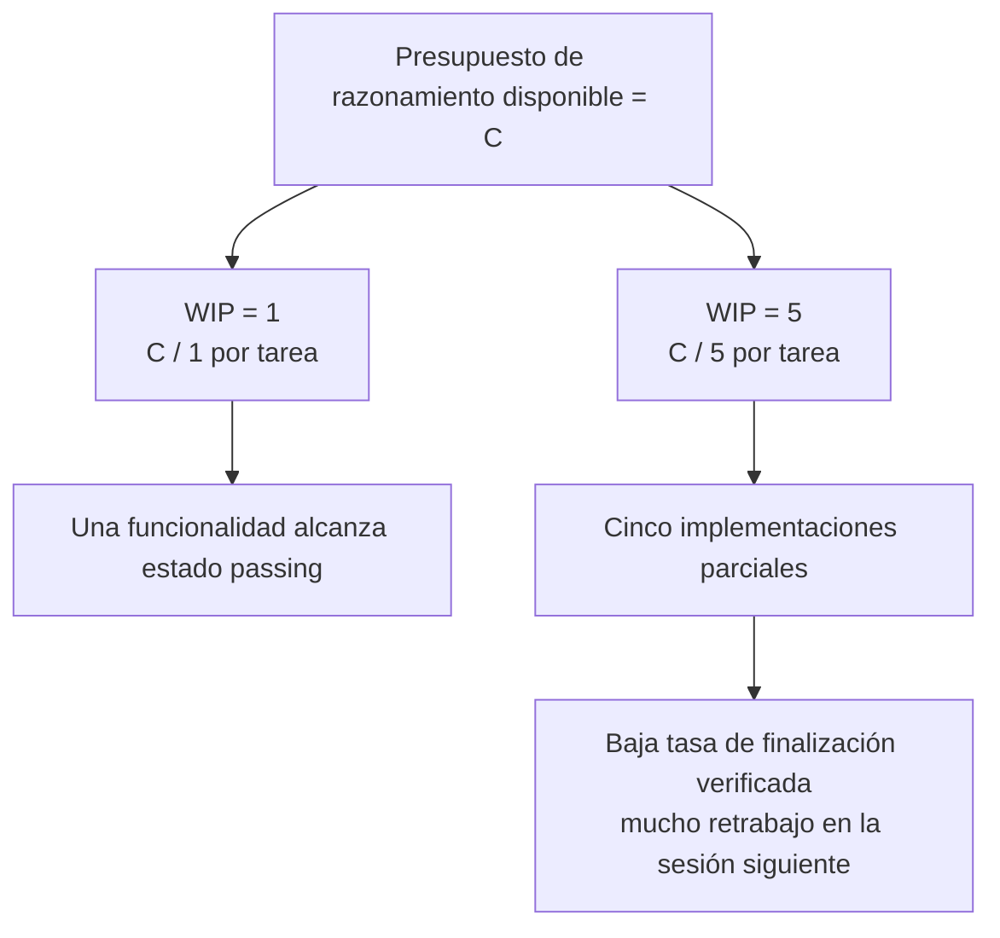

[Versión en chino →](../../../zh/lectures/lecture-07-why-agents-overreach-and-under-finish/)

> Ejemplos de código: [code/](https://github.com/walkinglabs/learn-harness-engineering/blob/main/docs/es/lectures/lecture-07-why-agents-overreach-and-under-finish/code/)
> Proyecto práctico: [Proyecto 04. Runtime feedback and scope control](./../../projects/project-04-incremental-indexing/index.md)

# Lección 07. Trazar límites claros de tarea para los agents

Le dices a Claude Code "añade autenticación de usuarios a este proyecto" y empieza a modificar el esquema de base de datos, escribir rutas, cambiar componentes frontend y, ya que está, refactorizar el middleware de manejo de errores. Dos horas después revisas: 12 archivos modificados, 800 líneas de código nuevo y ni una sola funcionalidad funciona end-to-end.

Querer abarcar más de lo que puedes masticar es una expresión que encaja especialmente bien con los agents de IA. Los agents nacen con el impulso de "hacer un poco más": ven cosas relacionadas y las arreglan de paso, como quien va al supermercado por una botella de salsa de soja y sale empujando un carro lleno. El problema es que una persona que compra demasiado solo pierde dinero; un agent que hace demasiadas cosas a la vez no termina bien ninguna.

El blog de ingeniería de Anthropic "Effective harnesses for long-running agents" lo dice claramente: cuando los prompts son demasiado amplios, los agents tienden a "empezar varias cosas a la vez" en lugar de "terminar una cosa primero". Las prácticas de ingeniería de Codex en OpenAI encontraron lo mismo: las tareas sin controles explícitos de scope ven caer drásticamente sus tasas de finalización. No es un problema del modelo; es un problema del harness. No trazaste el límite.

## La atención es un recurso finito

No es una metáfora: es matemático. Supón que la capacidad de contexto del agent es C y que activa k tareas simultáneamente. Cada tarea recibe de media C/k recursos de razonamiento. Cuando C/k cae por debajo del umbral mínimo necesario para completar una sola tarea, ninguna se termina. Tu estómago tiene un tamaño limitado: si intentas tragarte diez piezas de golpe, no las digieres todas; acabas con diez indigestiones.

El comportamiento real de Claude Code es revelador. Si le pides "añade registro de usuarios", puede:

1. Crear un modelo `User`.
2. Escribir la ruta de registro.
3. Darse cuenta de que necesita verificación de correo y añadir un servicio de email.
4. Ver que las contraseñas necesitan hashing e incorporar `bcrypt`.
5. Notar que el manejo de errores es inconsistente y refactorizar el middleware global.
6. Ver que la estructura de pruebas está desordenada y reorganizar directorios.

Seis pasos después, todos están a medio hacer. No hay verificación end-to-end, hay acoplamientos complejos entre código incompleto, y la siguiente sesión que recoja los restos estará completamente perdida. Como cocinar seis platos a la vez: todos están en la sartén, ninguno está emplatado y todos se queman.

Los datos experimentales de Anthropic apoyan esto directamente: los agents que usan una estrategia de "siguiente paso pequeño", equivalente a WIP=1, muestran una tasa de finalización de tareas un 37% mayor que los agents con prompts amplios. Más interesante aún: el número de líneas de código generadas por agents tiene una correlación débilmente negativa con la finalización real de funcionalidades. Más código escrito, menos funcionalidades completas. Abarcar demasiado, demostrado con datos.

## Flujo de trabajo WIP=1





## Conceptos clave

- **Exceso de alcance**: el agent activa más tareas en una sesión de las que conviene. Es cuantificable: hacer 5 funcionalidades con 0 pasando end-to-end es exceso de alcance.
- **Finalización insuficiente**: la proporción de tareas que pasan verificación end-to-end, entre todas las tareas activadas, cae por debajo del umbral. Código escrito pero pruebas sin pasar es finalización insuficiente.
- **Límite WIP (Work-in-Progress Limit)**: viene de Kanban. Idea central: limitar cuántas tareas están en curso a la vez. Para agents, WIP=1 es el valor seguro por defecto: termina una antes de empezar la siguiente.
- **Evidencia de finalización**: condición verificable que una tarea debe satisfacer para pasar de "en curso" a "hecha". Sin esto, los agents sustituyen "el código parece bien" por "el comportamiento pasa pruebas".
- **Superficie de scope**: estructura DAG donde cada nodo es una unidad de trabajo y las aristas son dependencias. Los estados se limitan a cuatro: `not_started`, `active`, `blocked`, `passing`.
- **Presión de finalización**: fuerza restrictiva que ejerce el harness mediante límites WIP y requisitos de evidencia, obligando al agent a terminar la tarea actual antes de iniciar otra.

## El exceso de alcance y la finalización insuficiente se refuerzan

Estos dos problemas no son independientes: se amplifican. El exceso de alcance diluye la atención; la atención diluida causa finalización insuficiente; el código a medio hacer aumenta la complejidad del sistema, lo que a su vez empuja al agent a abarcar aún más en la siguiente tarea. Un ciclo vicioso.

En términos de Kanban, la ley de Little dice que L = lambda * W. Si el trabajo en curso L es demasiado alto, es decir, si se hacen demasiadas cosas a la vez, el tiempo de entrega W de cada tarea aumenta inevitablemente. Para agents, eso significa que cada funcionalidad tarda más desde el inicio hasta la finalización verificada, y la probabilidad de fallo crece.

También es un problema antiguo en el mundo humano: Steve McConnell documentó en *Rapid Development* que el scope creep es la principal causa de fracaso de proyectos. Pero las personas al menos tienen la intuición de "ya he hecho suficiente". Los agents no. Generar la siguiente idea apenas cuesta tokens al modelo; escribir "ya que estoy, arreglo esto también" casi no se nota, pero cada modificación adicional diluye su atención. Como un buffet donde cada plato extra tiene coste marginal casi cero, pero tu estómago sigue teniendo capacidad limitada.

## Cómo hacerlo bien

### 1. Exigir WIP=1

Es el método más directo y efectivo. En tu harness, dile al agent explícitamente: **solo una tarea puede tener estado `active` en cualquier momento**. En `CLAUDE.md` para Claude Code o `AGENTS.md` para Codex, escribe:

```text
## Work Rules
- Work on one feature at a time
- Only start the next feature after the current one passes end-to-end verification
- Don't "also refactor" feature B while implementing feature A
```

Como en un buffet: un plato cada vez; termínalo antes de volver por el siguiente.

### 2. Definir evidencia explícita de finalización para cada tarea

Hecho no significa "el código está escrito": significa "la verificación de comportamiento pasa". En tu lista de funcionalidades, cada entrada necesita un comando de verificación:

```text
F01: User Registration
  Verification: curl -X POST /api/register -d '{"email":"test@example.com","password":"123456"}' | jq .status == 201
  State: passing
```

### 3. Externalizar la superficie de scope

Usa un archivo legible por máquina, JSON o Markdown, para registrar todos los estados de tareas. Cualquier sesión nueva puede leerlo y saber de inmediato: ¿qué tarea está activa?, ¿qué comportamiento cuenta como hecho?, ¿qué verificaciones han pasado?

### 4. Monitorizar la tasa de finalización verificada

El harness debería seguir continuamente la VCR (Verified Completion Rate) = tareas verificadas / tareas activadas. Bloquea nuevas activaciones cuando VCR < 1.0.

## Caso real

Un proyecto de API REST con 8 funcionalidades comparó dos estrategias:

**Modo buffet sin restricciones**: el agent activa 5 funcionalidades simultáneamente en la sesión 1. Produce unas 800 líneas en 12 archivos. Tasa de paso end-to-end: 20%; solo funciona el registro de usuarios. Las otras 4 funcionalidades tienen esquemas creados pero sin lógica de validación, rutas definidas pero con formatos de respuesta incorrectos. Como cocinar seis platos a la vez y que solo uno sea apenas comestible. Al final de la sesión 3, solo 3 de 8 funcionalidades están completas.

**Modo plato único (WIP=1)**: el agent trabaja solo en registro de usuarios en la sesión 1. Produce unas 200 líneas en 4 archivos. Pruebas end-to-end: 100% pasando. Hace commit de una implementación limpia y verificada. Al final de la sesión 4, 7 de 8 funcionalidades están completas; la octava está bloqueada por una dependencia externa.

Resultado: menos código total, 800 frente a 1200 líneas, pero código más efectivo. Tasa de finalización: 87,5% frente a 37,5%. Bocado a bocado se come más.

## Ideas clave

- **WIP=1 es el valor seguro por defecto para harnesses de agents**: termina una cosa y después empieza la siguiente; no intentes paralelizar.
- **La evidencia de finalización debe ser ejecutable**: "el código parece bien" no cuenta; "curl devuelve 201" sí.
- **La superficie de scope debe externalizarse como archivo**: no basta con mencionarla en la conversación; debe quedar registrada en el repo en un formato legible por máquina.
- **Exceso de alcance y finalización insuficiente son simbióticos**: resolver uno ayuda a resolver el otro.
- **"Hacer menos pero terminar" siempre gana a "hacer más pero dejarlo a medias"**: las líneas de código generadas por agents y la tasa de finalización de funcionalidades se correlacionan negativamente. La calidad gana a la cantidad.

## Lecturas adicionales

- [Effective harnesses for long-running agents - Anthropic](https://www.anthropic.com/engineering/effective-harnesses-for-long-running-agents) — blog de ingeniería de Anthropic con una discusión detallada de la estrategia de "siguiente paso pequeño".
- [Harness Engineering - OpenAI](https://openai.com/index/harness-engineering/) — tratamiento completo de OpenAI sobre harness engineering.
- [Kanban: Successful Evolutionary Change - David Anderson](https://www.goodreads.com/book/show/1070822.Kanban) — fuente clásica sobre límites WIP.
- [Rapid Development - Steve McConnell](https://www.goodreads.com/book/show/125171.Rapid_Development) — datos empíricos sobre scope creep como causa principal de fracaso de proyectos.

## Ejercicios

1. **Atomización de tareas**: toma un requisito amplio, por ejemplo "implementar un sistema de gestión de usuarios", y divídelo en al menos 5 unidades de trabajo atómicas. Para cada unidad, especifica: (a) una descripción de comportamiento único, (b) un comando de verificación ejecutable, (c) dependencias. Comprueba si la descomposición satisface WIP=1.

2. **Experimento de comparación**: ejecuta el mismo proyecto dos veces: una sin restricciones y otra con WIP=1 exigido. Compara tasa de finalización verificada, líneas totales de código y proporción de código efectivo.

3. **Auditoría de evidencia de finalización**: revisa la salida de una ejecución reciente de un agent y clasifica cada cambio de código como "comportamiento completado", "comportamiento incompleto" o "andamiaje". Añade comandos de verificación faltantes para cada comportamiento incompleto.
