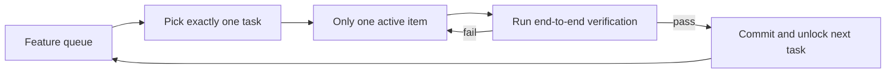
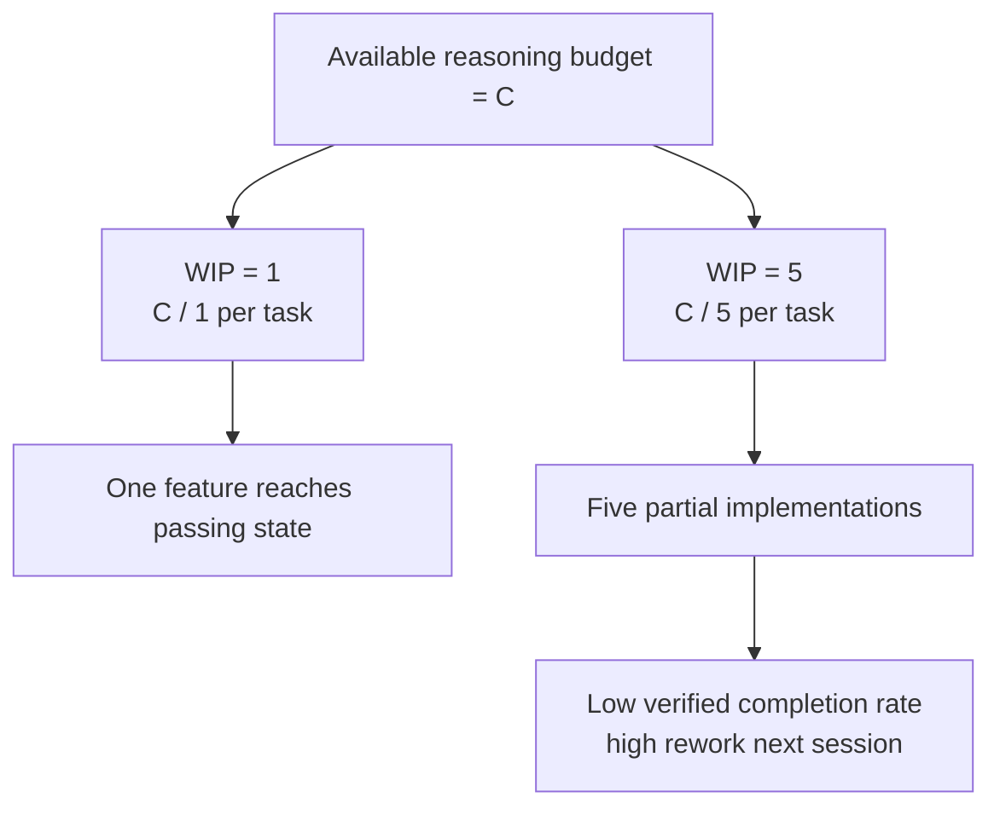

[Versión en chino →](../../../zh/lectures/lecture-07-why-agents-overreach-and-under-finish/)

> Ejemplos de código: [código/](https://github.com/walkinglabs/learn-harness-engineering/blob/main/docs/es/lectures/lecture-07-why-agents-overreach-and-under-finish/code/)
> Proyecto práctico: [Proyecto 04. Runtime feedback and alcance control](./../../projects/project-04-incremental-indexing/index.md)

# Lección 07. Draw Claro Tarea Límites for Agents

You tell Claude Código to "añadir usuario authentication to this proyecto," and it starts modifying the database schema, escritura routes, changing frontend components, and — while it's at it — refactoring the error-handling middleware. Two hours later you check: 12 archivos modified, 800 lines of new código, and not a single feature works end-to-end.

Biting off more than you can chew — this saying applies to AI agents especially well. Agents are born with an impulse to "do a little extra" — they see related things and just handle them along the way, like someone who goes to the supermarket for a bottle of soy sauce and comes out pushing a full cart. The problema is, humans who buy too much just waste money; agents doing too many things simultaneously means none of them get terminado properly.

Anthropic's "Effective harnesses for agents de larga duración" ingeniería blog states clearly: when prompts are too broad, agents tend to "empezar multiple things at once" rather than "finish one thing first." OpenAI's Codex ingeniería practices found the mismo — tareas without explícito alcance controls see finalización rates plummet. This is not a modelo problema — it's a harness problema. You didn't draw the boundary.

## Attention Is a Finite Recurso

This isn't a metaphor — it's math. Assume the agent's contexto capacity is C and it activates k tareas simultaneously. Each tarea gets an average of C/k reasoning recursos. When C/k drops below the minimum threshold needed to completo a single tarea, none of them get terminado. Your stomach is only so big — stuff ten dumplings in at once and you won't digest them all, you'll just get ten cases of indigestion.

Claude Código's real behavior is telling. Ask it to "añadir usuario registration" and it might:

1. Crear a Usuario modelo
2. Escribir the registration route
3. Notice it needs email verificación, so añadir a mail service
4. See that passwords need hashing, so bring in bcrypt
5. Notice the error handling is inconsistent, so refactor the global error middleware
6. See the prueba archivo estructura is messy, so reorganize the directory

Six pasos later, every one is half-done. No end-to-end verificación, complex coupling between the half-baked código, and the siguiente sesión to pick up the pieces will be completely lost. Like someone cooking six dishes simultaneously — every dish is in the pan but none has been plated. They all burn.

Anthropic's experimental datos directly supports this: agents usando a "small siguiente paso" strategy (equivalent to WIP=1) show a 37% higher tarea finalización rate than agents usando broad prompts. More interestingly, the number of lines of código generated by agents is weakly negatively correlated with real feature finalización — more código written, fewer funcionalidades completed. Biting off more than you can chew, proven by datos.

## WIP=1 Flujo de trabajo





## Core Concepts

- **Overreach**: The agent activates more tareas in a single sesión than optimal. It's quantifiable — doing 5 funcionalidades with 0 passing end-to-end is overreach.
- **Under-finish**: The ratio of tareas that pass end-to-end verificación, out of all activated tareas, falls below threshold. Código written but pruebas not passing is under-finish.
- **WIP Limit (Work-in-Progress Limit)**: From Kanban methodology. Core idea: limit how many tareas are in-flight at once. For agents, WIP=1 is the safest default — finish one before starting the siguiente. Like a buffet — don't pile your plate, finish one plate then go back for the siguiente.
- **Finalización Evidence**: The verifiable condición a tarea must satisfy to move from "in progress" to "terminado." Without this, agents substitute "the código looks fine" for "the behavior passes pruebas."
- **Scope Surface**: A DAG estructura where each node is a work unit and edges are dependencies. States are limited to four: not_started, active, blocked, passing.
- **Finalización Pressure**: The constraining force the harness exerts through WIP limits and finalización evidence requirements, forcing the agent to finish the current tarea before starting a new one.

## Overreach and Under-finish Are Symbiotic

These two problemas aren't independent — they amplify each other. Overreach dilutes attention, diluted attention causes under-finish, and the half-finished código left behind increases system complexity, which further drives overreach in the siguiente tarea. A vicious cycle.

In Kanban terms: Little's Law tells us L = lambda * W. If work-in-progress L is too high (doing too many things at once), the lead time W for each tarea inevitably increases. For agents, this means each feature takes longer from empezar to verified finalización, and the probability of fallo grows.

This is an old problema in the human world too — Steve McConnell documented in *Rapid Development* that alcance creep is the leading cause of proyecto fallo. But humans at least have the intuition of "I've terminado enough." Agents have none. Generating the siguiente idea costs the modelo almost nothing in extra tokens — escritura "let me arreglar this too while I'm here" barely registers — but every additional modification dilutes the agent's attention. Like a buffet where each extra plate has near-zero marginal cost, but your stomach only has so much capacity.

## How to Do It Right

### 1. Enforce WIP=1

This is the most direct and effective método. In your harness, tell the agent explicitly: **only one tarea is allowed in "active" status at any time.** In Claude Código's CLAUDE.md or Codex's AGENTS.md, escribir:

```
## Work Rules
- Work on one feature at a time
- Only start the next feature after the current one passes end-to-end verification
- Don't "also refactor" feature B while implementing feature A
```

Like eating at a buffet — one plate at a time, finish it before going back for more.

### 2. Define Explícito Finalización Evidence for Every Tarea

Terminado is not "código is written" — it's "behavior verificación passes." In your lista de funcionalidades, every entry needs a verificación comando:

```
F01: User Registration
  Verification: curl -X POST /api/register -d '{"email":"test@example.com","password":"123456"}' | jq .status == 201
  State: passing
```

### 3. Externalize the Scope Surface

Usar a machine-readable archivo (JSON or Markdown) to record all tarea states. Any new sesión can leer this archivo and immediately know: which tarea is active? What behavior counts as terminado? What verificacións have passed?

### 4. Monitor Verified Finalización Rate

The harness should continuously track VCR (Verified Finalización Rate) = verified tareas / activated tareas. Block new tarea activations when VCR < 1.0.

## Real-World Case

A REST API proyecto with 8 funcionalidades, two strategies compared:

**Buffet mode (unconstrained)**: Agent activates 5 funcionalidades simultaneously in sesión 1. Produces ~800 lines across 12 archivos. End-to-end prueba pass rate: 20% — only usuario registration works. The other 4 funcionalidades: database schema created but faltante validation logic, routes defined but returning incorrecto response formats. Like someone cooking six dishes at once, only one is barely edible. By end of sesión 3, only 3 of 8 funcionalidades completo.

**Single-plate mode (WIP=1)**: Agent works on usuario registration only in sesión 1. Produces ~200 lines across 4 archivos. End-to-end pruebas: 100% passing. Commits a limpio, verified implementation. By end of sesión 4, 7 of 8 funcionalidades completo (the 8th blocked by an external dependency).

Resultado: less total código (800 vs 1200 lines) but more effective código. Finalización rate: 87.5% vs 37.5%. Take one bite at a time, and you actually eat more.

## Ideas clave

- **WIP=1 is the default safe setting for agent harnesses** — finish one, then empezar the siguiente; don't try to parallelize. You can't become fat in one bite.
- **Finalización evidence must be executable** — "the código looks fine" doesn't count; "curl returns 201" does.
- **The alcance surface must be externalized as a archivo** — not just mentioned in conversation, but recorded in a machine-readable format in the repo.
- **Overreach and under-finish are symbiotic** — solving one solves the other.
- **"Do less but finish" always beats "do more but leave half-done"** — agent código lines and feature finalización rate are negatively correlated. Calidad always beats quantity.

## Lecturas adicionales

- [Effective harnesses for agents de larga duración - Anthropic](https://www.anthropic.com/engineering/effective-harnesses-for-long-running-agents) — Anthropic's ingeniería blog, detailed discussion of the "small siguiente paso" strategy
- [Harness Ingeniería - OpenAI](https://openai.com/index/harness-engineering/) — OpenAI's completo treatment of harness ingeniería
- [Kanban: Correcto Evolutionary Cambio - David Anderson](https://www.goodreads.com/book/show/1070822.Kanban) — The classic source on WIP limits
- [Rapid Development - Steve McConnell](https://www.goodreads.com/book/show/125171.Rapid_Development) — Empirical datos on alcance creep as the leading cause of proyecto fallo

## Ejercicios

1. **Tarea Atomization**: Pick a broad requirement (e.g., "implement a usuario gestión system") and break it into at least 5 atomic work units. For each unit, specify: (a) a single behavior description, (b) an executable verificación comando, (c) dependencies. Check whether the decomposition satisfies the WIP=1 constraint.

2. **Comparación Experiment**: Ejecutar the mismo proyecto twice — once without constraints, once with enforced WIP=1. Comparar: verified finalización rate, total lines of código, effective código ratio.

3. **Finalización Evidence Audit**: Revisión a recent agent ejecutar's salida, classifying each código cambio as "completed behavior," "incomplete behavior," or "scaffolding." Añadir faltante verificación comandos for each incomplete behavior.
