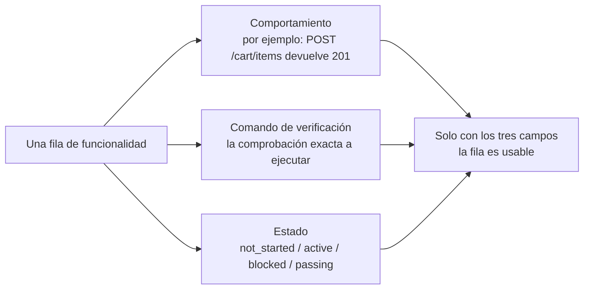
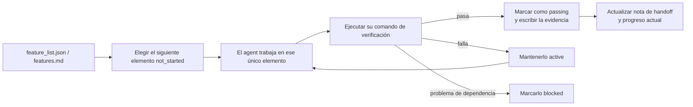

[Versión en chino →](../../../zh/lectures/lecture-08-why-feature-lists-are-harness-primitives/)

> Ejemplos de código: [code/](https://github.com/walkinglabs/learn-harness-engineering/blob/main/docs/es/lectures/lecture-08-why-feature-lists-are-harness-primitives/code/)
> Proyecto práctico: [Proyecto 04. Runtime feedback and scope control](./../../projects/project-04-incremental-indexing/index.md)

# Lección 08. Usar listas de funcionalidades para acotar lo que hace el agent

Le pides a un agent que construya un sitio de e-commerce. Cuando termina, te dice "hecho". Miras el código: la autenticación de usuarios funciona, pero el botón de checkout del carrito no hace nada y el flujo de pago no está conectado. El problema: nunca le dijiste qué significa "hecho", así que usó su propio estándar: "he escrito bastante código y parece bastante completo".

Para mucha gente, las listas de funcionalidades son solo un apunte: escribe cosas para no olvidarlas y luego déjalas a un lado. Pero en el mundo de los harnesses, una lista de funcionalidades no es una nota para humanos; es la columna vertebral del harness entero. El planificador depende de ella para elegir tareas, el verificador para juzgar finalización y el informe de handoff para generar resúmenes. Si rompes la columna, todo el cuerpo queda paralizado.

Anthropic y OpenAI enfatizan lo mismo: **los artefactos deben externalizarse**. El estado de las funcionalidades debe vivir en un archivo legible por máquina dentro del repo, no en texto conversacional no estructurado.

## Los agents no saben qué significa "hecho"

Ni Claude Code ni Codex saben automáticamente qué quieres decir con "hecho". Dices "añade un carrito de compra", y la interpretación del modelo puede ser "escribir un componente `Cart` y un método `addToCart`". Pero tú querías "el usuario puede navegar productos, añadirlos al carrito y completar el checkout end-to-end". Esta brecha de comprensión persiste si no hay una lista de funcionalidades. El agent usa su estándar implícito, normalmente "el código no tiene errores de sintaxis obvios". Lo que necesitas es verificación de comportamiento end-to-end. Como pedirle a alguien que compre fruta y que vuelva con limones: su idea de fruta y la tuya no eran la misma.

Mira esta nota de progreso común:

```text
Did user auth, shopping cart mostly done, still need payments
```

¿Puede una nueva sesión de agent responder estas preguntas a partir de esa nota? ¿Qué significa "mostly done"? ¿Qué pruebas pasó el carrito? ¿Qué bloquea los pagos? La respuesta a todo es "nadie lo sabe". Es como decirle al médico "me duele el estómago, últimamente bien": ¿qué tratamiento puede decidir con eso?

Resultado: la sesión nueva dedica 20 minutos a inferir el estado del proyecto y puede reimplementar funcionalidades ya completadas. Los datos de ingeniería de Anthropic muestran que buenos registros de progreso reducen el tiempo de diagnóstico al inicio de sesión entre un 60% y un 80%.

## Máquina de estados de funcionalidades





## Conceptos clave

- **Las listas de funcionalidades son primitivas de harness**: no son "herramientas opcionales de planificación", sino estructuras de datos fundamentales de las que dependen otros componentes del harness. Como las estructuras de tablas de una base de datos: no puedes decir "saltemos las claves primarias".
- **Estructura triple**: cada elemento de funcionalidad es una terna `(descripción de comportamiento, comando de verificación, estado actual)`. Si falta cualquier elemento, la entrada está incompleta.
- **Modelo de máquina de estados**: cada funcionalidad tiene cuatro estados: `not_started`, `active`, `blocked`, `passing`. Las transiciones de estado las controla el harness, no las cambia libremente el agent.
- **Pass-state gating**: la única forma de que una funcionalidad pase de `active` a `passing` es que el comando de verificación se ejecute correctamente. Es irreversible: una vez `passing`, no vuelve atrás.
- **Fuente única de verdad**: toda la información sobre "qué hay que hacer" debe derivarse de una lista de funcionalidades. Sin contradicciones entre la lista y el historial de conversación.
- **Back-pressure**: el número de funcionalidades que aún no han pasado es la presión que ejerce el harness sobre el agent. Presión cero = proyecto completo.

## Por qué las listas de funcionalidades deben ser "primitivas"

Los documentos son para que los lean humanos; las primitivas son para que las ejecuten sistemas. Los documentos pueden ignorarse; las primitivas no deberían poder saltarse.

Piensa en la diferencia entre restricciones de triggers de base de datos y comprobaciones en la capa de aplicación: las primeras las impone el motor de base de datos y ningún SQL puede saltárselas; las segundas dependen de que el código de aplicación sea correcto y pueden omitirse por accidente. Como primitivas de harness, las listas de funcionalidades sirven específicamente a cuatro componentes:

1. **Planificador**: lee estados y elige la siguiente funcionalidad `not_started`. Como un sistema de planificación de producción en fábrica.
2. **Verificador**: ejecuta comandos de verificación y decide si permite transiciones de estado. Como control de calidad.
3. **Informe de handoff**: genera automáticamente resúmenes de cambio de sesión a partir de la lista de funcionalidades.
4. **Seguimiento de progreso**: cuenta la distribución de estados y aporta métricas de salud del proyecto. Como un dashboard.

## Cómo hacerlo bien

### 1. Definir un formato mínimo de lista de funcionalidades

No necesitas un sistema complejo: un archivo Markdown estructurado o JSON sirve. Lo esencial es que cada entrada tenga la terna:

```json
{
  "id": "F03",
  "behavior": "POST /cart/items with {product_id, quantity} returns 201",
  "verification": "curl -X POST http://localhost:3000/api/cart/items -H 'Content-Type: application/json' -d '{\"product_id\":1,\"quantity\":2}' | jq .status == 201",
  "state": "passing",
  "evidence": "commit abc123, test output log"
}
```

### 2. Dejar que el harness controle las transiciones de estado

El agent no puede cambiar directamente el estado de una funcionalidad a `passing`. Solo puede solicitar verificación; el harness ejecuta el comando y decide si permite la transición. Esto es `pass-state gating`.

### 3. Escribir las reglas en `CLAUDE.md`

```text
## Feature List Rules
- Feature list file: /docs/features.md
- Only one feature active at a time
- Verification command must pass before marking as passing
- Don't modify feature list states yourself — the verification script updates them automatically
```

### 4. Calibrar la granularidad

Cada elemento de funcionalidad debería tener scope de "completable en una sesión". Demasiado amplio y no se terminará; demasiado estrecho y el coste de gestión crece. "El usuario puede añadir artículos al carrito" tiene buena granularidad. "Implementar el carrito" es demasiado amplio. "Crear el campo `name` en el modelo `Cart`" es demasiado estrecho. Como cortar un filete: ni la pieza entera ni carne picada.

## Caso real

Una plataforma de e-commerce con 10 funcionalidades comparó dos enfoques de seguimiento:

**Modo nota**: el agent usa notas no estructuradas. Después de 3 sesiones, las notas dicen "did user auth and product list, shopping cart mostly done but has bugs, payments not started". Una nueva sesión necesita 20 minutos para inferir el estado y termina reimplementando funcionalidades completadas. Como una lista de compra que dice "leche, pan y esa cosa": en la tienda sigues sin saber qué comprar.

**Modo columna vertebral**: cada funcionalidad tiene un estado claro y un comando de verificación. La nueva sesión lee la lista y en 3 minutos sabe: F01-F05 están `passing`, F06 está `active`, F07-F10 están `not_started`. Retoma directamente desde F06, sin retrabajo.

Resultado cuantificado: los proyectos con listas estructuradas de funcionalidades muestran una tasa de finalización un 45% mayor que los proyectos con seguimiento libre, con cero implementaciones duplicadas.

## Ideas clave

- **Las listas de funcionalidades son la columna vertebral del harness**, no notas para humanos. Planificador, verificador e informe de handoff dependen de ellas.
- **Cada elemento debe tener la terna**: descripción de comportamiento + comando de verificación + estado actual. Si falta uno, está incompleto.
- **El harness controla las transiciones de estado**: el agent no cambia estados por su cuenta. Pasar verificación es el único camino de ascenso.
- **La lista de funcionalidades es la fuente única de verdad del proyecto**: toda la información de "qué hacer" deriva de una lista.
- **Calibra la granularidad a "completable en una sesión"**.

## Lecturas adicionales

- [Building Effective Agents - Anthropic](https://www.anthropic.com/research/building-effective-agents) — identifica explícitamente la lista de funcionalidades como la "estructura de datos central" para controlar el scope del agent.
- [Harness Engineering - OpenAI](https://openai.com/index/harness-engineering/) — enfatiza el principio de "externalizar artefactos".
- [Design by Contract - Bertrand Meyer](https://www.goodreads.com/book/show/130439.Object_Oriented_Software_Construction) — principios de diseño por contrato, base teórica de las listas de funcionalidades.
- [How Google Tests Software](https://www.goodreads.com/book/show/13563030-how-google-tests-software) — pirámide de pruebas y prácticas de ingeniería de especificación conductual.

## Ejercicios

1. **Diseño de lista de funcionalidades**: define un esquema JSON mínimo para listas de funcionalidades. Incluye id, descripción de comportamiento, comando de verificación, estado actual y referencia de evidencia. Úsalo para describir un proyecto real con 5 funcionalidades.

2. **Comparación de estrictitud de verificación**: elige 3 funcionalidades y diseña una verificación "laxa", por ejemplo "el código no tiene errores de sintaxis", y una verificación "estricta", por ejemplo "la prueba end-to-end pasa". Compara la tasa de falsos positivos de cada enfoque.

3. **Auditoría del principio de fuente única**: revisa un proyecto existente con agents y busca información de scope que contradiga la lista de funcionalidades, como requisitos implícitos en conversaciones o comentarios TODO en el código. Diseña un plan para unificar toda la información en la lista de funcionalidades.
