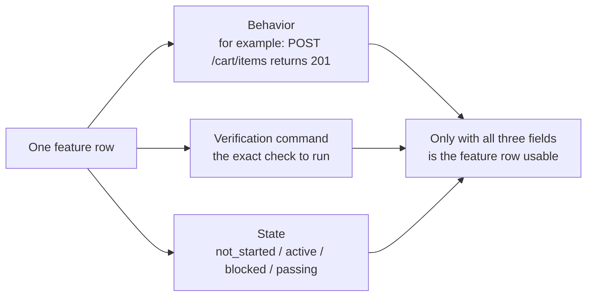
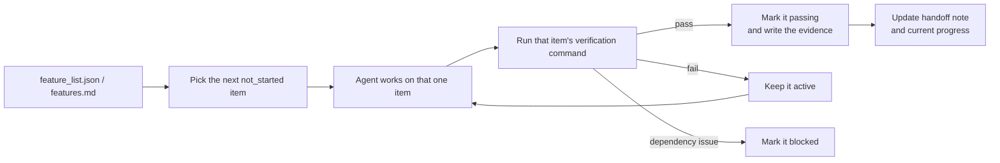

[Versión en chino →](../../../zh/lectures/lecture-08-why-feature-lists-are-harness-primitives/)

> Ejemplos de código: [código/](https://github.com/walkinglabs/learn-harness-engineering/blob/main/docs/es/lectures/lecture-08-why-feature-lists-are-harness-primitives/code/)
> Proyecto práctico: [Proyecto 04. Runtime feedback and alcance control](./../../projects/project-04-incremental-indexing/index.md)

# Lección 08. Usar Feature Lists to Constrain What the Agent Does

You ask an agent to construir an e-commerce site. After it finishes, it tells you "terminado." You look at the código — usuario authentication works, but the checkout button in the shopping cart does nothing, and the payment flow isn't connected at all. The problema: you never told it what "terminado" means, so it usado its own standard — "I wrote a lot of código and it looks fairly completo."

 Feature lists, in many people's eyes, are just a memo — escribir things down so you don't forget, then toss it aside. But in the harness world, a lista de funcionalidades isn't a memo for humans — it's the backbone of the entire harness. The scheduler relies on it to pick tareas, the verifier relies on it to judge finalización, the traspaso reporter relies on it to generate summaries. Break the backbone and the whole body is paralyzed.

Both Anthropic and OpenAI emphasize: **artifacts must be externalized.** Feature estado must live in a machine-readable archivo in the repo, not in no estructurado conversation text.

## Agents Don't Know What "Terminado" Means

Neither Claude Código nor Codex automatically knows what you mean by "terminado." You say "añadir a shopping cart feature," and the modelo's interpretation might be "escribir a Cart component and an addToCart método." But you meant "the usuario can browse products, añadir to cart, and completo checkout end-to-end." This comprensión gap persists without a lista de funcionalidades. The agent uses its own implícito standard — usually "the código has no obvious syntax errors." What you need is end-to-end behavioral verificación. Like asking a friend to buy you fruit — you say "get some fruit" and they come back with lemons. Their fruit and your fruit are not the mismo fruit.

Look at this common progress note:

```
Did user auth, shopping cart mostly done, still need payments
```
Can a new agent sesión answer these questions from this note? What does "mostly terminado" mean? Which pruebas did the cart pass? What's blocking payments? The answer to all is "nobody knows." Like telling your doctor "my stomach hurts, been okay lately" — what medicine can they prescribe?

The resultado: the new sesión spends 20 minutes inferring proyecto estado, and may re-implement completed funcionalidades. Anthropic's ingeniería datos shows that good progress records reduce sesión startup diagnostic time by 60-80%.

## Feature Estado Machine





## Core Concepts

- **Feature lists are harness primitives**: Not "optional planning herramientas," but foundational datos structures that all other harness components depend on. Like database table structures — you can't say "let's skip primary keys."
- **Triple estructura**: Each feature item is a `(behavior description, verificación comando, current estado)` triple. Faltante any element hace the item incomplete.
- **Estado machine modelo**: Each feature item has four states — `not_started`, `active`, `blocked`, `passing`. Estado transitions are controlled by the harness, not freely changed by the agent.
- **Pass-state gating**: The only way a feature moves from `active` to `passing` is by verificación comando executing successfully. This is irreversible — once `passing`, it can't go back. Like passing an exam means you passed, you can't retroactively cambio the score.
- **Single fuente de verdad**: All information about "what needs to be terminado" must derive from one lista de funcionalidades. No contradictions between the lista de funcionalidades and conversation history.
- **Back-pressure**: The number of funcionalidades that haven't passed yet is the pressure the harness exerts on the agent. Zero pressure = proyecto completo.

## Why Feature Lists Must Be "Primitives"

Documents are for humans to leer; primitives are for sistemas to execute. Documents can be ignored; primitives can't be bypassed.

Think of it like database trigger constraints vs. application-layer checks: the former is enforced by the database engine, no SQL can skip it; the latter depends on application código correctness and can be accidentally bypassed. Feature lists as harness primitives are Specifically, the lista de funcionalidades serves four harness components:

1. **Scheduler**: Reads states, picks the siguiente `not_started` feature. Like a factory producción planning system.
2. **Verifier**: Executes verificación comandos, decides whether to allow estado transitions. Like calidad inspection.
3. **Handoff reporter**: Automatically generates sesión traspaso summaries from the lista de funcionalidades. Like an automatic shift-change report.
4. **Progress tracker**: Tallies estado distribution, proporciona proyecto health metrics. Like a dashboard.

## How to Do It Right

### 1. Define a Minimal Feature Lista Format

You don't need a complex system — a estructurado Markdown or JSON archivo works. The key is every entry must have the triple:

```json
{
  "id": "F03",
  "behavior": "POST /cart/items with {product_id, quantity} returns 201",
  "verification": "curl -X POST http://localhost:3000/api/cart/items -H 'Content-Type: application/json' -d '{\"product_id\":1,\"quantity\":2}' | jq .status == 201",
  "state": "passing",
  "evidence": "commit abc123, test output log"
}
```

### 2. Let the Harness Control Estado Transitions

The agent can't directly cambio a feature's estado to `passing`. It can only submit a verificación request; the harness executes the verificación comando and decides whether to allow the transition. This is "pass-state gating."

### 3. Escribir the Reglas in CLAUDE.md

```
## Feature List Rules
- Feature list file: /docs/features.md
- Only one feature active at a time
- Verification command must pass before marking as passing
- Don't modify feature list states yourself — the verification script updates them automatically
```

### 4. Calibrate Granularity

Each feature item should be alcanced to "completable in one sesión." Too broad and it won't finish; too narrow and the gestión overhead grows. "Usuario can añadir items to cart" is good granularity. "Implement the shopping cart" is too broad. "Crear the name field on the Cart modelo" is too narrow. Like cutting a steak — not the whole piece, and not ground meat.

## Real-World Case

An e-commerce platform with 10 funcionalidades. Two tracking approaches compared:

**Memo mode**: Agent uses no estructurado notes. After 3 sesións, notes become "did usuario auth and product lista, shopping cart mostly terminado but has errores, payments not iniciado." New sesión needs 20 minutes to infer estado, ultimately re-implements completed funcionalidades. Like your shopping lista saying "milk, bread, and that thing" — at the store, you still don't know what to buy.

**Backbone mode**: Every feature has a claro estado and verificación comando. New sesión reads the lista de funcionalidades and in 3 minutes knows: F01-F05 are `passing`, F06 is `active`, F07-F10 are `not_started`. Picks up from F06 directly, zero rework.

Quantified resultado: proyectos usando estructurado lista de funcionalidadess show 45% higher feature finalización rate than free-form tracking, with zero duplicate implementations.

## Ideas clave

- **Feature lists are the harness's backbone**, not memos for humans. Scheduler, verifier, and traspaso reporter all depend on them.
- **Every feature item must have the triple**: behavior description + verificación comando + current estado. Faltante one element hace it incomplete — like a three-legged stool faltante a leg.
- **Estado transitions are controlled by the harness** — the agent can't cambio states on its own. Passing verificación = the only upgrade ruta.
- **The lista de funcionalidades is the proyecto's single fuente de verdad** — all "what to do" information derives from one lista.
- **Calibrate granularity to "completable in one sesión."**

## Lecturas adicionales

- [Construyendo Effective Agents - Anthropic](https://www.anthropic.com/research/building-effective-agents) — Explicitly identifies lista de funcionalidades as the "core datos estructura" for controlling agent alcance
- [Harness Ingeniería - OpenAI](https://openai.com/index/harness-engineering/) — Emphasizes the principle of "externalizing artifacts"
- [Diseño by Contract - Bertrand Meyer](https://www.goodreads.com/book/show/130439.Object_Oriented_Software_Construction) — Contract diseño principles, the theoretical foundation of lista de funcionalidadess
- [How Google Pruebas Software](https://www.goodreads.com/book/show/13563030-how-google-tests-software) — Prueba pyramid and behavioral specification ingeniería practices

## Ejercicios

1. **Feature Lista Diseño**: Define a minimal lista de funcionalidades JSON schema. Include: id, behavior description, verificación comando, current estado, evidence referencia. Usar it to describe a real proyecto with 5 funcionalidades.

2. **Verification Strictness Comparación**: Pick 3 funcionalidades and diseño both a "loose" verificación (e.g., "código has no syntax errors") and a "strict" verificación (e.g., "end-to-end prueba passes"). Comparar false positive rate under each approach.

3. **Single Fuente Principle Audit**: Revisión an existing agent proyecto and check for alcance information that contradicts the lista de funcionalidades (implícito requirements in conversations, TODO comments in código, etc.). Diseño a plan to unify all information into the lista de funcionalidades.
