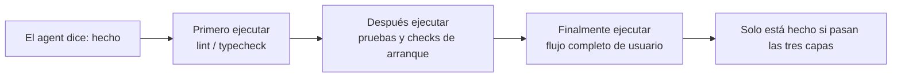
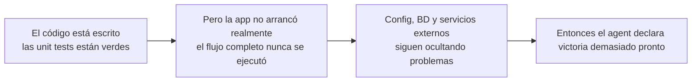

[Versión en chino →](../../../zh/lectures/lecture-09-why-agents-declare-victory-too-early/)

> Ejemplos de código de esta lección: [code/](https://github.com/walkinglabs/learn-harness-engineering/blob/main/docs/es/lectures/lecture-09-why-agents-declare-victory-too-early/code/)
> Práctica guiada: [Proyecto 05. Let the agent verify its own work](./../../projects/project-05-grounded-qa-verification/index.md)

# Lección 9. Evitar que los agents declaren victoria demasiado pronto

Le pides a un agent que implemente una funcionalidad de "restablecimiento de contraseña". Modifica el esquema de base de datos, escribe el endpoint de API, añade la plantilla de email, ejecuta pruebas unitarias, todas pasan, y te dice con seguridad: "está hecho". Cuando intentas usarlo de verdad, el enlace de restablecimiento no puede enviarse porque falta la configuración del servicio de email, la migración de base de datos falla a mitad por una inconsistencia de esquema y el flujo end-to-end no se ha ejecutado ni una vez.

La sensación debería resultar familiar: como llenar todo el examen, entregarlo el primero con confianza y luego suspender cuando salen las notas. Que el papel esté lleno no significa que las respuestas sean correctas.

No es un caso aislado. El artículo clásico de ICML 2017 de Guo et al. demostró que **las redes neuronales modernas son sistemáticamente sobreconfiadas**: la confianza que reportan los modelos es bastante mayor que su precisión real. Lo mismo ocurre con los agents de programación: "sienten" que han terminado, pero en realidad están lejos de ello. Tu harness debe sustituir las "sensaciones" del agent por verificación externalizada basada en ejecución.

## La pendiente resbaladiza

Las declaraciones prematuras de finalización casi siempre siguen el mismo patrón: el código parece correcto, la sintaxis es válida, la lógica parece razonable y el análisis estático no muestra errores obvios. Pero el harness no exige verificación de ejecución completa, así que el agent no lo ejecuta realmente o solo corre pruebas parciales. Ejecuta pruebas unitarias pero salta integración; ejecuta pruebas pero no revisa cobertura. Al final, "el código parece bien" se toma como evidencia de que "la funcionalidad está completa". Y se entrega el examen.

Se pierde información en cada paso. Desde la especificación de tarea hasta la implementación y el comportamiento en runtime, cada transformación puede introducir sesgo, y cada verificación omitida agrava la asimetría de información.

## Comprobación de terminación en tres capas





## Conceptos clave

- **Declaración prematura de finalización**: el agent afirma que la tarea está completa, pero aún existen especificaciones de corrección incumplidas. El problema central: el agent juzga por confianza local a nivel de código, mientras que la corrección del sistema requiere verificación global.
- **Sesgo de calibración de confianza**: brecha sistemática entre la confianza reportada por el agent sobre la finalización y la calidad real. En tareas complejas de varios archivos, el sesgo es claramente positivo: el agent confía más de lo que su rendimiento justifica.
- **Criterios de terminación**: conjunto claro y ejecutable de condiciones de juicio definido por el harness. El agent debe satisfacerlas todas antes de declarar finalización. "Hecho" pasa de juicio subjetivo a determinación objetiva.
- **Doble puerta verificación-validación**: la primera capa comprueba "si el código implementó correctamente el comportamiento especificado"; la segunda comprueba "si el comportamiento del sistema satisface los requisitos end-to-end". Ambas deben pasar.
- **Señales de feedback en runtime**: logs, estados de procesos y health checks de la ejecución del programa. Son la base objetiva para que el harness juzgue la calidad de finalización.
- **Restricción de prioridad de finalización**: primero verificar corrección funcional, después rendimiento y por último estilo. Refactorizar está prohibido hasta que la funcionalidad central esté verificada.

## Unit tests en verde no equivalen a tarea completa

Es la trampa más común y la más peligrosa. El agent escribió el código, ejecutó unit tests, todo salió verde y dijo "hecho". Pero la filosofía de las unit tests, aislar la unidad bajo prueba y simular dependencias, es precisamente lo que les impide detectar problemas entre componentes:

**Desajuste de interfaz**: el proceso renderer pasa una ruta relativa al script preload, pero el preload espera una ruta absoluta. Las unit tests de ambos usan mocks y pasan. El problema solo aparece en pruebas end-to-end. Como músicos que practican perfectamente por separado y descubren al tocar juntos que están en tonalidades distintas.

**Errores de propagación de estado**: una migración cambia el esquema de tabla, pero la capa de caché del ORM conserva entradas del esquema antiguo. Las unit tests crean un entorno mock fresco cada vez y no exponen esa inconsistencia entre capas.

**Dependencia del entorno**: el código se comporta correctamente en el entorno de pruebas, donde todo está simulado, pero falla en el entorno real por diferencias de configuración, latencia de red o servicios no disponibles. Como cantar perfecto en la sala de ensayo y encontrarte problemas de sonido en el escenario.

### "Refactorizar ya que estamos" envenena el juicio de finalización

Claude Code tiene un patrón frecuente: empieza a refactorizar, optimizar rendimiento y mejorar estilo antes de que la funcionalidad central haya pasado verificación. La cita de Knuth, "la optimización prematura es la raíz de todos los males", cobra un sentido nuevo con agents: refactorizar altera el límite entre código verificado y no verificado, y puede romper rutas que eran implícitamente correctas. Es como pasar a limpio tus respuestas de opción múltiple antes de terminar los problemas largos: pierdes tiempo y además puedes copiarlas mal.

### Sesgo sistemático en la autoevaluación

Anthropic descubrió un patrón de fallo más profundo en su investigación de 2026: **cuando se pide a un agent que evalúe su propio trabajo, entrega evaluaciones sistemáticamente demasiado positivas, incluso cuando una persona consideraría que la calidad es claramente insuficiente**. Es como pedir a un estudiante que corrija su propio examen: siempre será especialmente indulgente con sus respuestas.

Este problema es especialmente grave en tareas subjetivas, como estética de diseño. Que un "layout sea exquisito" es una cuestión de juicio, y el agent se inclina de forma fiable hacia lo positivo. Incluso en tareas con resultados verificables, el rendimiento del agent puede verse limitado por un mal juicio.

La solución no es hacer que el agent sea "más objetivo": el mismo modelo que genera y evalúa tiende inherentemente a favorecerse. **La solución es separar al "trabajador" del "verificador"**. Como un estudiante que no debería corregir su propio examen: necesitas un corrector independiente.

Un agent evaluador independiente, afinado para ser exigente, es mucho más eficaz que hacer que el agent generador se evalúe a sí mismo. Datos experimentales de Anthropic:

| Arquitectura | Runtime | Coste | ¿Funcionan las funcionalidades centrales? |
|--------------|---------|-------|-------------------------------------------|
| Agent único (ejecución desnuda) | 20 min | $9 | No (entidades del juego no responden a input) |
| Tres agents (planner + generador + evaluador) | 6 h | $200 | Sí (el juego es plenamente jugable) |

Es el mismo modelo, Opus 4.5, con el mismo prompt, "build a 2D retro game editor". La única diferencia es el harness: de "ejecución desnuda" a "planner expande requisitos → generador implementa funcionalidad por funcionalidad → evaluador realiza pruebas reales de clic con Playwright".

> Fuente: [Anthropic: Harness design for long-running application development](https://www.anthropic.com/engineering/harness-design-long-running-apps)

## Cómo evitar entregas prematuras

### 1. Externalizar el juicio de terminación

El juicio de finalización no debería hacerlo el agent. El harness debe ejecutar validación de terminación de forma independiente usando señales de runtime como entrada, no la confianza del agent. Escríbelo con claridad en `CLAUDE.md`:

```text
## Definition of Done
- Feature complete = end-to-end verification passed, not "code is written"
- Required verification levels:
  1. Unit tests pass
  2. Integration tests pass
  3. End-to-end flow verification passes
- Do not proceed to level 2 if level 1 fails
- Do not proceed to level 3 if level 2 fails
```

### 2. Construir una validación de terminación en tres capas

- **Capa 1: sintaxis y análisis estático**. Menor coste y menos información, pero debe pasar. Es el mínimo absoluto: primero hay que escribir bien las palabras.
- **Capa 2: verificación de comportamiento en runtime**. Ejecución de pruebas, checks de arranque de app y validación de rutas críticas. Es la evidencia central de finalización. No basta escribirlo: debe ejecutarse.
- **Capa 3: confirmación a nivel de sistema**. Pruebas end-to-end, validación de integración y simulación de escenarios de usuario. La última defensa contra declaraciones prematuras. No basta con que se ejecute: debe hacerlo correctamente.

### 3. Diseñar buenos "marcados en rojo" para agents

OpenAI introdujo un patrón especialmente eficaz en su práctica con Codex: **los mensajes de error para agents deben incluir instrucciones de corrección**. No pongas solo una cruz roja como un corrector perezoso; actúa como buen profesor y escribe "así deberías cambiarlo" en el margen. No uses `"Test failed"`; usa `"Test failed: POST /api/reset-password returned 500. Check that the email service config exists in environment variables. The template file should be at templates/reset-email.html."` Este feedback concreto y accionable permite al agent autocorregirse sin intervención humana.

### 4. Capturar señales de runtime

Señales de runtime efectivas:

- ¿La aplicación arrancó correctamente y alcanzó estado ready?
- ¿Las rutas críticas de la funcionalidad se ejecutaron correctamente en runtime?
- ¿Las escrituras en base de datos, operaciones de archivo y otros efectos secundarios fueron correctos?
- ¿Se limpiaron los recursos temporales?

## Caso real

**Tarea**: implementar restablecimiento de contraseña de usuario. Implica operaciones de base de datos, envío de email y cambios en endpoints de API.

**Camino de entrega prematura**: el agent modifica el esquema, escribe el endpoint, añade la plantilla de email, ejecuta unit tests, pasan, y declara finalización. El examen está completamente rellenado.

**Pérdidas reales de puntos**: (1) flujo end-to-end sin probar: nunca se confirmó el envío real ni la verificación del enlace; (2) la migración de base de datos falló tras ejecución parcial, causando inconsistencia de esquema; (3) faltaba la configuración del servicio de email en el entorno objetivo.

**Intervención del harness**: validación de terminación exigida: (1) arrancar la app completa para verificar accesibilidad del endpoint; (2) ejecutar el flujo completo de restablecimiento; (3) verificar consistencia del estado de base de datos. Todos los defectos se encontraron dentro de la sesión, ahorrando entre 5x y 10x el coste de correcciones posteriores. El corrector independiente encontró los problemas reales.

## Ideas clave

- **Los agents son sistemáticamente sobreconfiados**: el sesgo de calibración de confianza es una realidad objetiva. Rellenar el examen no significa aprobarlo.
- **El juicio de finalización debe externalizarse**: el harness verifica de forma independiente; no confíes en las "sensaciones" del agent.
- **Las tres capas de validación son esenciales**: sintaxis pasando, comportamiento pasando, sistema pasando, capa por capa.
- **Los mensajes de error deben parecer las notas de un buen profesor**: incluir pasos concretos de corrección para que el agent pueda autocorregirse.
- **Nada de refactorizar hasta que la funcionalidad central esté verificada**: la restricción de prioridad de finalización evita la optimización prematura.

## Lecturas adicionales

- [On Calibration of Modern Neural Networks - Guo et al.](https://arxiv.org/abs/1706.04599) — prueba que las redes profundas modernas son sistemáticamente sobreconfiadas.
- [Building Effective Agents - Anthropic](https://www.anthropic.com/research/building-effective-agents) — papel crítico de la evidencia de runtime en el juicio de finalización.
- [Harness Engineering - OpenAI](https://openai.com/index/harness-engineering/) — la declaración prematura de finalización es uno de los principales modos de fallo de agents.
- [The Art of Software Testing - Myers](https://www.goodreads.com/book/show/137543.The_Art_of_Software_Testing) — referencia clásica sobre jerarquías de métodos de prueba y efectividad.

## Ejercicios

1. **Diseño de función de validación de terminación**: diseña una validación completa para una tarea que implique migración de base de datos y modificación de API. Lista las señales de runtime requeridas y los criterios de paso/fallo de cada una. Ejecútala en una tarea real y registra qué problemas ocultos encuentra.

2. **Medición del sesgo de calibración**: elige 10 tipos distintos de tareas de programación y registra la confianza de finalización reportada por el agent frente a la calidad real. Calcula el sesgo y analiza su relación con la complejidad de la tarea.

3. **Experimento de defensa multicapa**: ejecuta tres configuraciones sobre el mismo conjunto de tareas: (a) solo análisis estático, (b) añadir unit tests, (c) validación completa en tres capas. Compara proporción de declaraciones prematuras y número de defectos no capturados.
