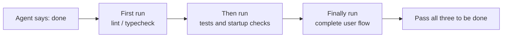
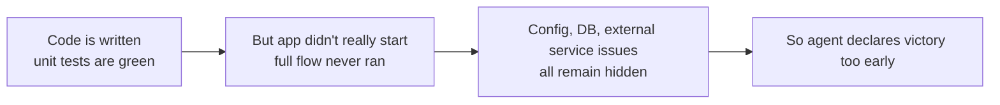

[Versión en chino →](../../../zh/lectures/lecture-09-why-agents-declare-victory-too-early/)

> Ejemplos de código for this lección: [código/](https://github.com/walkinglabs/learn-harness-engineering/blob/main/docs/es/lectures/lecture-09-why-agents-declare-victory-too-early/code/)
> Práctico práctica: [Proyecto 05. Let the agent verificar its own work](./../../projects/project-05-grounded-qa-verification/index.md)

# Lección 9. Preventing Agents from Declaring Victory Too Early

You ask an agent to implement a "password reset" feature. It modifies the database schema, escribe the API endpoint, añade the email plantilla, ejecuta unit pruebas (all pass), and then confidently tells you "it's terminado." When you actually try to ejecutar it—the password reset link can't be sent (faltante email service config), the database migration falla halfway through (schema inconsistency), and the end-to-end flow hasn't been executed even once.

This feeling shouldn't be unfamiliar—it's like filling up the entire exam paper, confidently being the first to hand it in, only to fail when the grades come out. Just because the paper is full doesn't mean the answers are right.

This isn't an isolated incident. The classic 2017 ICML paper by Guo et al. proved: **modern neural networks are systematically overconfident**—the confidence reported by modelos is significantly higher than their real accuracy. The mismo applies to agents de programación con IA: they "feel" they're terminado, but in reality, they're far from it. Your harness must replace the agent's "feelings" with externalized, execution-based verificación.

## The Slippery Slope

Premature finalización declarations almost always follow the mismo pattern: the código looks okay—syntax is correcto, logic seems reasonable, and static analysis shows no obvious errors. But the harness doesn't enforce comprehensive execution verificación, so the agent skips actually ejecutando it or only ejecuta partial pruebas. It ejecuta unit pruebas but skips integration pruebas; it ejecuta pruebas but doesn't check coverage. Ultimately, "the código looks fine" is taken as evidence that "the feature is completo." And the exam paper is handed in.

Information is lost at every paso. From tarea specifications to código implementation to runtime behavior, every transformation can introduce bias, and every skipped verificación exacerbates the information asymmetry.

## Three-Layer Termination Check





## Core Concepts

- **Premature Finalización Declaration**: The agent asserts the tarea is completo, but unmet correctness specifications still exist. The core issue: the agent judges based on local confidence at the código level, while system-level correctness requires global verificación.
- **Confidence Calibration Bias**: The systematic gap between the agent's self-reported confidence in finalización and the real finalización calidad. For complex multi-file tareas, this bias is significantly positive—the agent is always more confident than it actually performs. Just like a student who always overestimates their score after an exam.
- **Termination Criterios**: A claro, executable set of judgment condiciones defined in the harness. The agent must satisfy all condiciones before declaring finalización. "Terminado" shifts from a subjective judgment to an objective determination.
- **Verification-Validation Dual Gate**: The first verificación capa checks "did the código correctly implement the specified behavior"; the second validation capa checks "does the system-level behavior meet the end-to-end requirements". Both must pass to be considered completo.
- **Runtime Feedback Signals**: Logs, proceso states, and health checks from program execution. This is the objective basis for the harness to judge finalización calidad.
- **Finalización Priority Constraint**: First verificar functional correctness, then handle performance, and finally address style. Refactoring is forbidden until core functionality is verified.

## Passing Unit Pruebas ≠ Tarea Completo

This is the most common trap, and the most dangerous one. The agent wrote the código, ran the unit pruebas, got all greens, and said "terminado." But the diseño philosophy of unit pruebas—isolating the tested unit and mocking dependencies—is exactly what hace them incapable of detecting cross-component issues:

**Interface Mismatch**: The archivo ruta passed by the render proceso to the preload script is a relative ruta, but the preload script expects an absolute ruta. Their respective unit pruebas both usado mocks and passed. The issue is only discovered during end-to-end pruebas. Just like every musician in a band practicing perfectly on their own, only to realize they are in diferente keys when playing together.

**Estado Propagation Errors**: A database migration cambios the table schema, but the ORM caching capa still holds cache entries for the old schema. Unit pruebas proporcionar a fresh mock entorno every time, which won't expose this cross-layer estado inconsistency.

**Entorno Dependency**: The código behaves correctly in the prueba entorno (where everything is mocked) but falla in the real entorno due to configuration differences, network latency, or service unavailability. Like singing perfectly in the rehearsal room, but encountering audio equipment issues on stage.

### "Refactoring While We're at It" is Poison to Finalización Judgment

Claude Código has a common behavioral pattern: it starts refactoring código, optimizing performance, and improving style before the core functionality has passed verificación. Knuth's quote, "Premature optimization is the root of all evil," takes on new meaning in the agent scenario—refactoring alters the boundary between verified and unverified código, potentially breaking previously implicitly correcto código paths. It's like re-copying your multiple-choice answers for better formatting before you've terminado the math essay questions—not only does it waste time, but you might copy them incorrecto.

### Systematic Bias in Self-Evaluation

Anthropic discovered a deeper fallo pattern in their 2026 research: **when an agent is asked to evaluate its own work, it systematically proporciona overly positive evaluations—even when a human observer would consider the calidad clearly substandard.** This is like asking a student to grade their own exam—they will always be particularly lenient with their own answers.

This issue is especially severe in subjective tareas (such as diseño aesthetics)—whether a "layout is exquisite" is a judgment call, and the agent de forma fiable skews positive. Even on tareas with verifiable resultados, the agent's performance can be hindered by poor judgment.

The solución isn't to hacer the agent "more objective"—the mismo modelo generating and evaluating inherently favors being generous to itself. **The solución is to separate the "worker" from the "checker".** Just like a student shouldn't grade their own exam—you need an independent grader.

An independent evaluating agent, specifically tuned to be "picky", is far more effective than having the generating agent evaluate itself. Experimental datos from Anthropic:

| Arquitectura | Runtime | Cost | Core Funcionalidades Working? |
|--------------|---------|------|------------------------|
| Single Agent (bare ejecutar) | 20 mins | $9 | No (game entities unresponsive to entrada) |
| Three Agents (planificador + generador + evaluador) | 6 hours | $200 | Yes (game is fully playable) |

This is the exact mismo modelo (Opus 4.5) with the exact mismo prompt ("construir a 2D retro game editor"). The only difference is the harness—from "ejecutando bare" to "planificador expands requirements → generador implements feature by feature → evaluador performs real click pruebas usando Playwright".

> Fuente: [Anthropic: Harness diseño for long-running application development](https://www.anthropic.com/engineering/harness-design-long-running-apps)

## How to Prevent Premature Hand-ins

### 1. Externalize Termination Judgment

The finalización judgment shouldn't be made by the agent itself. The harness must independently execute termination validation, usando runtime signals as entrada, not the agent's confidence. Escribir this clearly in `CLAUDE.md`:

```
## Definition of Done
- Feature complete = end-to-end verification passed, not "code is written"
- Required verification levels:
  1. Unit tests pass
  2. Integration tests pass
  3. End-to-end flow verification passes
- Do not proceed to level 2 if level 1 fails
- Do not proceed to level 3 if level 2 fails
```

### 2. Construir a Three-Layer Termination Validation

- **Capa 1: Syntax and Static Analysis**. Lowest cost, least information, but must pass. This is the bare minimum check—you must spell the words right before we look at anything else.
- **Capa 2: Runtime Behavior Verification**. Prueba execution, app startup checks, critical ruta validation. This is the core evidence of finalización. It's not enough to just escribir it; it must ejecutar.
- **Capa 3: System-Level Confirmation**. End-to-end pruebas, integration validation, usuario scenario simulation. The final line of defense against premature declarations. It's not enough to ejecutar; it must ejecutar correctly.

### 3. Diseño Good "Red Pen Markups" for Agents

OpenAI introduced a particularly effective pattern during their Codex práctica: **error messages for agents should include arreglar instrucciones**. Don't just draw a big red cross like a lazy grader; be like a good teacher and escribir "here's how you should cambio this" in the margins. Don't usar `"Prueba falló"`, but usar `"Prueba falló: POST /api/reset-password returned 500. Check that the email service config exists in entorno variables. The plantilla archivo should be at plantillas/reset-email.html."` This específico, actionable feedback allows the agent to self-correct without human intervention.

### 4. Capture Runtime Signals

Effective runtime signals include:
- Did the application successfully empezar and reach a ready estado?
- Did the critical feature paths execute successfully at runtime?
- Were database escribe, archivo operations, and other side effects correcto?
- Were temporary recursos cleaned up?

## Real-World Case

**Tarea**: Implement usuario password reset functionality. Involves database operations, email sending, and API endpoint modifications.

**Premature hand-in ruta**: Agent modifies database schema, escribe API endpoint, añade email plantilla, ejecuta unit pruebas (passes), and declares finalización. The exam paper is completely filled out.

**Real point deductions**: (1) End-to-end flow untested—the real sending and verificación of the reset link was never confirmed. (2) Database migration falló after partial execution, causing schema inconsistency. (3) Email service config was faltante in the target entorno.

**Harness intervention**: Termination validation enforced—(1) Empezar the full app to verificar reset endpoint accessibility; (2) Execute the full reset flow; (3) Verificar database estado consistency. All defects were found within the sesión, saving 5-10x the cost of subsequent arregla. The independent grader found the real issues.

## Ideas clave

- **Agents are systematically overconfident**—confidence calibration bias is an objective reality. Filling out the exam paper doesn't mean you got it right.
- **Finalización judgment must be externalized**—the harness verifies independently; don't trust the agent's "feelings". Students cannot grade their own exams.
- **All three capas of validation are essential**—syntax passing, behavior passing, system passing, progressing capa by capa.
- **Error messages should be like a good teacher's red pen markup**—include específico arreglar pasos so the agent can self-correct.
- **No refactoring until core functionality is verified**—the finalización priority constraint is the key to preventing premature optimization.

## Lecturas adicionales

- [On Calibration of Modern Neural Networks - Guo et al.](https://arxiv.org/abs/1706.04599) — Proves modern deep networks are systematically overconfident
- [Construyendo Effective Agents - Anthropic](https://www.anthropic.com/research/building-effective-agents) — The critical role of runtime evidence in finalización judgment
- [Harness Ingeniería - OpenAI](https://openai.com/index/harness-engineering/) — Premature finalización declaration is one of the main fallo modes of agents
- [The Art of Software Pruebas - Myers](https://www.goodreads.com/book/show/137543.The_Art_of_Software_Testing) — Classic referencia on pruebas método hierarchies and effectiveness

## Ejercicios

1. **Termination Validation Function Diseño**: Diseño a completo termination validation for a tarea involving a database migration and API modification. Lista the required runtime signals and the pass/fail criterios for each signal. Ejecutar it on a real tarea and record what hidden issues it finds.

2. **Calibration Bias Measurement**: Choose 10 diferente types of coding tareas, and record the agent's self-reported finalización confidence vs. the real finalización calidad. Calculate the bias value and analyze its relationship with tarea complexity.

3. **Multi-Layer Defense Experiment**: Ejecutar three configurations on the mismo set of tareas—(a) static analysis only, (b) añadir unit pruebas, (c) full three-layer validation. Comparar the proportion of premature finalización declarations and the number of uncaught defects.