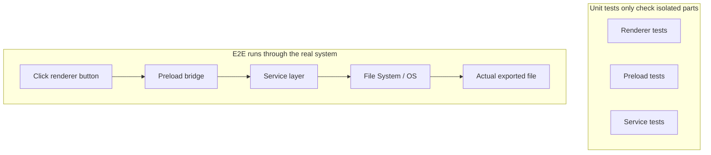
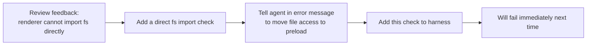

[Versión en chino →](../../../zh/lectures/lecture-10-why-end-to-end-testing-changes-results/)

> Ejemplos de código for this lección: [código/](https://github.com/walkinglabs/learn-harness-engineering/blob/main/docs/es/lectures/lecture-10-why-end-to-end-testing-changes-results/code/)
> Práctico práctica: [Proyecto 05. Let the agent verificar its own work](./../../projects/project-05-grounded-qa-verification/index.md)

# Lección 10. Only End-to-End Pruebas is True Verification

You ask the agent to añadir a archivo export feature to an Electron app. It escribe the render proceso component, the preload script, and the service capa logic. The unit pruebas for each component pass perfectly. The agent says, "It's terminado." When you actually click the export button—the archivo ruta format is incorrecto, the progress bar doesn't update, and exporting large archivos causes a memory leak. Five component boundary defects, and the unit pruebas didn't catch a single one.

It's like a choir rehearsal—each voice part sounds perfect when sung individually, but when they sing together, the sopranos are half a beat faster than the basses, and the accompaniment is a semitone off from the main melody. Each part is "correcto" on its own, but the whole thing is out of tune.

Google's Pruebas Pyramid tells us: a large number of unit pruebas are the foundation, but if you stop there, you will systematically miss component interaction issues. For agents de programación con IA, this problema is even more severe—agents tend to ejecutar only the fastest pruebas and then declare finalización. **Only end-to-end pruebas can prove that system-level defects don't exist.**

## The Blind Spots of Unit Pruebas

The diseño philosophy of unit pruebas is isolation—mocking dependencies and focusing solely on the unit under prueba. This philosophy hace unit pruebas fast and precise, but it also crea systematic blind spots. It's like having each voice part práctica with headphones on during a choir rehearsal—it sounds fine to them, but the issues only emerge when they come together:

**Interface Mismatch**: The archivo ruta passed by the render proceso to the preload script is a relative ruta, but the preload script expects an absolute ruta. Their respective unit pruebas both usado mocks and passed. The issue is only discovered when the end-to-end flow is executed—just like two voice parts practicing independently and feeling fine, only to realize during the ensemble that one is singing in 4/4 time and the other in 3/4 time.

**Estado Propagation Errors**: A database migration cambios the table schema, but the ORM caching capa still holds cache entries for the old schema. Unit pruebas proporcionar a completely new mock entorno every time, which won't expose this cross-layer estado inconsistency. It's like changing the lyrics of a song, but someone is still singing the old version.

**Recurso Lifecycle Issues**: The acquisition and release of archivo handles, database connections, and network sockets span multiple components. Unit pruebas crear and destroy independent recursos for each prueba, failing to expose recurso contention or leaks. It's like each voice part taking turns usando the microphones during rehearsal, but when everyone goes on stage together, there aren't enough mics.

**Entorno Dependency**: The código behaves correctly in the prueba entorno (where everything is mocked) but falla in the real entorno due to configuration differences, network latency, or service unavailability. Like singing perfectly in the rehearsal room, but encountering audio feedback and wind interference at an outdoor festival.

## End-to-End Pruebas Not Only Cambios Resultados, It Cambios Behavior

This is something many people fail to realize: when an agent knows its work will be subjected to end-to-end pruebas, its coding behavior cambios.

1. **Considering Component Interactions**: While escritura código, it will think about "how this interface connects with upstream," rather than just focusing on a single function. Just like knowing you'll eventually sing together, you'll pay attention to other voice parts during práctica.
2. **Respecting Architectural Límites**: In sistemas with architectural constraints, end-to-end pruebas forces the agent to adhere to boundary reglas. Like sheet music marked with "crescendo here," you have to follow it.
3. **Handling Error Paths**: End-to-end pruebas usually include fallo scenarios, forcing the agent to consider exception handling. It's like simulating "what if the mic suddenly dies" during rehearsal, so you know what to do.

## Pruebas Pyramid and Revisión Feedback Promotion





In Codex ingeniería practices, OpenAI emphasizes: **error messages written for agents must include arreglar instrucciones.** Don't just escribir `"Direct filesystem access in renderer"`; escribir `"Direct filesystem access in renderer. All archivo operations must go through the preload bridge. Move this call to preload/file-ops.ts and invoke it via window.api."` This turns architectural reglas into an auto-correction loop. Like a choir conductor who doesn't just say "you sang that incorrecto," but instead says "you were half a beat fast here, listen to the altos' rhythm, and come in at measure 32."

## Core Concepts

- **Component Boundary Defects**: Component A and B both pass their unit pruebas, but their interaction produces incorrect behavior. This is the type of issue end-to-end pruebas is best at catching—like choir parts that are individually correcto but out of tune together.
- **Pruebas Adequacy Gradient**: Defects caught by unit pruebas <= defects caught by integration pruebas <= defects caught by end-to-end pruebas. Each capa up increases detection capability.
- **Architectural Boundary Enforcement Reglas**: Turning reglas from arquitectura documents (like "render proceso cannot access the archivo system directly") into executable, automated checks. From "written on paper" to "ejecutando in CI."
- **Revisión Feedback Promotion**: Converting repeated código revisión comments into automated pruebas. Every time a recurring issue is found, añadir a rule, and the harness automatically grows stronger. Like a conductor turning common rehearsal mistakes into warm-up ejercicios—the siguiente time the mismo mistake is made, the ejercicio itself exposes it without the conductor needing to say a word.
- **Agent-Oriented Error Messages**: Fallo messages shouldn't just estado "what went incorrecto," but also tell the agent exactly how to arreglar it. This turns prueba fallos into self-correcting feedback loops.

## How to Do It

### 0. Define Architectural Límites First, Then Escribir E2E Pruebas

The prerequisite for end-to-end pruebas is claro system límites. If the arquitectura is a plate of spaghetti, end-to-end pruebas will only prove "this plate of spaghetti ejecuta," it won't tell you where diseño intents were violated. It's like a choir that hasn't even divided into voice parts—no amount of rehearsal will hacer it sound good.

OpenAI's experience: **for codebases generated by agents, architectural constraints must be early prerequisites established on day one, not something to consider when the equipo grows larger.** The reason is simple—agents will copy existing patterns in the repositorio, even if those patterns are uneven or suboptimal. Without architectural constraints, the agent will introduce more deviations in every sesión.

OpenAI adopted a "Layered Domain Arquitectura"—each business domain is divided into fixed capas: Types → Config → Repo → Service → Runtime → UI. Dependencies flow strictly forward, and cross-domain concerns enter through explícito Providers interfaces. Any other dependencies are forbidden and mechanically enforced via custom linting.

Key principle: **Enforce invariants, don't micromanage implementation.** For ejemplo, require "datos is parsed at the boundary," but don't dictate which biblioteca to usar. Error messages must include arreglar instrucciones—not just saying "violation," but telling the agent exactly how to cambio it.

> Fuente: [OpenAI: Harness ingeniería: leveraging Codex in an agent-first world](https://openai.com/index/harness-engineering/)

### 1. Harness Must Include an End-to-End Capa

Hacer it explícito in your validation flow: for tareas involving cross-component cambios, passing end-to-end pruebas is a prerequisite for finalización:

```
## Validation Hierarchy
- Level 1: Unit tests (Must pass)
- Level 2: Integration tests (Must pass)
- Level 3: End-to-end tests (Must pass when cross-component changes are involved)
- Skipping any required level = Not Complete
```

### 2. Turn Architectural Reglas into Executable Checks

Every architectural constraint should have a corresponding prueba or lint rule:

```bash
# Check if the render process directly calls Node.js APIs
grep -r "require('fs')" src/renderer/ && exit 1 || echo "OK: no direct fs access in renderer"
```

### 3. Diseño Agent-Oriented Error Messages

Fallo messages should contain three elements: what went incorrecto, why, and how to arreglar it:

```
ERROR: Found direct import of 'fs' in src/renderer/App.tsx:12
WHY: Renderer process has no access to Node.js APIs for security
FIX: Move file operations to src/preload/file-ops.ts and call via window.api.readFile()
```

### 4. Establish a Revisión Feedback Promotion Proceso

Every time a new type of agent error is found during código revisión, turn it into an automated check. A month later, your harness will be significantly stronger than at the empezar of the month. It's like rehearsal notes for a choir—recording issues found in every rehearsal so they can be checked before the siguiente one. Over time, common errors decrease, and the music becomes more harmonious.

## Real-World Case

**Tarea**: Implement a archivo export feature in an Electron app. Involves render proceso UI, preload script filesystem proxy, and service capa datos transformation.

**Singing parts individually (Unit pruebas passed)**: Render component pruebas (passed, archivo operations mocked), preload script pruebas (passed, filesystem mocked), service capa pruebas (passed, datos source mocked). Agent declares finalización.

**Singing together (Defects revealed by End-to-End pruebas)**:

| Defect | Description | Unit Prueba | E2E |
|--------|-------------|-----------|-----|
| Interface Mismatch | Inconsistent archivo ruta format | Missed | Caught |
| Estado Propagation | Export progress not sent back to UI via IPC | Missed | Caught |
| Recurso Leak | Large archivo export handles not released | Missed | Caught |
| Permission Issue | Diferente permissions in packaged entorno | Missed | Caught |
| Error Propagation | Service capa exceptions didn't reach UI capa | Missed | Caught |

All 5 defects were caught by end-to-end pruebas, while unit pruebas caught none. The cost was an increase in prueba time from 2 seconds to 15 seconds—completely acceptable in an agent flujo de trabajo. No matter how well each part sings individually, it can't beat a full ensemble rehearsal.

## Ideas clave

- **Unit pruebas are systematically blind to component boundary defects**—their isolation diseño is exactly what prevents them from detecting interaction issues. Everyone singing correctly doesn't mean the choir isn't out of tune.
- **End-to-end pruebas not only detects defects, it cambios agent coding behavior**—making it focus more on integration and límites.
- **Architectural reglas must be executable**—not written in a document waiting to be leer, but automatically checked on every commit.
- **Error messages must be designed for agents**—including específico pasos on "how to arreglar it" to form a self-correcting loop.
- **Revisión feedback promotion hace the harness automatically stronger**—every category of captured defect becomes a permanent line of defense.

## Lecturas adicionales

- [How Google Pruebas Software - Whittaker et al.](https://www.goodreads.com/book/show/13563030-how-google-tests-software) — The classic source of the Pruebas Pyramid modelo
- [Harness Ingeniería - OpenAI](https://openai.com/index/harness-engineering/) — Ingeniería practices for automated execution of architectural constraints
- [Chaos Ingeniería - Netflix (Basiri et al.)](https://ieeexplore.ieee.org/document/7466237) — Proactively injecting fallos to verificar system resilience
- [QuickCheck - Claessen & Hughes](https://www.cs.tufts.edu/~nr/cs257/archive/john-hughes/quick.pdf) — Property pruebas methodology, sitting between ejemplo pruebas and formal verificación

## Ejercicios

1. **Cross-Component Defect Detection**: Pick a modification tarea involving at least three components. First, ejecutar only unit pruebas and record the resultados, then ejecutar end-to-end pruebas. Analyze which type of cross-layer interaction issue each additionally discovered defect belongs to.

2. **Architectural Rule Automation**: Pick an architectural constraint from your proyecto and turn it into an executable check (with an agent-oriented error message). Integrate it into the harness and verificar its effectiveness with a baseline tarea.

3. **Revisión Feedback Promotion**: Find a recurring comment type from your código revisión history and convert it into an automated check usando the five-step proceso. Comparar the frequency of the issue before and after the promotion.