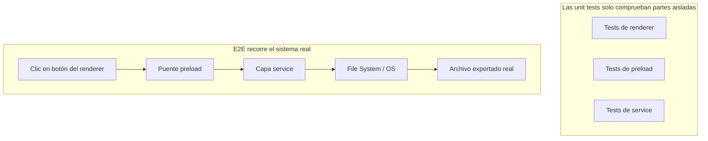
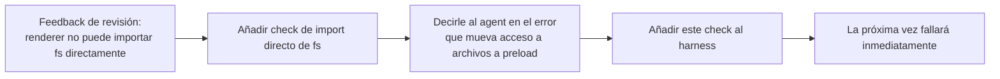

[Versión en chino →](../../../zh/lectures/lecture-10-why-end-to-end-testing-changes-results/)

> Ejemplos de código de esta lección: [code/](https://github.com/walkinglabs/learn-harness-engineering/blob/main/docs/es/lectures/lecture-10-why-end-to-end-testing-changes-results/code/)
> Práctica guiada: [Proyecto 05. Let the agent verify its own work](./../../projects/project-05-grounded-qa-verification/index.md)

# Lección 10. Solo las pruebas end-to-end son verificación real

Le pides al agent que añada exportación de archivos a una app Electron. Escribe el componente del proceso renderer, el script preload y la lógica de la capa de servicio. Las unit tests de cada componente pasan perfectamente. El agent dice: "está hecho". Cuando haces clic en el botón de exportar, el formato de ruta es incorrecto, la barra de progreso no se actualiza y exportar archivos grandes provoca una fuga de memoria. Cinco defectos en límites entre componentes, y las unit tests no detectaron ninguno.

Es como un ensayo de coro: cada voz suena perfecta por separado, pero cuando cantan juntas, las sopranos van medio compás por delante de los bajos y el acompañamiento está medio tono fuera de la melodía principal. Cada parte es "correcta" por sí sola, pero el conjunto está desafinado.

La pirámide de pruebas de Google nos dice que una gran cantidad de unit tests es la base, pero si te quedas ahí, perderás de forma sistemática problemas de interacción entre componentes. Para agents de programación, el problema es aún más severo: tienden a ejecutar solo las pruebas más rápidas y luego declarar finalización. **Solo las pruebas end-to-end pueden demostrar que no existen defectos a nivel de sistema.**

## Los puntos ciegos de las unit tests

La filosofía de las unit tests es el aislamiento: simular dependencias y centrarse solo en la unidad bajo prueba. Esto las hace rápidas y precisas, pero también crea puntos ciegos sistemáticos. Es como hacer que cada voz practique con auriculares en un ensayo de coro: para cada una suena bien, pero los problemas aparecen cuando se juntan.

**Desajuste de interfaz**: el proceso renderer pasa una ruta relativa al script preload, pero el preload espera una ruta absoluta. Las unit tests de ambos usan mocks y pasan. El problema solo aparece cuando se ejecuta el flujo end-to-end, como dos voces que practican por separado y descubren en el conjunto que una canta en 4/4 y otra en 3/4.

**Errores de propagación de estado**: una migración cambia el esquema de tabla, pero la capa de caché del ORM conserva entradas del esquema antiguo. Las unit tests proporcionan un entorno mock completamente nuevo cada vez y no exponen esa inconsistencia entre capas. Es como cambiar la letra de una canción mientras alguien sigue cantando la versión antigua.

**Problemas de ciclo de vida de recursos**: la adquisición y liberación de file handles, conexiones de base de datos y sockets de red atraviesan varios componentes. Las unit tests crean y destruyen recursos independientes por prueba, así que no exponen contención ni fugas. Como si cada voz usara los micrófonos por turnos en el ensayo, pero en el escenario no hubiera suficientes para todos.

**Dependencia del entorno**: el código funciona en pruebas, donde todo está simulado, pero falla en el entorno real por configuración, latencia de red o servicios no disponibles. Como cantar perfecto en la sala de ensayo y encontrarte acoples y viento en un festival al aire libre.

## Las pruebas end-to-end no solo cambian resultados; cambian comportamiento

Muchas personas no lo perciben: cuando un agent sabe que su trabajo pasará por pruebas end-to-end, cambia su forma de programar.

1. **Considera interacciones entre componentes**: al escribir código, piensa "cómo se conecta esta interfaz con aguas arriba", no solo en una función aislada. Como saber que al final cantarás con el coro y prestar atención a las otras voces durante la práctica.
2. **Respeta límites arquitectónicos**: en sistemas con restricciones de arquitectura, las pruebas end-to-end empujan al agent a respetar reglas de límites. Como una partitura que marca "crescendo aquí": hay que seguirla.
3. **Maneja rutas de error**: las pruebas end-to-end suelen incluir escenarios de fallo, lo que obliga al agent a considerar excepciones. Como ensayar qué hacer si un micrófono se apaga de repente.

## Pirámide de pruebas y promoción de feedback de revisión





En las prácticas de ingeniería con Codex, OpenAI enfatiza que **los mensajes de error escritos para agents deben incluir instrucciones de corrección**. No escribas solo `"Direct filesystem access in renderer"`; escribe `"Direct filesystem access in renderer. All file operations must go through the preload bridge. Move this call to preload/file-ops.ts and invoke it via window.api."` Esto convierte las reglas arquitectónicas en un bucle de autocorrección. Como un director de coro que no se limita a decir "lo cantaste mal", sino "vas medio compás rápido aquí; escucha el ritmo de las contraltos y entra en el compás 32".

## Conceptos clave

- **Defectos de límite entre componentes**: los componentes A y B pasan sus unit tests, pero su interacción produce un comportamiento incorrecto. Es el tipo de problema que mejor detectan las pruebas end-to-end.
- **Gradiente de suficiencia de pruebas**: defectos detectados por unit tests <= defectos detectados por integration tests <= defectos detectados por end-to-end tests. Cada capa superior aumenta la capacidad de detección.
- **Reglas ejecutables de límites arquitectónicos**: convertir reglas de documentos de arquitectura, como "el proceso renderer no puede acceder directamente al sistema de archivos", en checks automatizados. De "escrito en papel" a "ejecutándose en CI".
- **Promoción de feedback de revisión**: convertir comentarios repetidos de code review en pruebas automatizadas. Cada vez que aparece un problema recurrente, añade una regla y el harness se fortalece de forma permanente.
- **Mensajes de error orientados a agents**: los fallos no deberían decir solo "qué salió mal", sino también cómo corregirlo. Esto convierte los fallos de pruebas en bucles de feedback autocorrectivo.

## Cómo hacerlo

### 0. Definir primero límites arquitectónicos y después escribir pruebas E2E

El prerrequisito de las pruebas end-to-end es tener límites claros del sistema. Si la arquitectura es un plato de espaguetis, las pruebas end-to-end solo demostrarán que "este plato de espaguetis corre"; no dirán dónde se violaron las intenciones de diseño. Es como un coro que ni siquiera está dividido en voces: ningún ensayo lo hará sonar bien.

Experiencia de OpenAI: **en codebases generadas por agents, las restricciones arquitectónicas deben establecerse desde el primer día, no considerarse cuando el equipo crezca**. La razón es sencilla: los agents copian patrones existentes del repositorio, incluso si esos patrones son irregulares o subóptimos. Sin restricciones, el agent introduce más desviaciones en cada sesión.

OpenAI adoptó una "Layered Domain Architecture": cada dominio de negocio se divide en capas fijas, Types → Config → Repo → Service → Runtime → UI. Las dependencias fluyen estrictamente hacia delante y las preocupaciones transversales entran por interfaces `Providers` explícitas. Cualquier otra dependencia se prohíbe y se impone mecánicamente mediante linting personalizado.

Principio clave: **impón invariantes, no microgestiones la implementación**. Por ejemplo, exige que "los datos se parseen en el límite", pero no dictes qué biblioteca usar. Los mensajes de error deben incluir instrucciones de corrección, no solo decir "violación", sino indicar al agent exactamente cómo cambiarlo.

> Fuente: [OpenAI: Harness engineering: leveraging Codex in an agent-first world](https://openai.com/index/harness-engineering/)

### 1. El harness debe incluir una capa end-to-end

Hazlo explícito en tu flujo de validación: para tareas que tocan varios componentes, pasar pruebas end-to-end es requisito de finalización:

```text
## Validation Hierarchy
- Level 1: Unit tests (Must pass)
- Level 2: Integration tests (Must pass)
- Level 3: End-to-end tests (Must pass when cross-component changes are involved)
- Skipping any required level = Not Complete
```

### 2. Convertir reglas arquitectónicas en checks ejecutables

Toda restricción arquitectónica debería tener una prueba o regla de lint correspondiente:

```bash
# Check if the render process directly calls Node.js APIs
grep -r "require('fs')" src/renderer/ && exit 1 || echo "OK: no direct fs access in renderer"
```

### 3. Diseñar mensajes de error orientados a agents

Los mensajes de fallo deben contener tres elementos: qué salió mal, por qué y cómo arreglarlo:

```text
ERROR: Found direct import of 'fs' in src/renderer/App.tsx:12
WHY: Renderer process has no access to Node.js APIs for security
FIX: Move file operations to src/preload/file-ops.ts and call via window.api.readFile()
```

### 4. Establecer un proceso de promoción de feedback de revisión

Cada vez que encuentres un nuevo tipo de error de agent durante code review, conviértelo en un check automatizado. Un mes después, tu harness será bastante más fuerte que al inicio. Es como las notas de ensayo de un coro: registrar los problemas de cada ensayo para comprobarlos antes del siguiente. Con el tiempo, los errores comunes disminuyen y la música se vuelve más armónica.

## Caso real

**Tarea**: implementar exportación de archivos en una app Electron. Implica UI del proceso renderer, proxy de sistema de archivos en preload y transformación de datos en la capa de servicio.

**Voces por separado (unit tests pasando)**: tests del componente renderer, pasando con operaciones de archivo simuladas; tests de preload, pasando con sistema de archivos simulado; tests de capa de servicio, pasando con fuente de datos simulada. El agent declara finalización.

**Voces juntas (defectos revelados por E2E)**:

| Defecto | Descripción | Unit Test | E2E |
|---------|-------------|-----------|-----|
| Desajuste de interfaz | Formato de ruta de archivo inconsistente | No detectado | Detectado |
| Propagación de estado | Progreso de exportación no enviado de vuelta a UI por IPC | No detectado | Detectado |
| Fuga de recursos | Handles de archivos grandes no liberados | No detectado | Detectado |
| Problema de permisos | Permisos distintos en entorno empaquetado | No detectado | Detectado |
| Propagación de errores | Excepciones de service no llegan a UI | No detectado | Detectado |

Los 5 defectos fueron capturados por pruebas end-to-end; las unit tests no capturaron ninguno. El coste fue aumentar el tiempo de prueba de 2 a 15 segundos, completamente aceptable en un flujo con agents. Por bien que cante cada parte por separado, nada sustituye un ensayo completo del conjunto.

## Ideas clave

- **Las unit tests son sistemáticamente ciegas a defectos de límites entre componentes**: su diseño de aislamiento es justo lo que les impide detectar interacciones.
- **Las pruebas end-to-end no solo detectan defectos; cambian el comportamiento de programación del agent**, haciendo que preste más atención a integración y límites.
- **Las reglas arquitectónicas deben ser ejecutables**: no escritas en un documento esperando a ser leídas, sino comprobadas automáticamente en cada commit.
- **Los mensajes de error deben diseñarse para agents**: con pasos concretos de "cómo arreglarlo" para formar un bucle autocorrectivo.
- **La promoción de feedback de revisión fortalece el harness automáticamente**: cada categoría de defecto capturada se convierte en una defensa permanente.

## Lecturas adicionales

- [How Google Tests Software - Whittaker et al.](https://www.goodreads.com/book/show/13563030-how-google-tests-software) — fuente clásica del modelo de pirámide de pruebas.
- [Harness Engineering - OpenAI](https://openai.com/index/harness-engineering/) — prácticas de ingeniería para ejecución automatizada de restricciones arquitectónicas.
- [Chaos Engineering - Netflix (Basiri et al.)](https://ieeexplore.ieee.org/document/7466237) — inyección proactiva de fallos para verificar resiliencia del sistema.
- [QuickCheck - Claessen & Hughes](https://www.cs.tufts.edu/~nr/cs257/archive/john-hughes/quick.pdf) — metodología de property testing entre pruebas por ejemplo y verificación formal.

## Ejercicios

1. **Detección de defectos entre componentes**: elige una modificación que implique al menos tres componentes. Ejecuta primero solo unit tests y registra resultados; luego ejecuta pruebas end-to-end. Analiza a qué tipo de interacción entre capas pertenece cada defecto adicional descubierto.

2. **Automatización de regla arquitectónica**: elige una restricción arquitectónica de tu proyecto y conviértela en un check ejecutable con un mensaje de error orientado a agents. Intégralo en el harness y valida su efectividad con una tarea baseline.

3. **Promoción de feedback de revisión**: encuentra un tipo recurrente de comentario en tu historial de code review y conviértelo en un check automatizado usando el proceso de cinco pasos. Compara la frecuencia del problema antes y después.
