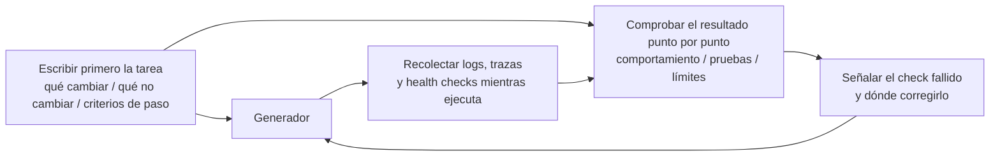

[Versión en chino →](../../../zh/lectures/lecture-11-why-observability-belongs-inside-the-harness/)

> Ejemplos de código: [code/](https://github.com/walkinglabs/learn-harness-engineering/blob/main/docs/es/lectures/lecture-11-why-observability-belongs-inside-the-harness/code/)
> Proyecto práctico: [Proyecto 06. Complete harness (Capstone)](./../../projects/project-06-runtime-observability-and-debugging/index.md)

# Lección 11. Hacer observable el runtime del agent

## ¿Qué problema resuelve esta lección?

Le pides a un agent que implemente una funcionalidad. Trabaja durante 20 minutos, modifica varios archivos y luego dice: "hecho, pero fallan dos pruebas". Le preguntas por qué fallan: "no estoy seguro, quizá sea un problema de timing". Le preguntas qué rutas críticas cambió: "déjame mirar el código...".

Esto no va de que al agent le falte capacidad. Va de que tu harness no proporciona suficiente observabilidad. **Sin observabilidad, los agents toman decisiones con incertidumbre, las evaluaciones se vuelven juicios subjetivos y los reintentos se convierten en exploración a ciegas.** Tanto OpenAI como Anthropic definen la fiabilidad como un problema de evidencia: el harness debe exponer comportamiento de runtime y señales de evaluación en una forma que guíe la siguiente decisión.

## Conceptos clave

- **Observabilidad de runtime**: señales a nivel de sistema: logs, trazas, eventos de proceso, health checks. Responde "qué hizo el sistema".
- **Observabilidad de proceso**: visibilidad sobre artefactos de decisión del harness: planes, rúbricas de puntuación, criterios de aceptación. Responde "por qué debería aceptarse este cambio".
- **Traza de tarea**: registro completo del camino de decisión desde el inicio hasta la finalización, análogo al tracing de requests en sistemas distribuidos. Cada paso del agent, con contexto, queda registrado.
- **Sprint contract**: acuerdo de corto plazo negociado antes de programar: especifica scope de tarea, estándares de verificación y exclusiones. Es la herramienta central de observabilidad de proceso.
- **Rúbrica de evaluador**: transforma la evaluación de calidad de juicio subjetivo a puntuación estructurada basada en evidencia. Hace que evaluadores distintos produzcan resultados similares para la misma salida.
- **Observabilidad por capas**: observabilidad de sistema y observabilidad de proceso diseñadas simultáneamente y reforzándose entre sí. Las señales de runtime explican comportamiento; los artefactos de proceso explican intención.

## Observabilidad por capas



## Por qué ocurre esto

### El coste real de no tener observabilidad

Cuando un harness carece de observabilidad, aparecen sistemáticamente cuatro tipos de problemas:

**No puede distinguir "correcto" de "parece correcto"**: una función se ve perfecta en code review, con sintaxis correcta y lógica razonable. Pero en runtime, un error de manejo de caso límite produce resultados incorrectos con ciertos inputs. Solo las trazas de runtime muestran que la ruta real de ejecución se desvió de lo esperado.

**La evaluación se vuelve mística**: sin rúbricas de puntuación ni criterios de aceptación, evaluadores humanos o agents se apoyan en supuestos implícitos. La misma salida puede recibir evaluaciones muy distintas de personas distintas. La evaluación de calidad deja de ser reproducible.

**Los reintentos son apuestas a ciegas**: cuando el agent no sabe por qué falló algo, la dirección del reintento es aleatoria. Puede intentarlo una y otra vez en la dirección equivocada, arreglando rutas de código irrelevantes mientras ignora la causa raíz real. Cada reintento ciego cuesta tokens y tiempo.

**Precipicio de información en el handoff de sesión**: cuando el trabajo incompleto pasa a la siguiente sesión, la falta de observabilidad obliga a la nueva sesión a diagnosticar el estado desde cero. Las observaciones de Anthropic sobre agents de larga duración muestran que este diagnóstico redundante puede consumir entre el 30% y el 50% del tiempo total de sesión.

### Un escenario realista con Claude Code

Imagina un harness con flujo de tres roles, planner-generator-evaluator, ejecutando una tarea "añadir dark mode a la app".

**Sin observabilidad**: el planner produce una descripción vaga. El generador implementa dark mode a partir de esa vaguedad, pero no coincide con las expectativas implícitas del planner. El evaluador rechaza según sus propios estándares implícitos, pero no puede articular qué está mal exactamente. El generador reintenta a ciegas a partir de razones vagas. El ciclo se repite 3-4 veces, tarda unos 45 minutos y produce una salida apenas aceptable.

**Con observabilidad completa**: el planner produce un sprint contract que lista componentes a modificar, estándares de verificación de cada uno y exclusiones, por ejemplo no tocar estilos de impresión. El generador implementa según el contrato. La observabilidad de runtime registra cómo se cargan y aplican los estilos en cada componente. El evaluador usa una rúbrica para evaluar dimensión por dimensión con citas de evidencia concretas. Una iteración produce un resultado de alta calidad en unos 15 minutos.

Diferencia de eficiencia de 3x. Lo único que cambió fue la observabilidad.

### Por qué los agents no pueden resolverlo solos

Quizá pienses: "¿No puede el agent imprimir sus propios logs?". Los problemas son:

1. El agent no sabe lo que no sabe; no registrará proactivamente señales que no percibe como necesarias.
2. Los formatos de log son inconsistentes; distintas sesiones usan formatos distintos y el análisis sistemático se vuelve imposible.
3. La observabilidad de proceso no se resuelve con logs; los sprint contracts y las rúbricas son artefactos estructurados que necesitan soporte a nivel de harness.

## Cómo hacerlo bien

### 1. Integrar recolección de señales de runtime en el harness

No dependas de que el agent imprima sus propios logs. El harness debería recopilar automáticamente estas señales:

- **Ciclo de vida de la aplicación**: fases de startup, ready, running y shutdown.
- **Ejecución de rutas de funcionalidad**: registros de rutas críticas, con puntos de entrada, checkpoints y salidas.
- **Flujo de datos**: registros de datos que fluyen entre componentes.
- **Uso de recursos**: patrones anómalos, por ejemplo memoria que crece continuamente.
- **Errores y excepciones**: contexto completo del error, no solo mensajes.

### 2. Implementar sprint contracts

Antes de cada tarea, el generador y el evaluador, que pueden ser invocaciones distintas del mismo agent, negocian un contrato:

```markdown
# Sprint Contract: Dark Mode Support

## Scope
- Modify the theme toggle component
- Update global CSS variables
- Add dark mode tests

## Verification Standards
- Visual regression tests pass for each component
- Main flow end-to-end tests pass
- No flash of unstyled content (FOUC)

## Exclusions
- Not handling print styles
- Not handling third-party component dark mode
```

### 3. Establecer una rúbrica de evaluador

Convierte "¿está bien o no?" en puntuación cuantificable:

```markdown
# Scoring Rubric

| Dimension | A | B | C | D |
|-----------|---|---|---|---|
| Code correctness | All tests pass | Main flow passes | Partial pass | Build fails |
| Architecture compliance | Fully compliant | Minor deviations | Obvious deviations | Serious violations |
| Test coverage | Main + edge cases | Main flow only | Only skeleton | No tests |
```

### 4. Estandarizar con OpenTelemetry

Crea una traza para cada sesión del harness, un span por tarea y sub-spans para cada paso de verificación. Usa atributos estándar para anotar información clave. Así los datos de observabilidad se integran con toolchains estándar como Jaeger o Zipkin.

## Caso real

Un harness con flujo planner-generator-evaluator ejecutando "añadir soporte de dark mode":

**Versión no observable**: 3-4 rondas de reintentos a ciegas, 45 minutos, salida apenas aceptable. El evaluador dice "no se siente bien", pero no puede decir qué específicamente. El generador desperdicia mucho tiempo en direcciones equivocadas.

**Versión plenamente observable**:

- El sprint contract aclara scope, estándares y exclusiones.
- Las trazas de runtime registran el proceso de carga de estilos de cada componente.
- La rúbrica de puntuación ofrece evaluación estructurada dimensión por dimensión.
- Una iteración produce un resultado de alta calidad en 15 minutos.

Mejora de eficiencia de 3x, calidad más estable y evaluaciones reproducibles.

## Ideas clave

- **La observabilidad es una propiedad de arquitectura del harness**: no una funcionalidad añadida después, sino una capacidad central que debe considerarse en el diseño.
- **Ambas capas de observabilidad son esenciales**: las señales de runtime explican "qué pasó"; los artefactos de proceso explican "por qué se hizo así".
- **Los sprint contracts adelantan la alineación**: evitan que el generador construya algo que el evaluador rechaza inmediatamente por motivos previsibles.
- **Las rúbricas hacen reproducible la evaluación**: evaluadores distintos producen puntuaciones similares para la misma salida.
- **La falta de observabilidad desperdicia entre el 30% y el 50% del tiempo de sesión en diagnóstico redundante.**

## Lecturas adicionales

- [Observability Engineering - Charity Majors](https://www.honeycomb.io/blog/observability-engineering-book) — marco teórico y práctico de la ingeniería de observabilidad moderna.
- [Dapper - Google (Sigelman et al.)](https://research.google/pubs/pub36356/) — práctica pionera en tracing distribuido a gran escala.
- [Harness Design - Anthropic](https://www.anthropic.com/engineering/harness-design-long-running-apps) — introducción de sprint contracts y rúbricas de evaluador.
- [Site Reliability Engineering - Google](https://sre.google/sre-book/table-of-contents/) — aplicación sistemática de observabilidad en sistemas de producción.

## Ejercicios

1. **Análisis de brechas de observabilidad**: audita tu harness actual para observabilidad de sistema y de proceso. Encuentra estados del sistema que no puedan distinguirse con las señales existentes y propón nuevas señales.

2. **Práctica de sprint contract**: escribe un sprint contract para una tarea real. Haz que el agent ejecute según el contrato y compara eficiencia y calidad con y sin contrato.

3. **Construcción de traza de tarea**: registra cada paso de las operaciones de un agent durante una tarea completa de programación. Anota con convenciones semánticas de OpenTelemetry. Analiza cuellos de botella de información en la traza: qué pasos carecen de señal suficiente para tomar decisiones.
