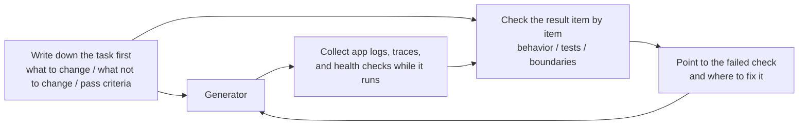

[Versión en chino →](../../../zh/lectures/lecture-11-why-observability-belongs-inside-the-harness/)

> Ejemplos de código: [código/](https://github.com/walkinglabs/learn-harness-engineering/blob/main/docs/es/lectures/lecture-11-why-observability-belongs-inside-the-harness/code/)
> Proyecto práctico: [Proyecto 06. Completo harness (Capstone)](./../../projects/project-06-runtime-observability-and-debugging/index.md)

# Lección 11. Hacer the Agent's Runtime Observable

## What Problema Does This Lección Solve?

You ask an agent to implement a feature. It ejecuta for 20 minutes, modifies a bunch of archivos, then tells you "terminado, but two pruebas are failing." You ask why they're failing — "not sure, might be a timing issue." You ask which critical paths it changed — "let me look at the código..."

This isn't about the agent lacking capability. It's about your harness not providing enough observabilidad. **Without observabilidad, agents hacer decisions under uncertainty, evaluations become subjective judgments, and retries become blind wandering.** Both OpenAI and Anthropic define reliability as an evidence problema — the harness must expose runtime behavior and evaluation signals in a form that can guía the siguiente decision.

## Core Concepts

- **Runtime observabilidad**: System-level signals — logs, traces, proceso events, health checks. Answers "what did the system do."
- **Proceso observabilidad**: Visibility into harness decision artifacts — plans, scoring rubrics, acceptance criterios. Answers "why should this cambio be accepted."
- **Tarea trace**: A completo decision-path record from tarea empezar to finalización, analogous to request tracing in distributed sistemas. Every paso the agent takes, with contexto, is recorded.
- **Sprint contract**: A short-term agreement negotiated before coding begins — specifying tarea alcance, verificación standards, and exclusions. The core herramienta for proceso observabilidad.
- **Evaluador rúbrica**: Transforms calidad evaluation from subjective judgment into evidence-based estructurado scoring. Hace diferente evaluators produce similar resultados for the mismo salida.
- **Layered observabilidad**: System-layer and process-layer observabilidad designed simultaneously and reinforcing each other. Runtime signals explain behavior; proceso artifacts explain intent.

## Layered Observability



## Why This Happens

### The Real Cost of Faltante Observability

When a harness lacks observabilidad, four types of problemas systematically appear:

**Cannot distinguish "correcto" from "looks correcto"**: A function looks perfectly right during código revisión — correcto syntax, sound logic. But at runtime, an edge case handling error produces incorrect resultados under específico inputs. Only runtime traces can reveal that the real execution ruta deviated from expectations.

**Evaluation becomes mysticism**: Without scoring rubrics and acceptance criterios, evaluators (human or agent) rely on implícito assumptions. The mismo salida might get wildly diferente evaluations from diferente assessors. Calidad assessment becomes non-reproducible.

**Retries become blind guesses**: When the agent doesn't know why something falló, retry direction is random. It might try repeatedly in the incorrecto direction — fixing unrelated código paths while ignoring the real fallo root cause. Every blind retry costs tokens and time.

**Session traspaso information cliff**: When incomplete work is handed to the siguiente sesión, faltante observabilidad means the new sesión must diagnose system estado from scratch. Anthropic's long-running agent observations show this redundant diagnosis can consume 30-50% of total sesión time.

### A Real Claude Código Scenario

Imagine a harness usando a "planner-generator-evaluator" three-role flujo de trabajo, executing an "añadir dark mode to the app" tarea.

**Without observabilidad**: The planificador outputs a vago description. The generador implements dark mode based on that vagueness, but it doesn't match the planificador's implícito expectations. The evaluador rejects based on their own implícito standards but can't articulate what's specifically incorrecto. The generador retries blindly based on vago rejection reasons. The cycle repeats 3-4 times, taking about 45 minutes, producing a barely acceptable salida.

**With full observabilidad**: The planificador outputs a sprint contract — listing which components to modify, verificación standards for each, and exclusions (no print styles). The generador implements according to the contract. Runtime observabilidad records each component's style loading and application proceso. The evaluador uses a scoring rúbrica to evaluate dimension by dimension, with específico evidence citations. One iteration produces a high-quality resultado, in about 15 minutes.

3x efficiency difference. The only cambio is observabilidad.

### Why Agents Can't Solve This Themselves

You might be thinking: "Can't the agent just print its own logs?" The problemas are:

1. The agent doesn't know what it doesn't know — it won't proactively record signals it doesn't realize it needs.
2. Log formats are inconsistent — diferente sesións usar diferente log formats, making systematic analysis impossible.
3. Proceso observabilidad can't be solved by logs — sprint contracts and scoring rubrics are estructurado artifacts that need harness-level soporte.

## How to Do It Right

### 1. Construir Runtime Signal Collection into the Harness

Don't rely on the agent to print its own logs. The harness should automatically collect these signals:

- **Application lifecycle**: Startup, ready, ejecutando, shutdown phase states
- **Feature ruta execution**: Records of critical ruta execution, including entry points, checkpoints, and exits
- **Datos flow**: Records of datos flowing between components
- **Recurso utilization**: Abnormal recurso usage patterns (e.g., continuously growing memory)
- **Errors and exceptions**: Full error contexto, not just error messages

### 2. Implement Sprint Contracts

Before each tarea starts, the generador and evaluador (which may be diferente invocations of the mismo agent) negotiate a contract:

```markdown
# Sprint Contract: Dark Mode Support

## Scope
- Modify the theme toggle component
- Update global CSS variables
- Add dark mode tests

## Verification Standards
- Visual regression tests pass for each component
- Main flow end-to-end tests pass
- No flash of unstyled content (FOUC)

## Exclusions
- Not handling print styles
- Not handling third-party component dark mode
```

### 3. Establish an Evaluador Rúbrica

Turn "is it good or not" into quantifiable scoring:

```markdown
# Scoring Rubric

| Dimension | A | B | C | D |
|-----------|---|---|---|---|
| Code correctness | All tests pass | Main flow passes | Partial pass | Build fails |
| Architecture compliance | Fully compliant | Minor deviations | Obvious deviations | Serious violations |
| Test coverage | Main + edge cases | Main flow only | Only skeleton | No tests |
```

### 4. Standardize with OpenTelemetry

Crear a trace for each harness sesión, a span for each tarea, and sub-spans for each verificación paso. Usar standard attributes to annotate key information. This way observabilidad datos integrates with standard toolchains (Jaeger, Zipkin).

## Real-World Case

A harness usando a planner-generator-evaluator flujo de trabajo, executing "añadir dark mode soporte":

**Unobservable version**: 3-4 rounds of blind retries, 45 minutes, barely acceptable salida. Evaluador says "it doesn't feel right" but can't say what specifically. Generador wastes significant time in incorrecto directions.

**Fully observable version**:
- Sprint contract clarifies alcance, standards, and exclusions
- Runtime traces record each component's style loading proceso
- Scoring rúbrica proporciona dimension-by-dimension estructurado evaluation
- One iteration produces high-quality resultados, 15 minutes

3x efficiency improvement, more stable calidad, reproducible evaluations.

## Ideas clave

- **Observability is a harness arquitectura property** — not a feature added after the fact, but a core capability that must be considered during diseño.
- **Both observabilidad capas are essential** — runtime signals explain "what happened," proceso artifacts explain "why it was terminado this way."
- **Sprint contracts front-load alignment** — preventing "the generador built something the evaluador immediately rejects for foreseeable reasons."
- **Scoring rubrics hacer evaluation reproducible** — diferente evaluators produce similar scores for the mismo salida.
- **Faltante observabilidad wastes 30-50% of sesión time on redundant diagnosis.**

## Lecturas adicionales

- [Observability Ingeniería - Charity Majors](https://www.honeycomb.io/blog/observabilidad-engineering-book) — Teoría and práctica framework for modern observabilidad ingeniería
- [Dapper - Google (Sigelman et al.)](https://research.google/pubs/pub36356/) — Groundbreaking práctica in large-scale distributed tracing
- [Harness Diseño - Anthropic](https://www.anthropic.com/engineering/harness-design-long-running-apps) — Introducing sprint contracts and evaluador rubrics
- [Site Reliability Ingeniería - Google](https://sre.google/sre-book/table-of-contents/) — Systematic application of observabilidad in producción sistemas

## Ejercicios

1. **Observability Gap Analysis**: Audit your current harness for system-layer and process-layer observabilidad. Find system states that can't be distinguished from existing signals, and propose additions.

2. **Sprint Contract Práctica**: Escribir a sprint contract for a real tarea. Have the agent execute according to the contract, and comparar efficiency and calidad with and without the contract.

3. **Tarea Trace Construction**: Record every paso of an agent's operations during a completo coding tarea. Annotate with OpenTelemetry semantic conventions. Analyze information bottlenecks in the trace — which pasos lack sufficient signal soporte for decisions.