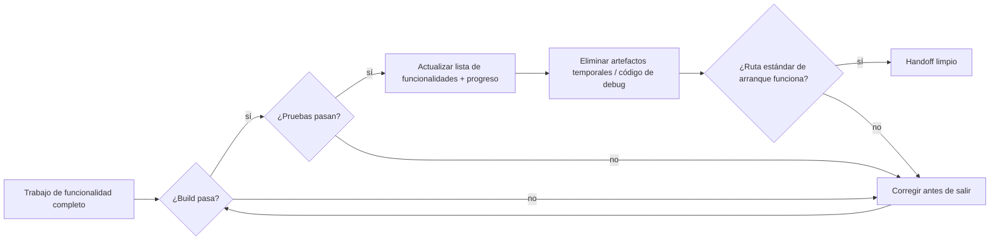
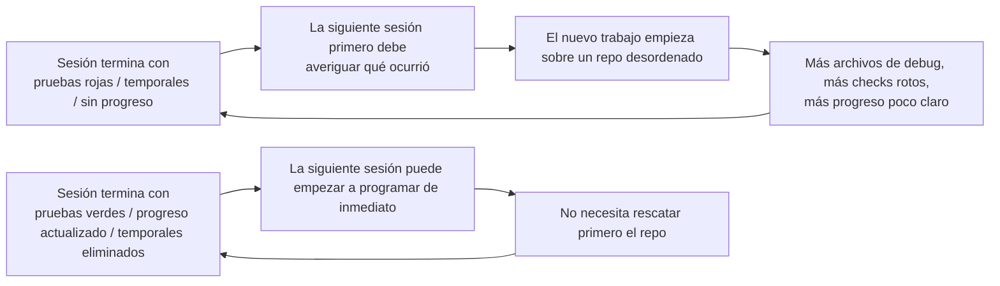

[Versión en chino →](../../../zh/lectures/lecture-12-why-every-session-must-leave-a-clean-state/)

> Ejemplos de código: [code/](https://github.com/walkinglabs/learn-harness-engineering/blob/main/docs/es/lectures/lecture-12-why-every-session-must-leave-a-clean-state/code/)
> Proyecto práctico: [Proyecto 06. Complete harness (Capstone)](./../../projects/project-06-runtime-observability-and-debugging/index.md)

# Lección 12. Dejar un handoff limpio al final de cada sesión

## ¿Qué problema resuelve esta lección?

Tu agent trabaja toda la tarde, modifica 20 archivos, hace commit y la sesión termina. La siguiente sesión empieza y descubre de inmediato que el build está roto, las pruebas están en rojo, hay archivos temporales de debug por todas partes, la lista de funcionalidades no se actualizó y el progreso no está claro. La nueva sesión dedica sus primeros 30 minutos solo a averiguar "qué hizo realmente la sesión anterior".

OpenAI y Anthropic lo dicen con claridad: **la fiabilidad a largo plazo depende de disciplina operativa, no solo del éxito de una ejecución aislada**. La calidad del estado al salir de una sesión determina directamente la eficiencia de la siguiente. Piensa en buenas prácticas de Git: cada commit debería ser un cambio atómico y compilable, no una pila de código a medio hacer.

## Conceptos clave

- **Estado limpio**: el sistema satisface cinco condiciones al final de la sesión: build pasa, pruebas pasan, progreso registrado, sin artefactos obsoletos y ruta de arranque disponible. Si falta cualquiera, la sesión no está "hecha".
- **Integridad de sesión**: análoga a transacciones de base de datos: o se confirma por completo y deja un estado limpio, o se vuelve al último estado consistente. No hay término medio.
- **Documento de calidad**: artefacto activo que registra continuamente valoraciones de calidad de cada módulo. No es una evaluación puntual, sino un tracker que muestra si el codebase mejora o empeora con el tiempo.
- **Bucle de limpieza**: sesión de mantenimiento regular orientada a reducir entropía en el codebase de forma sistemática. No es un arreglo de emergencia, sino operación rutinaria.
- **Simplificación del harness**: a medida que los modelos mejoran, elimina periódicamente componentes del harness que ya no son necesarios. Una restricción esencial hoy puede ser sobrecarga innecesaria dentro de tres meses.
- **Limpieza idempotente**: operaciones de limpieza que producen el mismo resultado sin importar cuántas veces se ejecuten. Hace que la limpieza sea segura incluso en escenarios de fallo y reintento.

## Cinco dimensiones del estado limpio





## Por qué ocurre esto

### El crecimiento de entropía es el estado por defecto

Las leyes de evolución de software de Lehman nos dicen que los sistemas sometidos a cambio continuo aumentan inevitablemente su complejidad si no se gestionan activamente. Esto es especialmente cierto con agents de programación: cada sesión introduce cambios y, sin limpieza al salir, la deuda técnica se acumula de forma exponencial.

Los datos reales son reveladores. Un proyecto desarrollado con agents durante 12 semanas, sin estrategia de limpieza:

- Semana 1: build 100% pasando, pruebas 100% pasando, arranque de nueva sesión 5 min.
- Semana 4: build 95%, pruebas 92%, arranque 15 min.
- Semana 8: build 82%, pruebas 78%, arranque 35 min.
- Semana 12: build 68%, pruebas 61%, arranque 60+ min.

El mismo proyecto con estrategia de limpieza:

- Semana 1: 100%, 100%, 5 min.
- Semana 12: 97%, 95%, 9 min.

Después de 12 semanas: la tasa de build pasando difiere en 29 puntos porcentuales y el tiempo de arranque de nueva sesión en 85%. No es teoría: es una diferencia observada.

### Cinco dimensiones del estado limpio

Estado limpio no significa solo "el código compila". Son cinco dimensiones evaluadas juntas:

**Dimensión de build**: ¿el código compila sin errores? Es lo más básico: la siguiente sesión no debería tener que arreglar errores de build antes de empezar.

**Dimensión de pruebas**: ¿pasan todas las pruebas? Incluidas las que existían antes de la sesión. La sesión es responsable de no romper funcionalidad existente. Y debería verificarse en CI, no solo como "funciona en mi máquina".

**Dimensión de progreso**: ¿el progreso actual está registrado en un artefacto legible por máquina? Subtareas completadas con sus criterios de paso, subtareas en curso con estado actual, subtareas no iniciadas. Los buenos registros de progreso reducen entre el 60% y el 80% del diagnóstico al inicio de sesión.

**Dimensión de artefactos**: ¿hay artefactos temporales obsoletos o ambiguos? Logs de debug, archivos temporales, código comentado, marcadores TODO: todo esto aumenta la carga cognitiva de la siguiente sesión.

**Dimensión de arranque**: ¿la ruta estándar de arranque está disponible? ¿Puede la siguiente sesión empezar a trabajar sin intervención manual? Inicialización de entorno, carga de codebase, adquisición de contexto y selección de tarea no deben estar rotas.

### "Limpiar después" significa no limpiar nunca

La trampa mental más común es "no hay tiempo para limpiar en esta sesión; lo haré la próxima". Pero la siguiente sesión del agent no sabe qué dejaste atrás: ve un desorden de código y estado incierto. Dedicará mucho tiempo a inferir qué partes son intencionales y cuáles temporales.

Peor aún, cada sesión tiene sus propios objetivos. La nueva sesión viene a hacer trabajo nuevo, no a limpiar el desorden anterior. Ignorará el caos y empezará encima, introduciendo más caos sobre el caos. Es el bucle de feedback positivo de la entropía.

## Cómo hacerlo bien

### 1. Estado limpio como requisito de finalización

Define explícitamente en el harness: **finalización de sesión = tarea pasa verificación Y check de estado limpio pasa**. Si falta cualquiera, la sesión no está completa. Escríbelo en `CLAUDE.md`:

```text
## Session Exit Checklist
- [ ] Build passes (npm run build)
- [ ] All tests pass (npm test)
- [ ] Feature list updated
- [ ] No debug code remaining (console.log, debugger, TODO)
- [ ] Standard startup path available (npm run dev)
```

### 2. Estrategia de limpieza de doble modo

Combina dos modos de limpieza:

**Limpieza inmediata al final de cada sesión**: eliminar artefactos temporales creados durante la sesión, actualizar estado de la lista de funcionalidades y asegurar que build y pruebas pasan. Es limpieza por "reference counting".

**Limpieza periódica semanal**: escaneo completo del sistema: tratar problemas estructurales acumulados, actualizar documentos de calidad y ejecutar benchmarks para detectar deriva. Es limpieza por "tracing".

### 3. Mantener un documento de calidad

Un documento de calidad es un artefacto activo que puntúa cada módulo continuamente:

```markdown
# Quality Document

## User Authentication Module (Quality: A)
- Verification passing: Yes
- Agent understandable: Yes
- Test stability: Stable
- Architecture boundaries: Compliant
- Code conventions: Followed

## Payment Module (Quality: C)
- Verification passing: Partial (payment callback untested)
- Agent understandable: Difficult (logic spread across 3 files)
- Test stability: Unstable (2 flaky tests)
- Architecture boundaries: Violations present
- Code conventions: Partially followed
```

Las nuevas sesiones leen este documento y saben al instante dónde priorizar. Arregla primero el módulo con peor puntuación.

### 4. Simplificar periódicamente el harness

Una idea importante de Anthropic: **cada componente del harness existe porque el modelo no puede hacer algo de forma fiable por sí solo. Pero al mejorar los modelos, esas suposiciones caducan.** Una restricción esencial hace tres meses puede ser sobrecarga innecesaria hoy.

Práctica recomendada: cada mes, elige un componente del harness, desactívalo temporalmente y ejecuta tareas benchmark. Si los resultados no empeoran, elimínalo permanentemente. Si empeoran, restáuralo o sustitúyelo por una alternativa más ligera.

### 5. Las operaciones de limpieza deben ser idempotentes

Los scripts de limpieza deben ser seguros al ejecutarse repetidamente:

```bash
# Idempotent cleanup operations
rm -f /tmp/debug-*.log  # -f ensures no error when files don't exist
git checkout -- .env.local  # Restore to known state
npm run test  # Verify cleanup didn't break anything
```

## Caso real

Una app Electron desarrollada con agents durante 12 semanas comparó dos enfoques:

**Sin estrategia de limpieza (grupo de control)**: semana 12, tasa de build pasando 68%, tasa de pruebas pasando 61%, arranque de nueva sesión 60+ min, 103 artefactos obsoletos.

**Con estrategia de limpieza (grupo experimental)**: check completo de estado limpio al final de cada sesión + bucle semanal de limpieza. Semana 12, tasa de build pasando 97%, pruebas 95%, arranque de nueva sesión 9 min, 11 artefactos obsoletos.

En la semana 12, el grupo experimental tiene 29 puntos porcentuales más en build pasando, 34 puntos más en pruebas y un tiempo de arranque de nueva sesión 85% menor.

## Ideas clave

- **El estado limpio es una condición necesaria para completar una sesión**: no es limpieza opcional, sino parte de la definición de hecho.
- **Las cinco dimensiones son obligatorias**: build, pruebas, progreso, artefactos y arranque deben comprobarse explícitamente.
- **Los documentos de calidad hacen trazable la salud del codebase**: solo puedes corregir lo que sabes que se está degradando.
- **Simplifica periódicamente el harness**: a medida que mejoran los modelos, elimina restricciones que ya no aportan valor.
- **"Limpiar después" equivale a no limpiar nunca**: la entropía crece por defecto; solo la limpieza activa la contrarresta.

## Lecturas adicionales

- [Clean Code - Robert C. Martin](https://www.goodreads.com/book/show/3735293-clean-code) — principios sistemáticos de limpieza de código.
- [Harness Engineering - OpenAI](https://openai.com/index/harness-engineering/) — reproducibilidad como requisito central del diseño de harness.
- [Effective Harnesses - Anthropic](https://www.anthropic.com/engineering/effective-harnesses-for-long-running-agents) — papel crítico de salidas de sesión limpias para fiabilidad a largo plazo.
- [Programs, Life Cycles, and Laws of Software Evolution - Lehman](https://ieeexplore.ieee.org/document/1702314) — leyes de evolución de software que demuestran que la complejidad crece sin mantenimiento activo.

## Ejercicios

1. **Checklist de estado limpio**: diseña una checklist de salida de sesión para tu codebase que cubra las cinco dimensiones. Aplícala durante 5 sesiones consecutivas y registra violaciones por dimensión.

2. **Comparación benchmark**: usa un conjunto fijo de tareas con dos variantes de harness, con y sin requisitos de estado limpio. Compara tasa de finalización, número de reintentos y tasa de defectos escapados.

3. **Práctica de simplificación del harness**: elige un componente del harness, desactívalo temporalmente y ejecuta tareas benchmark. Compara resultados con y sin él. Decide si mantenerlo, eliminarlo o reemplazarlo.
