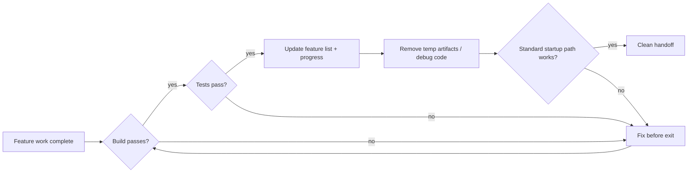
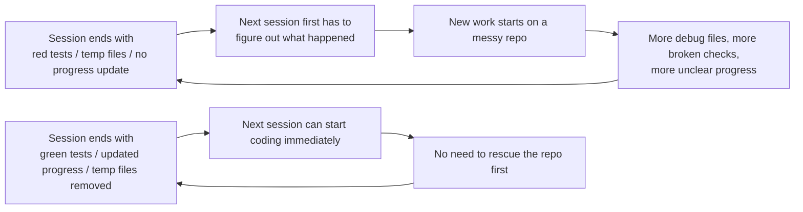

[Versión en chino →](../../../zh/lectures/lecture-12-why-every-session-must-leave-a-clean-state/)

> Ejemplos de código: [código/](https://github.com/walkinglabs/learn-harness-engineering/blob/main/docs/es/lectures/lecture-12-why-every-session-must-leave-a-clean-state/code/)
> Proyecto práctico: [Proyecto 06. Completo harness (Capstone)](./../../projects/project-06-runtime-observability-and-debugging/index.md)

# Lección 12. Limpio Handoff at the End of Every Session

## What Problema Does This Lección Solve?

Your agent ejecuta all afternoon, modifies 20 archivos, commits the código, sesión ends. The siguiente agent sesión starts and immediately discovers: construir is broken, pruebas are red, temporary depurar archivos are everywhere, the lista de funcionalidades wasn't updated, and progress is completely unclear. The new sesión spends its first 30 minutes just figuring out "what did the last sesión actually do."

Both OpenAI and Anthropic estado clearly: **long-term reliability depends on operational discipline, not just single-run éxito.** The calidad of estado at sesión exit directly determines the siguiente sesión's efficiency. Think of it like Git best practices — every commit should be an atomic, compilable cambio, not a pile of half-finished código.

## Core Concepts

- **Limpio estado**: The system satisfies five condiciones at sesión end — construir passes, pruebas pass, progress recorded, no stale artifacts, startup ruta available. Faltante any one means the sesión isn't "terminado."
- **Session integrity**: Analogous to database transactions — either fully commit and leave a limpio estado, or roll back to the last consistent estado. No middle ground.
- **Calidad document**: An active artifact that continuously records calidad ratings for each module. Not a one-time assessment, but a tracker showing whether the codebase is getting stronger or weaker over time.
- **Cleanup loop**: A regular maintenance sesión aimed at systematically reducing entropy in the codebase. Not an emergency arreglar, but routine operations.
- **Harness simplification**: As modelo capabilities improve, periodically remove harness components that are no longer necessary. A constraint essential today may be unnecessary overhead in three months.
- **Idempotent cleanup**: Cleanup operations produce the mismo resultado regardless of how many times they ejecutar. Ensures cleanup remains safe even in failure-retry scenarios.

## Five Dimensions of Limpio Estado





## Why This Happens

### Entropy Growth Is the Default Estado

Lehman's laws of software evolution tell us: sistemas undergoing continuous cambio will inevitably increase in complexity unless actively managed. This is especially true for agents de programación con IA — every sesión introduces cambios, and without cleanup at exit, technical debt accumulates exponentially.

Real datos is telling. A proyecto developed with agents for 12 weeks, without cleanup strategy:

- Week 1: Construir pass rate 100%, prueba pass rate 100%, new sesión startup 5 min
- Week 4: Construir 95%, pruebas 92%, startup 15 min
- Week 8: Construir 82%, pruebas 78%, startup 35 min
- Week 12: Construir 68%, pruebas 61%, startup 60+ min

Mismo proyecto with a cleanup strategy:

- Week 1: 100%, 100%, 5 min
- Week 12: 97%, 95%, 9 min

After 12 weeks: construir pass rate differs by 29 percentage points, new sesión startup time differs by 85%. This is not theoretical — it's an observed difference.

### Five Dimensions of Limpio Estado

Limpio estado isn't just "the código compiles." It's five dimensions evaluated together:

**Construir dimension**: Does the código construir without errors? This is the most basic — the siguiente sesión shouldn't have to arreglar construir errors first.

**Prueba dimension**: Do all pruebas pass? Including pruebas that existed before the sesión — the sesión is responsible for not breaking existing functionality. And it should be verified in CI, not just "works on my machine."

**Progress dimension**: Is current progress recorded in a machine-readable artifact? Completed subtasks with their passing criterios, in-progress but incomplete subtasks with current estado, not-yet-started subtasks. Good progress records reduce 60-80% of sesión startup diagnostic time.

**Artifact dimension**: Are there stale or ambiguous temporary artifacts? Depurar logs, temporary archivos, commented-out código, TODO markers — all of these increase cognitive load for the siguiente sesión.

**Startup dimension**: Is the standard startup ruta available? Can the siguiente sesión empezar working without manual intervention? Entorno inicialización, codebase loading, contexto acquisition, tarea selection — these paths must not be broken.

### "Limpio Up Later" Means Never Limpio Up

The most common mental trap is "no time to limpio up this sesión, I'll do it siguiente time." But the siguiente agent sesión doesn't know what you left behind — it sees a mess of código and uncertain estado. It'll spend significant time inferring "which parts of this código are intentional and which are temporary."

Worse, every sesión has its own tarea objectives. The new sesión is there to do new work, not limpio up the anterior sesión's mess. It'll ignore the chaos and empezar new work on top of it, introducing more chaos on top of chaos. This is entropy's positive feedback loop.

## How to Do It Right

### 1. Limpio Estado as a Finalización Requirement

Define explicitly in the harness: **sesión finalización = tarea passes verificación AND limpio estado check passes.** Faltante either one means the sesión isn't completo. Escribir in CLAUDE.md:

```
## Session Exit Checklist
- [ ] Build passes (npm run build)
- [ ] All tests pass (npm test)
- [ ] Feature list updated
- [ ] No debug code remaining (console.log, debugger, TODO)
- [ ] Standard startup path available (npm run dev)
```

### 2. Dual-Mode Cleanup Strategy

Combine two cleanup modes:

**Immediate cleanup (at end of every sesión)**: Limpio up temporary artifacts created during the sesión, update lista de funcionalidades estado, ensure construir and pruebas pass. This is "referencia counting" cleanup.

**Periodic cleanup (weekly)**: Full-system scan — handle accumulated structural issues, update calidad documents, ejecutar benchmark pruebas to detect drift. This is "tracing" cleanup.

### 3. Maintain a Calidad Document

A calidad document is an active artifact that continuously scores each module:

```markdown
# Quality Document

## User Authentication Module (Quality: A)
- Verification passing: Yes
- Agent understandable: Yes
- Test stability: Stable
- Architecture boundaries: Compliant
- Code conventions: Followed

## Payment Module (Quality: C)
- Verification passing: Partial (payment callback untested)
- Agent understandable: Difficult (logic spread across 3 files)
- Test stability: Unstable (2 flaky tests)
- Architecture boundaries: Violations present
- Code conventions: Partially followed
```

New sesións leer this document and immediately know where to prioritize. Arreglar the lowest-scoring module first.

### 4. Periodically Simplify the Harness

An important insight from Anthropic: **every harness component exists because the modelo can't de forma fiable do something on its own. But as modelos improve, these assumptions become outdated.** A constraint essential three months ago may be unnecessary overhead today.

Recommended práctica: Every month, pick one harness component, temporarily disable it, and ejecutar benchmark tareas. If resultados don't degrade, remove it permanently. If they do, restore it or replace with a lighter alternative.

### 5. Cleanup Operations Must Be Idempotent

Cleanup scripts should be safe to ejecutar repeatedly:

```bash
# Idempotent cleanup operations
rm -f /tmp/debug-*.log  # -f ensures no error when files don't exist
git checkout -- .env.local  # Restore to known state
npm run test  # Verify cleanup didn't break anything
```

## Real-World Case

An Electron app developed with agents over 12 weeks, comparing two approaches:

**Without cleanup strategy** (control group): Week 12, construir pass rate 68%, prueba pass rate 61%, new sesión startup 60+ min, stale artifacts 103.

**With cleanup strategy** (experimental group): Full clean-state check at every sesión end + weekly cleanup loop. Week 12, construir pass rate 97%, prueba pass rate 95%, new sesión startup 9 min, stale artifacts 11.

By week 12, the experimental group's construir pass rate is 29 percentage points higher, prueba pass rate 34 points higher, and new sesión startup time 85% lower.

## Ideas clave

- **Limpio estado is a necessary condición for sesión finalización** — not optional housekeeping, but part of the "definition of terminado."
- **All five dimensions are required** — construir, pruebas, progress, artifacts, startup — each must be explicitly checked.
- **Calidad documents hacer codebase health trackable** — you can only arreglar what you know is degrading.
- **Periodically simplify the harness** — as modelo capabilities improve, remove constraints that are no longer needed.
- **"Limpio up later" equals never cleaning up** — entropy growth is the default; only active cleanup counteracts it.

## Lecturas adicionales

- [Limpio Código - Robert C. Martin](https://www.goodreads.com/book/show/3735293-clean-code) — Systematic principles of código cleanliness
- [Harness Ingeniería - OpenAI](https://openai.com/index/harness-engineering/) — Reproducibility as a core harness diseño requirement
- [Effective Harnesses - Anthropic](https://www.anthropic.com/engineering/effective-harnesses-for-long-running-agents) — The critical role of limpio sesión exits for long-term reliability
- [Programs, Life Cycles, and Laws of Software Evolution - Lehman](https://ieeexplore.ieee.org/document/1702314) — Software evolution laws proving system complexity inevitably grows without active maintenance

## Ejercicios

1. **Limpio Estado Checklist**: Diseño a sesión exit checklist for your codebase covering all five dimensions. Apply it across 5 consecutive sesións and record violations per dimension.

2. **Benchmark Comparación**: Usar a fixed tarea set with two harness variants (with/without limpio estado requirements). Comparar finalización rate, retry count, and defect escape rate.

3. **Harness Simplification Práctica**: Pick one harness component, temporarily disable it, and ejecutar benchmark tareas. Comparar resultados with and without it. Decide whether to keep, remove, or replace.